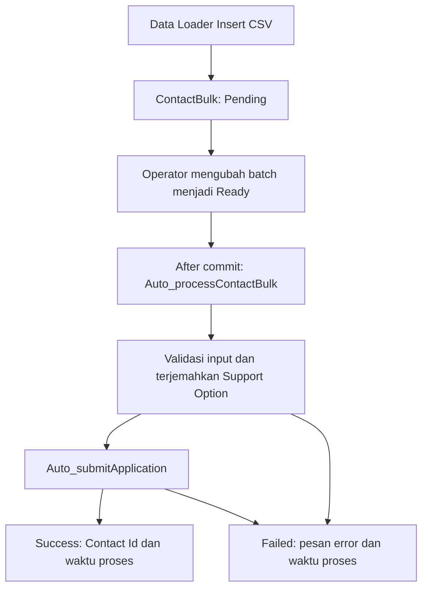

# Import CSV melalui ContactBulk__c

Data Loader memasukkan CSV ke staging `ContactBulk__c`. Flow
`[Tgr] OnUpsert ContactBulk` menjalankan asynchronous path saat staging dibuat Ready
atau berubah dari status lain menjadi Ready. Path tersebut memanggil
`Auto_processContactBulk`, lalu `Auto_submitApplication` untuk menyimpan Contact.
Tidak ada trigger baru pada Contact.



## CSV dan mapping

Keempat file `SAMPLE _ Support Option from Applicants - Picklist*.csv` di folder
`doc` mempunyai enam header yang sama, masing-masing 101 record. Data selain label
Support Option identik. Setiap file memiliki 101 Phone unik; jika keempat file
langsung digabung, setiap Phone berulang empat kali. File sumber tidak diubah.

Pakai mapping `scripts/dataloader/ContactBulk.sdl`. Enam kolom sumber dipetakan ke:

| Header CSV           | Field staging        | Field Contact                    |
| -------------------- | -------------------- | -------------------------------- |
| Applicant First Name | FirstName__c         | FirstName                        |
| Applicant Last Name  | LastName__c          | LastName                         |
| Phone                | Phone__c             | Phone                            |
| Mailing Postal Code  | MailingPostalCode__c | MailingPostalCode                |
| Monthly Income       | MonthlyIncome__c     | Monthly_Income__c                |
| Support Option       | SupportOptionRaw__c  | Support_Option__c setelah lookup |

Kolom tambahan opsional `ImportBatch` dan `Status` juga tersedia pada mapping.
Jika CSV asli tidak memiliki kedua header ini, mapping tidak digunakan untuk
keduanya. Tinjau mapping yang muncul di Data Loader sebelum menjalankan import.
Postal code disimpan sebagai Text agar nol di depan tidak hilang.

Support Option menerima empat bentuk label berikut untuk setiap opsi:

- `Option 1`
- `Option 1: SGD 500 per month for 3 months`
- `SGD 500 per month for 3 months`
- `SGD 500 for 3 months`

Flow mengabaikan huruf besar/kecil, membersihkan tab, serta memangkas spasi di
awal/akhir. Opsi 1 dipetakan ke Amount 500 / Duration 3; opsi 2 ke 300 / 6; opsi 3
ke 200 / 12. Flow mencari master berdasarkan Amount__c dan Duration__c, bukan Id
hardcoded. Tidak ditemukan atau lebih dari satu master yang cocok menghasilkan
Failed. Angka pada label lengkap harus konsisten dengan opsi tersebut.

## Pemakaian

1. Deploy komponen dalam `manifest/contact-bulk.xml`. Assign permission set
   `ContactBulk_Import` kepada operator internal yang sudah memiliki akses API
   Data Loader. Permission set tidak diberikan kepada guest. Tab dapat dibuka
   melalui App Launcher; tambahkan ke navigation aplikasi jika diperlukan.
2. Pastikan Account `hdbsf` dan tiga master Support Option tersedia. Master di org
   hdbsf sudah diperiksa saat implementasi dan sesuai ketiga pasangan angka di atas.
3. Pilih **satu file**. Pastikan satu Phone hanya muncul sekali dalam file dan tidak
   ada import lain atau penulisan aplikasi yang bersamaan untuk Phone tersebut.
4. Disarankan menambahkan kolom `ImportBatch` dengan kode unik, misalnya
   `IMPORT-20260907-01`, pada salinan CSV. Pilih Data Loader **Insert → ContactBulk__c**
   dan muat mapping `.sdl`. Tanpa kolom Status, nilai default adalah Pending.
5. Export staging batch yang baru masuk, lalu gunakan Data Loader **Update** dengan
   kolom `Id,Status__c` dan nilai `Ready`. Gunakan Id dari success file Data Loader
   untuk memilih tepat baris import jika tidak menambahkan ImportBatch. Jangan
   mengubah semua Pending lintas batch sekaligus.
6. Pantau staging hingga semua baris menjadi Success atau Failed sebelum memproses
   file berikutnya. Success file Data Loader hanya membuktikan staging tersimpan;
   hasil penulisan Contact terlihat dari `Status__c` dan `Contact__c`.
7. Untuk Failed: baca ErrorMessage__c, perbaiki data atau konfigurasi, lalu ubah status
   kembali ke Ready. Update Success tidak menjadwalkan proses lagi. Jangan mengubah
   payload ketika status masih Ready karena pekerjaan async mungkin sedang berjalan.

Query pemantauan (ganti kode batch):

```sql
SELECT Id, Name, Phone__c, Status__c, Contact__c, ErrorMessage__c, ProcessedAt__c
FROM ContactBulk__c
WHERE ImportBatch__c = 'IMPORT-20260907-01'
ORDER BY CreatedDate
```

## Perilaku dan batasan

- Last Name, Phone, serta Monthly Income nonnegatif wajib untuk pemrosesan; input
  yang tidak valid dicatat sebagai Failed. Batas kelayakan grant tidak ditambahkan
  pada import ini; perilaku bisnis tetap mengikuti Auto_submitApplication.
- Input staging dipetakan ke Contact baru di memori tanpa Id staging. Phone
  dicocokkan dengan format yang sama persis seperti Auto_submitApplication; tidak
  ada normalisasi kode negara atau penghapusan spasi Phone.
- Auto_submitApplication memilih Account hdbsf dengan CreatedDate terbaru, kemudian
  Contact dengan Phone sama pada Account itu, diurutkan CreatedDate descending.
  Contact lama tidak dihapus atau digabung. CreatedDate yang sama persis belum
  memiliki tie-break khusus pada flow yang ada.
- Async tidak menjamin urutan antarbaris atau antrean serial per Phone. Solusi ini
  tidak melakukan deduplikasi/locking lintas file. Jika butuh impor paralel atau
  Phone berulang dalam satu file, gunakan processor dengan kontrol konkurensi.
- Flow hanya memproses staging yang status terkininya Ready. Status Success/Failed
  menyimpan hasil dan waktu proses; pemanggilan ulang processor untuk Success
  tidak menyimpan Contact lagi.
- Auto_submitApplication memiliki input opsional varB_ReturnErrors (default false)
  dan output varT_Error. Staging mengisi true sehingga fault pada Save Contact
  dikembalikan sebagai pesan. Pemanggil lama tetap mendapatkan fault default.
- Duplicate rules dan validation rules Contact di org tetap berlaku. Jika Contact
  ditolak saat penyimpanan, pesan tersebut dicatat di staging sebagai Failed;
  import ini tidak melakukan bypass duplicate rules.
- Error platform yang tidak dapat ditangkap, limit transaksi, atau kegagalan saat
  menyimpan status staging masih dapat meninggalkan baris Ready. Periksa failed
  flow interviews sebelum retry; jangan menganggap Ready yang lama pasti belum
  pernah menulis Contact.
- Record-triggered Flow memakai system context. Permission set staging ditujukan
  hanya bagi operator internal yang dipercaya untuk mengimpor dan memperbarui
  field Contact yang dipetakan. Operator melihat staging miliknya sesuai sharing.

## Validasi

`ContactBulkFlowTest` menguji processor dengan Flow asli, termasuk seluruh 12 label,
postal code dengan nol depan, pemilihan Contact terbaru pada Account yang benar,
replay Success, data tidak valid, master hilang/ambigu, Account hilang, dan retry.
Test memanggil processor langsung; ini bukan bukti timing/delivery asynchronous
path atau uji Data Loader end-to-end. Untuk uji end-to-end setelah deployment,
import satu file contoh, tunggu status terminal, lalu cocokkan 101 hasil staging
terhadap Contact dan uji file berikutnya secara berurutan.

Validasi deployment dapat dijalankan tanpa menyimpan metadata:

```sh
sf project deploy start --dry-run --target-org hdbsf \
  --manifest manifest/contact-bulk.xml \
  --test-level RunSpecifiedTests --tests ContactBulkFlowTest --wait 10
```

Hasil validasi terakhir di `hdbsf`: **Succeeded**, check-only deployment
`0Affj00000QGJR7CAP`, **9 test dijalankan dan 0 gagal**. Ringkasan tersimpan di
`doc/ContactBulk_Validation.json`. Metadata belum di-deploy dan belum ada CSV yang
benar-benar diimpor oleh pekerjaan ini.
