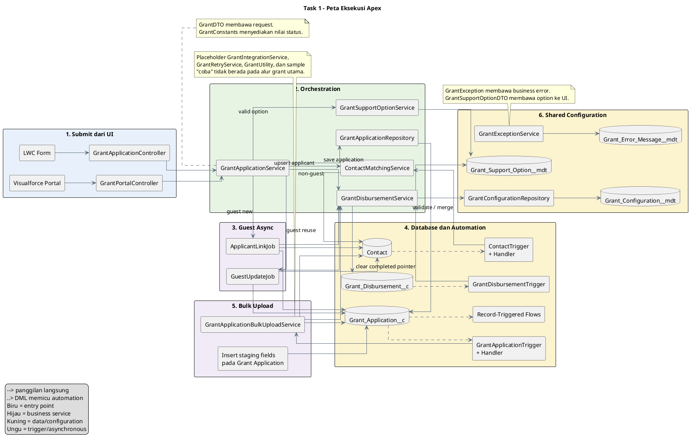
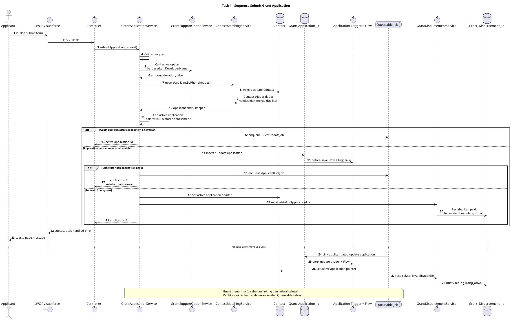
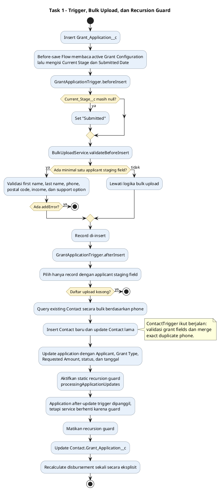
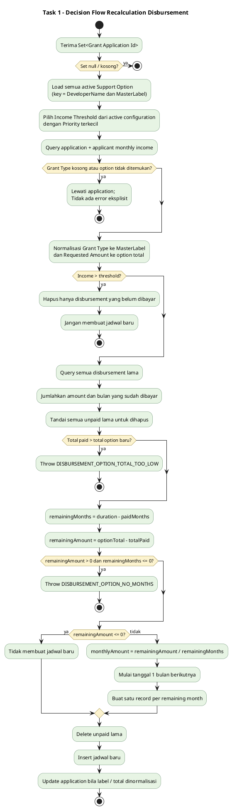
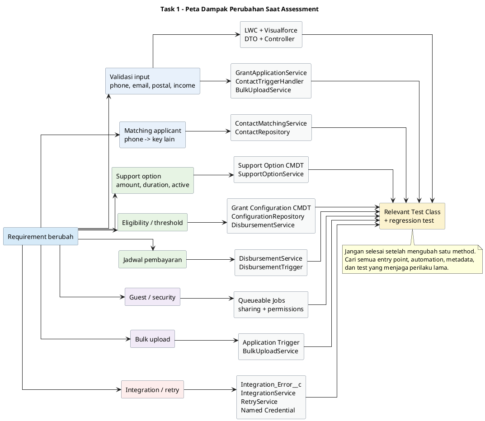

# Panduan Membaca Logika Semua Apex Class - Task 1

Dokumen ini adalah peta belajar terhadap source code yang berada di `force-app/main/default/classes` dan `force-app/main/default/triggers`. Tujuannya bukan sekadar menghafal nama class, tetapi membuat Anda mampu menjawab tiga pertanyaan saat assessment:

1. Request masuk dari mana?
2. Business rule dijalankan di mana?
3. Jika requirement berubah, file apa saja yang harus ikut diperiksa?

Snapshot yang dianalisis: **32 Apex class** (`24` production/supporting class dan `8` test class), **3 Apex trigger**, dua record-triggered Flow, LWC grant form, Visualforce grant portal, dan Custom Metadata yang dipakai Apex.

## 1. Cara menggunakan panduan ini

Baca source dengan urutan berikut, bukan berdasarkan alfabet:

1. `GrantApplicationController` dan `GrantPortalController` untuk menemukan entry point.
2. `GrantApplicationService` untuk menemukan orchestration utama.
3. `ContactMatchingService` dan repository untuk memahami applicant.
4. trigger dan handler untuk melihat logic yang otomatis ikut berjalan setelah DML.
5. `GrantDisbursementService` untuk memahami algoritma pembayaran.
6. configuration, support option, error service, DTO, dan constants.
7. Queueable job untuk melihat pemisahan transaksi guest.
8. test class untuk memahami perilaku yang dianggap penting oleh pembuat solusi.

Setiap diagram ditampilkan langsung pada bab yang relevan. File sumber `.puml` tetap disimpan di folder `puml task1` dan ditautkan di atas diagram masing-masing.

## 2. Kamus singkat untuk membaca Apex

| Bentuk di source               | Cara membacanya                                                                                                                                                                  |
| ------------------------------ | -------------------------------------------------------------------------------------------------------------------------------------------------------------------------------- |
| `@AuraEnabled`                 | Method atau property dapat dipakai oleh LWC/Aura. Ini boundary antara browser dan server.                                                                                        |
| `@AuraEnabled(cacheable=true)` | Operasi read-only yang dapat di-cache oleh client. Jangan melakukan DML di method ini.                                                                                           |
| `@InvocableMethod`             | Method dapat dipanggil oleh Flow.                                                                                                                                                |
| `with sharing`                 | Apex menghormati record-level sharing milik user pemanggil.                                                                                                                      |
| `without sharing`              | Apex tidak memakai record-level sharing pemanggil. Ini bukan berarti CRUD/FLS otomatis diabaikan atau otomatis diperiksa; keamanan object/field tetap harus dirancang eksplisit. |
| `static`                       | Dipanggil melalui nama class tanpa membuat object. Static variable juga hidup sepanjang satu transaction.                                                                        |
| `Trigger.new`                  | Versi record yang baru.                                                                                                                                                          |
| `Trigger.oldMap`               | Versi record sebelum update/delete, diakses berdasarkan Id.                                                                                                                      |
| `addError()`                   | Membatalkan DML record dan menampilkan pesan validasi.                                                                                                                           |
| `Queueable`                    | Logic dijalankan asynchronous dalam transaction terpisah.                                                                                                                        |
| `@TestVisible`                 | Member private dapat diakses test, tetapi tetap private untuk production caller.                                                                                                 |
| DTO                            | Object pengangkut data antar-layer; bukan record database.                                                                                                                       |
| Repository                     | Class yang berfokus pada query atau persistence.                                                                                                                                 |
| Custom Metadata Type           | Configuration yang dideploy sebagai metadata dan dapat dibaca Apex.                                                                                                              |

## 3. Tujuh pertanyaan saat membaca setiap method

Gunakan checklist ini setiap membuka method:

1. **Siapa yang memanggilnya?** LWC, Visualforce, Flow, trigger, service lain, Queueable, atau test?
2. **Input-nya apa?** Apakah bisa `null`, kosong, duplikat, atau lebih dari satu record?
3. **Guard clause-nya apa?** Contoh: `if (records == null || records.isEmpty()) return;`.
4. **Branch utama apa?** Contoh: guest versus internal, application baru versus reuse.
5. **SOQL dan DML apa yang terjadi?** Tandai `SELECT`, `insert`, `update`, dan `delete`.
6. **Automation apa yang ikut terpicu oleh DML itu?** DML bukan akhir alur; trigger dan Flow dapat memanggil logic berikutnya.
7. **Test mana yang membuktikan perilaku tersebut?** Jika requirement berubah, assertion lama mungkin juga harus berubah.

Cara cepat memberi anotasi saat assessment:

```text
ENTRY -> VALIDATE -> LOOKUP CONFIG -> MATCH DATA -> SAVE
      -> TRIGGER/FLOW -> ASYNC? -> RECALCULATE -> RESPONSE
```

## 4. Gambaran sistem dalam satu kalimat

Applicant mengirim `GrantDTO`; application service memvalidasi request, mencari support option, membuat atau memperbarui Contact berdasarkan exact phone, membuat atau memakai kembali Grant Application, lalu membuat ulang jadwal disbursement yang belum dibayar. Untuk guest, linking dan recalculation dipindahkan ke Queueable.

Source diagram: [4.01 Peta Eksekusi Apex.puml](<../puml task1/4.01 Peta Eksekusi Apex.puml>)



## 5. Alur utama: submit dari LWC atau Visualforce

### 5.1 Entry point

Ada dua UI yang menuju service yang sama:

| Channel                        | Entry point                                      | Delegasi                                               |
| ------------------------------ | ------------------------------------------------ | ------------------------------------------------------ |
| LWC `grantApplicationForm`     | `GrantApplicationController.submitApplication()` | `GrantApplicationService.submitApplication()`          |
| Visualforce `GrantPortal.page` | `GrantPortalController.submit()`                 | membentuk `GrantDTO`, lalu memanggil service yang sama |

Keuntungan desain ini: business rule tidak diduplikasi di dua controller. Saat requirement inti berubah, mulai dari service, bukan controller.

### 5.2 Urutan internal `GrantApplicationService.submitApplication`

Source utama: `force-app/main/default/classes/GrantApplicationService.cls`.

1. Menolak request `null`.
2. Menjalankan validasi first name, last name, phone, email, postal code, monthly income, dan support option.
3. Mengambil active `Grant_Support_Option__mdt` berdasarkan **DeveloperName**.
4. Memanggil `ContactMatchingService.upsertApplicantByPhone`.
5. Menentukan apakah applicant masih mempunyai application aktif.
6. Untuk guest yang sudah memiliki active application, enqueue `GrantApplicationGuestUpdateJob` lalu langsung mengembalikan Id lama.
7. Jika bukan kondisi tersebut, membuat object application baru atau object parsial dengan Id application lama.
8. Mengisi Grant Type dari **MasterLabel support option**, requested amount dari `monthly amount × duration`, reason, status Pending, dan tanggal.
9. Menyimpan melalui `GrantApplicationRepository.save`.
10. Guest baru: enqueue `GrantApplicationApplicantLinkJob`.
11. Non-guest: langsung memperbarui pointer `Contact.Grant_Application__c`.
12. Non-guest: langsung memanggil `GrantDisbursementService.recalculateForApplicationIds`.

### 5.3 Arti “active application” di implementasi ini

`getActiveApplicationId()` memakai dua cara:

1. Jika `Contact.Grant_Application__c` terisi, Id tersebut langsung dianggap aktif.
2. Jika pointer kosong, ambil maksimum 10 application terbaru. Application dianggap masih aktif bila:
   - belum mempunyai disbursement sama sekali; atau
   - masih mempunyai minimal satu disbursement yang belum dibayar.

Jika semua disbursement pada semua application kandidat sudah dibayar, method mengembalikan `null` dan submit berikutnya membuat application baru.

Implikasi perubahan: requirement “satu applicant hanya boleh satu application seumur hidup” atau “boleh beberapa application aktif” harus dimulai dari method ini, tetapi juga berdampak pada pointer di Contact, Queueable, bulk upload, dan cleanup pada disbursement trigger.

### 5.4 Perbedaan non-guest dan guest

| Aspek                                  | Non-guest                        | Guest                                                          |
| -------------------------------------- | -------------------------------- | -------------------------------------------------------------- |
| Link `Application.Applicant__c`        | Diisi pada DML utama             | Diisi kemudian oleh Queueable                                  |
| Pointer `Contact.Grant_Application__c` | Di-update langsung               | Di-update kemudian oleh Queueable                              |
| Jadwal disbursement                    | Dibuat dalam request transaction | Dibuat dalam Queueable transaction                             |
| Response ke UI                         | Setelah proses sinkron selesai   | Application Id dapat diterima sebelum linking/jadwal selesai   |
| Risiko                                 | Request lebih berat              | Eventual consistency dan kegagalan asynchronous harus dipantau |

Saat debugging guest, jangan berhenti pada log request UI. Cari juga `AsyncApexJob` dan log transaction Queueable.

Source diagram: [4.02 Alur Submit Grant Application.puml](<../puml task1/4.02 Alur Submit Grant Application.puml>)



## 6. Bedah class production satu per satu

### 6.0 Navigator method: buka bagian mana lebih dahulu

Nomor baris adalah snapshot saat dokumen ini dibuat dan dapat bergeser setelah code diedit. Gunakan nama method sebagai anchor utama.

| Class                               | Method/area pertama yang dibaca                                           | Lokasi saat ini                                           |
| ----------------------------------- | ------------------------------------------------------------------------- | --------------------------------------------------------- |
| `GrantApplicationController`        | tiga method `@AuraEnabled`                                                | `GrantApplicationController.cls:1`                        |
| `GrantPortalController`             | `getSupportOptions`, `submit`, `clearForm`                                | `GrantPortalController.cls:11`, `:35`, `:67`              |
| `GrantApplicationService`           | `submitApplication`, `getActiveApplicationId`, `validateApplicantRequest` | `GrantApplicationService.cls:16`, `:101`, `:166`          |
| `GrantDTO`                          | property contract                                                         | `GrantDTO.cls:1`                                          |
| `GrantSupportOptionDTO`             | constructor mapping metadata                                              | `GrantSupportOptionDTO.cls:17`                            |
| `ContactMatchingService`            | upsert, duplicate merge, holding Account                                  | `ContactMatchingService.cls:6`, `:49`, `:223`             |
| `ContactRepository`                 | `getById`, `getByPhone`, selected fields                                  | `ContactRepository.cls:7`, `:29`, `:50`                   |
| `GrantApplicationRepository`        | `save`, `getById`                                                         | `GrantApplicationRepository.cls:2`, `:12`                 |
| `ContactTriggerHandler`             | validation dan after-insert merge                                         | `ContactTriggerHandler.cls:9`, `:17`, `:21`               |
| `GrantApplicationTriggerHandler`    | default stage dan bulk hooks                                              | `GrantApplicationTriggerHandler.cls:2`, `:18`, `:22`      |
| `GrantApplicationBulkUploadService` | public hooks, core processor, validation                                  | `GrantApplicationBulkUploadService.cls:10`, `:70`, `:241` |
| `GrantSupportOptionService`         | list option dan single option lookup                                      | `GrantSupportOptionService.cls:2`, `:23`                  |
| `GrantConfigurationService`         | single configuration dan active types                                     | `GrantConfigurationService.cls:2`, `:19`                  |
| `GrantConfigurationRepository`      | active configuration dan priority                                         | `GrantConfigurationRepository.cls:5`, `:27`, `:42`        |
| `GrantDisbursementService`          | Flow entry, recalc, cleanup, rebuild schedule                             | `GrantDisbursementService.cls:6`, `:24`, `:143`, `:202`   |
| `GrantExceptionService`             | metadata fallback, formatter, client messages                             | `GrantExceptionService.cls:19`, `:39`, `:60`              |
| `GrantException`                    | custom exception declaration                                              | `GrantException.cls:1`                                    |
| `GrantConstants`                    | constant values                                                           | `GrantConstants.cls:1`                                    |
| `GrantUtility`                      | blank/null/transaction helpers                                            | `GrantUtility.cls:6`, `:13`, `:20`                        |
| `GrantApplicationApplicantLinkJob`  | Queueable `execute`                                                       | `GrantApplicationApplicantLinkJob.cls:10`                 |
| `GrantApplicationGuestUpdateJob`    | Queueable `execute`                                                       | `GrantApplicationGuestUpdateJob.cls:22`                   |
| `GrantIntegrationService`           | empty placeholder                                                         | `GrantIntegrationService.cls:1`                           |
| `GrantRetryService`                 | empty placeholder                                                         | `GrantRetryService.cls:1`                                 |
| `coba`                              | SOQL, JSON/REST, Platform Event                                           | `coba.cls:18`, `:32`, `:46`, `:69`                        |

### 6.1 Presentation dan DTO

#### `GrantApplicationController`

Peran: façade untuk LWC.

- `submitApplication()` meneruskan request dan mengubah exception apa pun menjadi `AuraHandledException`.
- `getActiveGrantTypes()` mengambil daftar grant type melalui configuration service.
- `getActiveSupportOptions()` mengambil pilihan benefit.

Catatan penting:

- LWC yang diperiksa saat ini memakai `submitApplication` dan `getActiveSupportOptions`, tetapi tidak memakai `getActiveGrantTypes`.
- Method submit menulis seluruh request ke debug log. Request memuat PII seperti nama, telepon, email, postal code, dan income. Ini perlu dinilai ulang untuk production logging.

Jika UI contract berubah, periksa class ini, `GrantDTO`, import Apex di LWC, payload JavaScript, dan test controller.

#### `GrantPortalController`

Peran: controller Visualforce untuk guest portal.

- Menyimpan property form.
- Membuat daftar `SelectOption` dari `GrantSupportOptionService`.
- Membentuk `GrantDTO` ketika `submit()`.
- Menampilkan success/error melalui `ApexPages.addMessage`.
- Mengosongkan form setelah success.

Jika menambah field pada Visualforce, ubah property controller, mapping ke DTO, markup `GrantPortal.page`, service validation/mapping, dan test.

#### `GrantDTO`

Peran: contract data dari client ke service.

Property yang tersedia: application Id, applicant Id, first name, last name, phone, email, postal code, monthly income, support option, grant type, requested amount, reason, dan status.

Tidak semua property dipakai saat submit. `grantType`, `requestedAmount`, dan `status` dari client tidak menjadi sumber kebenaran; service menghitung atau menentukan nilai sendiri. Ini baik untuk mencegah client menentukan jumlah/status, tetapi sebaiknya contract tidak membingungkan.

#### `GrantSupportOptionDTO`

Peran: mengubah Custom Metadata menjadi data aman dan sederhana untuk UI.

- `value` = DeveloperName.
- `label` = MasterLabel.
- `monthlyAmount` dan `durationMonths` berasal dari metadata.
- `totalAmount` dihitung pada constructor.

Jika UI mengirim `value`, service mencari metadata berdasarkan DeveloperName. Application kemudian menyimpan MasterLabel. Pahami perbedaan dua identifier ini ketika mengganti label metadata.

### 6.2 Orchestration dan applicant

#### `GrantApplicationService`

Peran: orchestration utama use case submit.

Business decision penting berada di sini:

- format input;
- application reuse;
- perbedaan guest/non-guest;
- field application yang disimpan;
- kapan disbursement dihitung.

Class ini `without sharing`. Itu membantu operasi portal tertentu, tetapi harus dibarengi pemeriksaan CRUD/FLS dan pembatasan input karena endpoint dapat dijangkau dari UI.

#### `ContactMatchingService`

Peran: membuat, memperbarui, atau menggabungkan Contact berdasarkan phone.

`upsertApplicantByPhone()`:

1. Mencari Contact pertama dengan phone yang sama persis.
2. Membuat Contact jika tidak ditemukan; selain itu update Contact lama.
3. Menyalin data request dan menghitung annual income.
4. Untuk user yang didukung, memakai atau membuat holding Account.
5. Setelah DML, mengambil kembali keeper Contact bila trigger melakukan duplicate merge.
6. Dalam konteks tertentu membuat manual `AccountShare` agar current user dapat mereferensikan Contact.

`mergeDuplicatePhoneContacts()`:

1. Mengumpulkan phone dari Contact yang baru di-insert.
2. Query semua Contact dengan phone tersebut, urut oldest first.
3. Contact tertua menjadi keeper.
4. Data dari Contact yang baru masuk disalin ke keeper.
5. Contact duplikat yang baru di-insert dihapus.
6. Static flag mencegah recursion saat update/delete internal.

Hal yang harus diingat:

- Matching bersifat **exact string**, belum ada normalisasi.
- `65 6812 3456` dan `+65 6812 3456` dianggap berbeda.
- Holding Account dicari berdasarkan Name; tidak ada unique key yang mencegah race membuat dua Account dengan nama sama.
- Merge memperbarui keeper dengan data terakhir yang masuk. Ini adalah business decision, bukan sekadar teknik.

#### `ContactRepository`

Peran: query Contact berdasarkan Id atau exact phone.

Query dibangun secara dinamis agar `AccountId` tidak dipilih untuk guest dan hanya ditambahkan bila field tersedia. Value sudah di-escape, tetapi untuk perubahan baru lebih mudah dan aman memakai bind variable jika dynamic SOQL tidak diperlukan.

Jika Contact field baru diperlukan oleh service, tambahkan field ke daftar query yang sesuai. Error umum saat assessment adalah menggunakan field yang tidak di-query lalu mendapat `SObject row was retrieved via SOQL without querying the requested field`.

#### `GrantApplicationRepository`

Peran:

- `save()` memilih insert versus update berdasarkan keberadaan Id.
- `getById()` mengambil field application inti.

`getById()` bukan jalur submit utama saat ini. Jika menambahkan logic yang memakai hasil repository, pastikan semua field yang dibaca ada dalam `SELECT`.

### 6.3 Trigger Contact dan Grant Application

#### `ContactTrigger`

Event:

- before insert;
- before update;
- after insert.

Trigger ini tipis; semua logic didelegasikan ke `ContactTriggerHandler`. Pola ini mempermudah unit test dan mencegah trigger menjadi tempat campuran business logic.

#### `ContactTriggerHandler`

- Before insert/update: bila `Support_Option__c` terisi, validasi phone, postal code, dan monthly income.
- After insert: panggil merge duplicate phone.

Validasi hanya aktif jika support option terisi. Contact biasa yang tidak terkait grant tidak dipaksa mengikuti format grant.

#### `GrantApplicationTrigger`

Event:

- before insert/update;
- after insert/update.

Trigger mendelegasikan ke satu handler. `beforeUpdate()` handler saat ini kosong dan merupakan extension point.

#### `GrantApplicationTriggerHandler`

- Before insert: memberi default `Current_Stage__c = Submitted` bila masih null, lalu validasi jalur bulk upload.
- After insert: proses staging fields bulk upload.
- After update: bila Grant Type berubah, minta recalculation disbursement melalui bulk upload service.

Perhatikan bahwa ada before-save Flow yang juga mengisi lifecycle fields. Saat mengubah default stage, baca trigger **dan** Flow agar tidak membuat dua sumber aturan yang saling menimpa.

### 6.4 Bulk upload

#### `GrantApplicationBulkUploadService`

Peran: mengubah record Grant Application yang membawa staging applicant fields menjadi Contact, relationship, dan jadwal pembayaran.

Record dianggap jalur upload jika minimal satu dari field berikut terisi:

- `Applicant_First_Name__c`;
- `Applicant_Last_Name__c`;
- `Applicant_Phone__c`;
- `Mailing_Postal_Code__c`;
- `Monthly_Income__c`;
- `Support_Option__c`.

Before insert, semua field wajib dan format diperiksa. After insert:

1. Query Contact secara bulk berdasarkan phone.
2. Reuse Contact lama atau buat Contact baru.
3. Salin staging fields ke Contact.
4. Update application dengan applicant, option label, requested amount, status, dan tanggal.
5. Update pointer application pada Contact.
6. Hitung disbursement.

Support option input dinormalisasi dengan menghapus karakter non-alphanumeric dan mengubah menjadi lowercase. Karena itu `Option 1`, `Option_1`, `option1`, DeveloperName, MasterLabel, atau sort order dapat diarahkan ke metadata yang sama.

Static `processingApplicationUpdates` mencegah update internal class memicu recalculation kedua melalui after-update trigger. Setelah update selesai, service melakukan recalculation satu kali secara eksplisit.

Source diagram: [4.03 Alur Trigger dan Bulk Upload.puml](<../puml task1/4.03 Alur Trigger dan Bulk Upload.puml>)



Catatan assessment:

- Jalur upload tidak menyalin email karena staging field email tidak ada dalam logic ini.
- Jika beberapa row dalam satu batch memakai phone yang sama, semuanya dapat menunjuk ke Contact yang sama dan data Contact dari row terakhir dapat menang.
- Query dan DML utama sudah dikelompokkan di luar loop; pertahankan pola bulkification ini saat menambah logic.

### 6.5 Support option dan configuration

#### `GrantSupportOptionService`

- `getActiveOptions()` mengembalikan semua option aktif, diurutkan oleh sort order dan label.
- `getActiveOption()` menerima DeveloperName dan menolak blank, inactive, atau unknown option.

Perubahan nominal, durasi, active flag, label, atau urutan umumnya dilakukan pada `Grant_Support_Option__mdt`, bukan hardcode Apex.

#### `GrantConfigurationService`

- `getConfiguration(grantType)` memilih active configuration untuk tipe tertentu atau throw exception.
- `getActiveGrantTypes()` menghasilkan unique grant type dari semua active configuration.

Pada jalur submit saat ini, method `getConfiguration()` tidak dipakai untuk menentukan option atau amount.

#### `GrantConfigurationRepository`

- Membaca seluruh record metadata melalui `Grant_Configuration__mdt.getAll()`.
- Menyaring `Active__c = true`.
- Jika ada beberapa configuration untuk grant type sama, priority paling kecil menang.

Pastikan `Priority__c` tidak null jika comparator tetap membandingkan angka secara langsung.

### 6.6 Disbursement

#### `GrantDisbursementService`

Peran: entry point Flow dan Apex untuk membuat atau menghitung ulang jadwal.

`recalculateDisbursementsFromFlow()` hanya mengubah list input Flow menjadi Set Id lalu meneruskan ke method utama. Dua Flow yang terdapat di repo saat snapshot ini tidak terlihat memanggil Invocable tersebut; method tetap tersedia untuk Flow lain atau penggunaan berikutnya.

`recalculateForApplicationIds()`:

1. Load active support options dengan key DeveloperName dan MasterLabel.
2. Memilih satu income threshold dari active Grant Configuration dengan priority terkecil.
3. Query application dan monthly income applicant.
4. Menormalisasi Grant Type dan Requested Amount sesuai support option.
5. Jika income melebihi threshold, hapus jadwal yang belum dibayar dan jangan membuat jadwal baru.
6. Untuk applicant eligible, panggil algoritma rebuild jadwal.

`recalculateForApplications()`:

1. Ambil seluruh jadwal lama.
2. Pertahankan record yang sudah dibayar.
3. Tandai seluruh unpaid record untuk dihapus.
4. Hitung total dan jumlah bulan yang sudah dibayar.
5. Validasi option baru tidak lebih kecil daripada total yang sudah dibayar.
6. Hitung remaining amount dan remaining months.
7. Bagi remaining amount secara rata.
8. Buat jadwal baru mulai tanggal 1 bulan berikutnya.
9. Delete unpaid lama lalu insert jadwal baru.

Source diagram: [4.04 Logika Recalculation Disbursement.puml](<../puml task1/4.04 Logika Recalculation Disbursement.puml>)



`clearCompletedApplicationReferences()` dipanggil oleh disbursement trigger. Jika sebuah application memiliki disbursement dan semuanya sudah dibayar, pointer `Contact.Grant_Application__c` dikosongkan agar applicant dapat membuat application baru.

Temuan penting untuk dibahas saat assessment:

- Threshold yang dipakai saat ini bersifat global: active configuration ber-priority terkecil. Ia tidak dipilih berdasarkan Grant Type application.
- Jika Grant Type kosong atau tidak cocok dengan active option, application hanya dilewati tanpa explicit error.
- Applicant dengan monthly income null dianggap eligible oleh method disbursement, meskipun jalur UI dan upload normalnya menolak income null.
- Application update yang mengubah Grant Type dapat memicu recalculation melalui trigger, sementara caller tertentu juga memanggil recalculation eksplisit. Periksa kemungkinan kerja dua kali ketika mengubah alur.

#### `GrantDisbursementTrigger`

Event after insert/update/delete/undelete mengumpulkan application Id dari versi baru dan/atau lama, lalu memanggil cleanup pointer.

Jika mengubah definisi “completed”, class service dan trigger ini harus diperiksa bersama. Jangan memindahkan query atau DML ke loop trigger.

### 6.7 Error, constant, dan helper

#### `GrantExceptionService`

Peran: central error code dan configurable user message.

- `getMessage()` memakai active `Grant_Error_Message__mdt` bila ada; jika tidak, fallback hardcoded.
- `formatMessage()` mengganti placeholder `{0}`, `{1}`, dan seterusnya.
- `getClientMessages()` hanya mengirim empat message code ke LWC: phone, postal, unexpected, dan unexpected-null.

Untuk menambah error baru:

1. Tambah constant code.
2. Tambah Custom Metadata record.
3. Pakai `getMessage()` di business logic.
4. Jika LWC membutuhkannya sebelum server call, tambahkan ke `getClientMessages()`.
5. Tambah test fallback, metadata, formatting, atau branch pemakai.

#### `GrantException`

Custom exception untuk membedakan business error grant dari exception umum. Class sengaja minimal.

#### `GrantConstants`

Berisi status application, integration status, grant type, error type, dan maximum retry.

Yang nyata dipakai oleh core saat ini terutama `STATUS_PENDING`. Beberapa constant integration/grant/error dan `MAX_RETRY` belum menjadi implementasi business flow; jangan menganggap keberadaan constant berarti feature sudah bekerja.

#### `GrantUtility`

Menyediakan `isBlank`, `isNull`, dan generator transaction Id SHA1. Pada source production yang diperiksa, helper ini belum dipakai oleh core grant dan hanya disentuh test.

### 6.8 Asynchronous guest processing

#### `GrantApplicationApplicantLinkJob`

Dipakai untuk guest yang membuat application baru:

1. Update lookup Applicant pada application.
2. Update pointer active application pada Contact.
3. Recalculate disbursement.

Constructor hanya menyimpan dua Id. `execute()` berhenti bila salah satu Id null.

#### `GrantApplicationGuestUpdateJob`

Dipakai untuk guest yang memakai kembali active application:

1. Update type, amount, reason, status, dan submission dates.
2. Isi applicant lookup bila Id tersedia.
3. Update pointer Contact.
4. Recalculate disbursement.

Kedua job belum mempunyai try/catch, retry, atau logging ke `Integration_Error__c`. Jika job gagal, UI sudah telanjur menerima application Id. Ini area penting untuk observability.

### 6.9 Placeholder dan sample

#### `GrantIntegrationService`

Class kosong dengan constructor kosong. Ini placeholder, bukan integrasi yang sudah berfungsi.

#### `GrantRetryService`

Class kosong dengan constructor kosong. `MAX_RETRY` ada di constants, tetapi belum ada retry algorithm.

#### `coba`

Class sample yang terpisah dari alur grant:

- SOQL Account yang memiliki active Opportunity;
- parse JSON ke inner DTO;
- GET REST endpoint;
- publish `Sample_Account_Event__e`;
- custom exceptions untuk callout dan publish failure.

Jika assessment meminta production integration, jangan sekadar memperluas nama `coba`. Buat class dengan nama domain yang jelas, gunakan Named Credential, define timeout/contract/error handling, dan sambungkan ke logging/retry yang nyata.

## 7. Automation non-Apex yang ikut memengaruhi logic

Membaca Apex saja belum cukup karena DML memicu automation berikut:

### `Grant_Application_Set_Lifecycle_Fields` Flow

- Before-save, saat application dibuat dengan status Pending.
- Mengambil active Grant Configuration dengan priority terkecil.
- Membandingkan `Requested_Amount__c` dengan `Income_Threshold__c`.
- Mengisi stage `Pending Approval` untuk high amount; selain itu `Submitted`.
- Mengisi Submitted Date.

Catatan: membandingkan requested amount dengan field bernama income threshold mungkin memang requirement khusus, tetapi secara semantic perlu dikonfirmasi. Apex disbursement memakai field yang sama untuk membandingkan applicant income.

### `Grant_Application_Notification_and_Assignment` Flow

- After-save pada update application.
- Berjalan ketika status Pending, stage Submitted, applicant terisi, dan applicant atau grant type berubah.
- Mengubah status menjadi Active.
- Mengambil Contact.
- Membuat task approval bila stage Pending Approval; jika tidak ada email, membuat task review email.

Karena start condition Flow mensyaratkan stage `Submitted`, branch yang kemudian memeriksa `Pending Approval` layak diverifikasi: record ber-stage Pending Approval mungkin tidak pernah masuk Flow. Ini contoh bagus saat assessment: jangan hanya membaca node, cek start condition dan apakah branch dapat dicapai.

## 8. “Kalau diminta mengubah X, ubah di mana?”

Source diagram: [4.05 Peta Dampak Perubahan Apex.puml](<../puml task1/4.05 Peta Dampak Perubahan Apex.puml>)



| Requirement assessment              | Mulai dari                                                                              | Ikut periksa                                                                                            | Test utama                                                                                           |
| ----------------------------------- | --------------------------------------------------------------------------------------- | ------------------------------------------------------------------------------------------------------- | ---------------------------------------------------------------------------------------------------- |
| Ubah format phone                   | `GrantApplicationService`, `ContactTriggerHandler`, `GrantApplicationBulkUploadService` | LWC pattern/message, Contact validation rule, matching/normalization, error metadata                    | `GrantApplicationServiceTest`, `ContactMatchingServiceTest`, `GrantApplicationBulkUploadServiceTest` |
| Ubah postal code                    | Tiga validation class yang sama                                                         | LWC pattern, Contact validation rule, error metadata                                                    | tiga test validation/upload/contact                                                                  |
| Ubah aturan email                   | `GrantApplicationService.EMAIL_PATTERN`                                                 | LWC email input, Visualforce, bulk upload yang saat ini tidak memetakan email                           | application, portal, bulk test                                                                       |
| Tambah field applicant              | `GrantDTO` dan UI payload                                                               | service validation, `ContactMatchingService`, repository query, staging fields bila upload, permissions | application/contact/bulk/portal tests                                                                |
| Matching berdasarkan National ID    | `ContactMatchingService` dan `ContactRepository`                                        | duplicate merge, normalization/unique strategy, bulk upload, field permissions                          | `ContactMatchingServiceTest`, bulk test                                                              |
| Tambah support option               | Record `Grant_Support_Option__mdt`                                                      | DeveloperName versus MasterLabel, active/sort order                                                     | application dan disbursement tests                                                                   |
| Ubah amount/duration option         | Custom Metadata                                                                         | recalculation terhadap paid schedule dan error rules                                                    | `GrantDisbursementServiceTest`                                                                       |
| Threshold berbeda per grant type    | `GrantDisbursementService.getActiveIncomeThreshold()` dan configuration repository      | mapping application Grant Type ke configuration, lifecycle Flow                                         | disbursement test + Flow scenario                                                                    |
| Ubah tanggal pembayaran pertama     | `firstDayOfNextMonth()` / `recalculateForApplications()`                                | timezone tidak relevan untuk Date tetapi business calendar/holiday mungkin relevan                      | disbursement test                                                                                    |
| Izinkan beberapa active application | `getActiveApplicationId()`                                                              | Contact pointer, Queueable, bulk update pointer, cleanup trigger/data model                             | application/contact/disbursement tests                                                               |
| Ubah definition completed           | `clearCompletedApplicationReferences()`                                                 | disbursement trigger dan application reuse                                                              | disbursement + application tests                                                                     |
| Ubah status/stage lifecycle         | `GrantConstants`, application service, trigger handler                                  | dua record-triggered Flow dan picklist values                                                           | application tests + Flow regression                                                                  |
| Tambah pesan error                  | `GrantExceptionService`                                                                 | error CMDT dan `getClientMessages()` bila perlu                                                         | `GrantExceptionServiceTest` + caller test                                                            |
| Ubah guest behavior                 | `isGuestUser()` dan dua Queueable                                                       | guest permissions, sharing, Flow timing, async failure monitoring                                       | guest branches pada application/contact tests                                                        |
| Perbaiki bulk CSV                   | `GrantApplicationBulkUploadService`                                                     | application trigger, staging fields, same-phone rows                                                    | bulk upload tests                                                                                    |
| Implement external integration      | class domain baru atau `GrantIntegrationService`                                        | Named Credential, `Integration_Error__c`, `GrantRetryService`, transaction Id, mocks                    | integration + retry tests                                                                            |
| Security hardening                  | semua class `without sharing` dan UI entry point                                        | CRUD/FLS, user mode query/DML strategy, guest permission, PII logs                                      | positive dan negative `System.runAs` tests                                                           |

## 9. Aturan yang tersebar dan rawan lupa

### 9.1 Phone dan postal validation ada di beberapa lapisan

Phone/postal rule muncul pada:

- LWC;
- application service;
- Contact trigger handler;
- bulk upload service;
- Contact Validation Rule;
- error metadata dan fallback message;
- beberapa test class.

Mengubah regex hanya di satu class akan membuat channel berbeda menerima hasil berbeda. Untuk perubahan validation, gunakan pencarian global berdasarkan regex, error code, dan field API name.

Contoh pencarian:

```bash
rg -n "SINGAPORE_PHONE_PATTERN|PHONE_INVALID|Applicant_Phone__c|Phone" force-app/main/default
rg -n "POSTAL_CODE_PATTERN|POSTAL_CODE_INVALID|Mailing_Postal_Code__c|MailingPostalCode" force-app/main/default
```

### 9.2 Tiga istilah option tidak selalu sama

| Nilai                              | Dipakai di mana                                                  |
| ---------------------------------- | ---------------------------------------------------------------- |
| DeveloperName, contoh `Option_One` | value dari UI, Contact support option, lookup service            |
| MasterLabel                        | Grant Type pada application dan Support Option pada disbursement |
| Sort order / bentuk `Option 1`     | alias yang diterima oleh bulk upload                             |

Jika admin hanya mengganti label, historical application yang menyimpan label lama masih harus dapat dipetakan. Service saat ini hanya memuat active metadata dengan current DeveloperName dan current MasterLabel.

### 9.3 DML membuka alur baru

Contoh:

```text
ApplicationService update Grant Application
-> GrantApplicationTrigger after update
-> BulkUploadService.processAfterUpdate
-> jika Grant Type berubah, DisbursementService
-> update application untuk normalisasi
-> trigger dapat berjalan kembali
```

Saat menambah update baru, selalu tanyakan:

- Apakah trigger akan memanggil service yang sama?
- Apakah static guard hanya melindungi satu transaction?
- Apakah Flow ikut update record lagi?
- Apakah caller juga melakukan recalculation secara eksplisit?

## 10. Hal yang sudah baik dan perlu dipertahankan

- Controller tipis dan business logic berada di service.
- Trigger mendelegasikan ke handler.
- Bulk upload mengelompokkan SOQL/DML, bukan melakukan query/DML per row.
- Request server-side divalidasi; tidak hanya mengandalkan client.
- Amount/status application tidak dipercaya dari client.
- Business option dan error message menggunakan Custom Metadata.
- Recalculation mempertahankan pembayaran yang sudah terjadi.
- Queueable dipakai untuk memisahkan operasi guest yang perlu transaction berikutnya.
- Test mencakup valid, invalid, reuse, guest, bulk, partial payment, exception, REST mock, dan platform event.

## 11. Titik perhatian yang layak Anda sebut saat assessment

Sampaikan sebagai observasi dan trade-off, bukan tuduhan:

1. **PII di debug log.** Controller dan service melakukan serialize data applicant.
2. **Security enforcement perlu eksplisit.** Banyak core class `without sharing`; belum terlihat pemeriksaan CRUD/FLS di method yang dianalisis.
3. **Exact-phone identity lemah.** Belum ada normalized phone atau stable external key.
4. **Threshold global.** Disbursement memilih configuration ber-priority terkecil, bukan per application grant type.
5. **Satu field dipakai untuk dua arti.** Flow membandingkan requested amount dengan Income Threshold, sedangkan Apex membandingkan monthly income dengan field yang sama.
6. **Branch Flow berpotensi tidak terjangkau.** Start mensyaratkan Submitted tetapi decision memeriksa Pending Approval.
7. **Async observability belum lengkap.** Queueable tidak mencatat kegagalan ke error object dan belum retry.
8. **Integration/retry masih placeholder.** Class kosong bukan implemented capability.
9. **Possible duplicate work.** Grant Type update dapat memicu recalculation dari trigger dan caller juga dapat memanggil recalculation.
10. **Bulk upload tidak membawa email.**
11. **Holding Account race.** Query-by-name lalu insert tidak menjamin uniqueness pada concurrent request.
12. **Unknown option/type dapat dilewati.** Disbursement tidak throw ketika Grant Type kosong/tidak cocok.
13. **Experience template test bergantung pada class yang source-nya tidak ada di folder class repo ini.** Pastikan dependency berasal dari org/template/package dan tersedia pada target deployment.

## 12. Inventory seluruh test class

### `GrantApplicationServiceTest`

Menjaga:

- valid/invalid request;
- controller error wrapping dan cached options/configuration;
- service/repository;
- application reuse dari Contact pointer dan history;
- guest Queueable update;
- completed application tidak direuse;
- trigger default stage;
- DTO, utility, constants, dan Queueable link.

Gunakan ini sebagai test pertama saat mengubah submit orchestration.

### `ContactMatchingServiceTest`

Menjaga:

- insert/update applicant berdasarkan phone;
- repository query;
- immediate/async applicant linking;
- duplicate phone merge dan oldest keeper;
- blank grant fields;
- duplicate dalam satu batch;
- Contact validation ketika support option ada.

### `GrantApplicationBulkUploadServiceTest`

Menjaga:

- upload membuat Contact dan disbursement;
- existing Contact direuse;
- income di atas threshold tidak mendapat jadwal;
- invalid row dibatalkan;
- required-field branches;
- guard clause input kosong.

### `GrantDisbursementServiceTest`

Menjaga:

- entry point Flow;
- mapping Grant Type dari label/DeveloperName;
- perubahan option setelah partial payment;
- error bila option baru lebih kecil daripada amount paid;
- error bila tidak ada remaining month;
- input kosong;
- pointer Contact dibersihkan setelah semua jadwal paid.

### `GrantPortalControllerTest`

Menjaga daftar support option, error page message, valid submit, dan clear form.

### `GrantExceptionServiceTest`

Menjaga fallback message, placeholder formatting, dan map client message.

### `cobaTest`

Menjaga sample SOQL, JSON parsing, successful/failed callout memakai `HttpCalloutMock`, serta Platform Event publish.

### `ExperienceCloudTemplateCoverageTest`

Mencoba menambah coverage untuk login, forgot password, self-registration, profile, dan Visualforce Experience Cloud template controllers.

Class yang dirujuk seperti `LightningLoginFormController`, `CommunitiesSelfRegController`, dan `MyProfilePageController` tidak ditemukan sebagai source `.cls` di folder yang dianalisis. Sebelum deployment ke org lain, konfirmasi apakah class tersebut berasal dari metadata lain, template org, atau dependency yang belum dimasukkan ke repo.

## 13. Cara membaca test agar cepat memahami business rule

Jangan mulai dari seluruh setup data. Baca test dalam empat potongan:

1. **Nama test**: biasanya sudah menyatakan rule.
2. **Given**: record dan metadata assumption yang disiapkan.
3. **When**: baris antara `Test.startTest()` dan `Test.stopTest()`.
4. **Then**: `System.assert...` setelah eksekusi.

Contoh cara menerjemahkan:

```text
test: submitApplicationDoesNotReuseCompletedApplicantApplication
Given: applicant punya application lama dan semua disbursement paid
When: submit request baru
Then: Id application baru berbeda
Business rule: completed application tidak aktif lagi
```

`Test.stopTest()` penting untuk Queueable karena asynchronous job biasanya diselesaikan pada titik ini di test context.

## 14. Latihan assessment: requirement ke lokasi perubahan

### Latihan 1 — Phone menerima `+65` dan harus dinormalisasi

Requirement:

> User boleh mengetik `+65 6812-3456`, tetapi matching harus tetap menemukan Contact dengan nomor yang sama.

Cara berpikir:

1. Jangan hanya melonggarkan regex.
2. Tentukan canonical form, misalnya digits-only atau E.164.
3. Simpan canonical value di field terpisah seperti `Normalized_Phone__c`.
4. Matching repository memakai canonical unique key.
5. UI dapat menampilkan format ramah user, tetapi server tetap normalisasi.
6. Duplicate merge dan bulk upload harus memakai key yang sama.
7. Tambah test untuk beberapa format yang menghasilkan satu Contact.

File terdampak utama:

- `GrantApplicationService`;
- `ContactMatchingService`;
- `ContactRepository`;
- `ContactTriggerHandler`;
- `GrantApplicationBulkUploadService`;
- LWC/Visualforce validation;
- object field/validation/unique setting;
- tiga kelompok test.

### Latihan 2 — Income threshold harus berbeda per grant type

Requirement:

> Education memakai threshold 2,000 dan Healthcare 5,000.

Masalah saat ini: `getActiveIncomeThreshold()` memilih satu configuration dengan priority terkecil untuk semua application.

Perubahan yang sehat:

1. Query application Grant Type.
2. Tentukan canonical mapping Grant Type ke `Grant_Configuration__mdt.Grant_Type__c`.
3. Ambil configuration per grant type.
4. Hitung eligibility per application, bukan satu threshold global.
5. Sinkronkan Flow lifecycle jika Flow juga harus memakai configuration per grant type.
6. Test dua application berbeda dalam **satu invocation** untuk membuktikan bulk behavior.

### Latihan 3 — Upload harus menerima email

1. Tambahkan field staging `Applicant_Email__c`.
2. Masukkan ke `hasUploadApplicantFields`.
3. Validasi format dan required/optional sesuai requirement.
4. Query existing Contact Email bila dibutuhkan.
5. Salin pada `copyApplicantFields`.
6. Tambahkan field permission dan mapping CSV.
7. Test new Contact, existing Contact, invalid email, dan mixed batch.

### Latihan 4 — Jadwal pertama dimulai 15 hari setelah approval

Mulai dari:

- `GrantDisbursementService.recalculateForApplications`;
- helper `firstDayOfNextMonth`;
- field Approval Date pada application;
- query application yang sekarang belum mengambil Approval Date.

Pertanyaan yang harus diajukan:

- 15 calendar days atau business days?
- Jika belum approved, apakah jadwal tidak dibuat?
- Tanggal yang sudah dibayar tetap tidak berubah?
- Perubahan approval date membangun ulang unpaid schedule atau tidak?
- Event apa yang memicu recalculation?

### Latihan 5 — External payment API dengan retry

Current state: integration dan retry class kosong.

Rancangan minimal:

1. `GrantPaymentIntegrationService` memakai Named Credential.
2. DTO request/response typed, bukan loose map untuk contract utama.
3. Timeout, idempotency key, dan response classification.
4. Log failure ke `Integration_Error__c` dengan transaction Id.
5. Queueable retry dengan exponential backoff yang sesuai mekanisme platform.
6. Bedakan retryable dan permanent failure.
7. Enforce maximum attempts.
8. `HttpCalloutMock` untuk 2xx, 4xx, 5xx, timeout/malformed body, dan retry exhaustion.

## 15. Template jawaban verbal saat diminta mengubah code

Gunakan struktur berikut:

> “Saya mulai dari entry point untuk memastikan channel yang terdampak. Business rule utamanya berada di `[service]`, sedangkan `[trigger/Flow]` dapat ikut berjalan setelah DML. Saya akan menjaga bulkification dengan query dan DML di luar loop. Sebelum mengubah, saya cek Custom Metadata agar tidak meng-hardcode rule yang seharusnya configurable. Setelah perubahan, saya update `[test class]` untuk positive, negative, bulk, security, dan regression scenario. Trade-off utama perubahan ini adalah `[consistency/security/performance/async]`.”

Versi khusus bug:

> “Saya reproduksi lewat test terkecil, ikuti call chain sampai state pertama kali menjadi salah, lalu perbaiki di pemilik rule tersebut. Saya tidak menambal hanya di controller karena jalur Visualforce, LWC, bulk upload, trigger, dan Queueable dapat memakai logic yang berbeda.”

## 16. Checklist sebelum menyatakan perubahan selesai

- [ ] Semua entry point yang relevan sudah ditemukan.
- [ ] Requirement dan acceptance criteria ditulis eksplisit.
- [ ] Tidak ada SOQL/DML baru di dalam loop.
- [ ] Null, blank, invalid, duplicate, dan bulk input sudah dipikirkan.
- [ ] Guest versus internal user sudah diuji.
- [ ] `with sharing`/`without sharing`, CRUD, FLS, dan permission sudah ditinjau.
- [ ] DML-trigger-Flow-Queueable chain sudah ditelusuri.
- [ ] Custom Metadata dipakai bila rule bersifat configurable.
- [ ] Paid disbursement tidak berubah tanpa business approval.
- [ ] Error message aman dan tidak membocorkan internals.
- [ ] PII tidak ditulis ke debug/log secara berlebihan.
- [ ] Positive, negative, boundary, bulk, async, dan regression tests diperbarui.
- [ ] Deployment dependency Experience Cloud/template sudah tersedia.

## 17. Ringkasan hafalan

```text
Controller = menerima request
DTO = membawa data
ApplicationService = mengatur use case
MatchingService = menentukan applicant
Repository = query/save
TriggerHandler = menjaga invariant otomatis
BulkUploadService = mengubah staging row menjadi model lengkap
Support/Configuration Service = membaca rule configurable
DisbursementService = mempertahankan paid dan membangun ulang unpaid
Queueable = menyelesaikan jalur guest di transaction berikutnya
ExceptionService = error code dan message
Test = kontrak perilaku yang tidak boleh rusak
```

Kalimat kunci untuk assessment: **jangan mengubah file berdasarkan nama saja; ubah pemilik business rule, lalu ikuti seluruh call chain, automation, metadata, dan regression test yang terdampak.**
