# Solution Architecture Design Document (SADD) — SADD Grant Application: Source-Grounded Baseline and Target Remediation

## 1. Executive Summary

This document defines an architecture baseline and remediation design for Agency X's financial-support application process described in **Salesforce Technical Assessment v3.2 — Task 1**. The baseline has been traced against every Salesforce source artifact under force-app/main/default: three production Apex classes, nine active Flows, one LWC bundle, custom objects/fields/validation rules, permissions, sharing rules, layout, list views, custom metadata, and tab metadata. It covers public online application and amendment through an Experience Cloud site, the Lightning Web Component (LWC) user interface, standard Contact applicant record, eligibility evaluation, support options, monthly Grant Disbursement schedules, and CSV staging.

The implemented baseline keeps **Contact** as the applicant master and uses Support_Option__c plus Grant_Disbursement__c. It does not yet implement a single secure submission boundary: the public LWC sends a raw Contact-shaped payload to GrantApplicationController, which is declared without sharing and invokes Auto_submitApplication. The Contact record is upserted first; asynchronous record-triggered Flow then evaluates eligibility/recalculation only when its start criteria are met. CSV staging reuses Auto_submitApplication but uses a separate, hard-coded label parser. These facts are distinguished below from the target remediation, which is deliberately not represented as already deployed.

No valid local Salesforce org authorization is currently available: sf org list reported no usable org and invalid macOS Keychain-backed auth files. Therefore all statements labelled **Source-confirmed** are repository facts; deployed-org activation, data, permissions, master records, tests, and package state remain unverified.

## 2. Requirement Coverage

### 2.1 Requirement Coverage Map

This map connects every explicit Task 1 requirement group to the design elements that implement or control it.

[Requirement Coverage Map](<puml_1/02.01 Requirement Coverage Map_Eng.puml>)

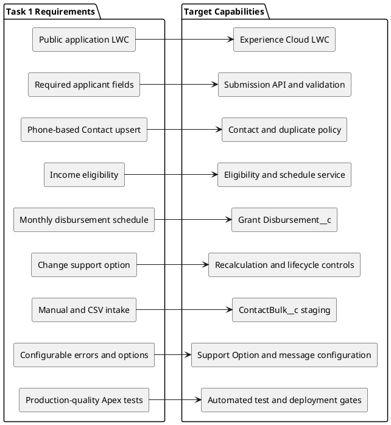

| ID   | Explicit requirement                                                                                                                                  | Concrete design response                                                                                                                                                 | Primary sections                                                                                                                                    |
| ---- | ----------------------------------------------------------------------------------------------------------------------------------------------------- | ------------------------------------------------------------------------------------------------------------------------------------------------------------------------ | --------------------------------------------------------------------------------------------------------------------------------------------------- |
| R-01 | Applicant submits online through Experience Cloud using LWC.                                                                                          | Public Experience Cloud page hosts grantApplicationForm; an allow-listed Apex facade accepts only the form contract.                                                     | [5](#5-target-solution-architecture), [6.3](#63-public-application-submission), [7.3](#73-public-submission-sequence)                               |
| R-02 | First name, last name, Singapore phone, six-digit postal code, monthly income, and support option are mandatory.                                      | LWC client guidance and server-side validation enforce a single canonical contract; Contact validation rules protect non-UI writes.                                      | [6.3](#63-public-application-submission), [7.4](#74-error-handling-strategy), [8.3](#83-recommended-objects-and-fields)                             |
| R-03 | A new Contact is created when phone is not associated with an existing Contact; matching phone updates it.                                            | Phone is canonicalized only when explicitly approved; exact canonical phone is a unique matching key, and the same Contact upsert service is used by every channel.      | [6.3](#63-public-application-submission), [7.2](#72-service-component-layer), [8](#8-data-architecture)                                             |
| R-04 | Eligibility passes only when monthly income is below SGD 1,800.                                                                                       | Eligibility rule is configuration-backed, evaluated before schedule mutation, and gives a safe, maintainable message.                                                    | [6.3](#63-public-application-submission), [7.5](#75-configurable-business-rules)                                                                    |
| R-05 | Create 3/6/12 monthly records with specified amounts, first day of month following submission; disbursement occurs on date.                           | GrantDisbursementService calculates a dated schedule, snapshots amount, and Scheduled Flow marks due records disbursed after the agency's operational confirmation rule. | [6.6](#66-monthly-disbursement-process), [8.6](#86-grant-disbursement-lifecycle)                                                                    |
| R-06 | Administrator may add/edit options; change is allowed only when paid total is less than new option total, then remaining value is evenly distributed. | Active Support_Option__c master, immutable schedule snapshots, row locking, paid-total test, remaining-month calculation, and replacement of unpaid rows.                | [6.5](#65-support-option-change-and-recalculation), [7.2](#72-service-component-layer), [8.4](#84-calculation-and-data-integrity-rules)             |
| R-07 | Administrator can create manually or bulk upload; CSV cannot bypass validation; matching phone updates Contact and schedules.                         | Manual guided action and Data Loader staging object both call the same submission orchestration; row outcomes are visible and replay-safe.                               | [6.4](#64-administrator-manual-and-bulk-intake), [9](#9-integration-and-bulk-intake-architecture), [11](#11-data-volume-and-lifecycle-strategy)     |
| R-08 | Errors are user friendly and easy for administrators to manage.                                                                                       | Error_Message__mdt or Grant_Message__c maps stable error codes to safe UI text; technical evidence is retained only in restricted logs.                                  | [7.4](#74-error-handling-strategy), [7.5](#75-configurable-business-rules), [10](#10-security-access-identity-and-compliance)                       |
| R-09 | Apex must be scalable, secure, production-ready, and at least 90% covered.                                                                            | Bulk-safe Apex domain service, sharing/FLS controls, negative-path tests, and a CI quality gate require 90% or higher Apex coverage.                                     | [7.6](#76-declarative-and-programmatic-implementation-strategy), [13](#13-non-functional-requirements), [16](#16-deployment-testing-and-governance) |

## 3. Scope, Assumptions, Constraints, and Open Questions

### 3.1 In Scope

| Area                  | Scope                                                                                                                                          |
| --------------------- | ---------------------------------------------------------------------------------------------------------------------------------------------- |
| Applicant intake      | Public LWC form in Experience Cloud, initial application, same-form amendment, server validation, and confirmation without Contact disclosure. |
| Applicant master      | Standard Contact fields for applicant identity, phone, postal code, monthly income, selected option, eligibility, and application status.      |
| Grant schedule        | Grant_Disbursement__c creation, future-option recalculation, due-date lifecycle, monitoring, and administrator visibility.                     |
| Option administration | Active/inactive Support_Option__c master records with amount and duration.                                                                     |
| Administrator intake  | Guided manual submission and CSV row staging through ContactBulk__c using the same business rules.                                             |
| Quality and security  | Least-privilege access, configurable safe messages, test strategy, monitoring, and deployment controls.                                        |

### 3.2 Out of Scope

| Area                                                                                                                 | Reason                                                                                                                                                                       |
| -------------------------------------------------------------------------------------------------------------------- | ---------------------------------------------------------------------------------------------------------------------------------------------------------------------------- |
| Financial-system transfer, bank account capture, and payment settlement                                              | The requirement says when a grant is considered disbursed, but names no payment system or financial interface. This design creates and manages the allocation schedule only. |
| Unrelated service-management, multi-channel service request, external identity-source, and public-feedback functions | These are not Task 1 facts and are deliberately excluded.                                                                                                                    |
| A separate Grant Application transaction object                                                                      | The requirement explicitly centers Contact and Grant Disbursed records. It is not introduced without a stated need for multiple applications/history.                        |
| Existing applicant identity proof provider, consent text, retention duration, and production data migration          | No requirement supplies the provider, policy, timeframe, or source data.                                                                                                     |

### 3.3 Assumptions

| ID   | Assumption and rationale                                                                                                                                                                                                                          |
| ---- | ------------------------------------------------------------------------------------------------------------------------------------------------------------------------------------------------------------------------------------------------- |
| A-01 | All applicants belong to an Agency X household/person Account or a consistent Contact ownership model. The account strategy must be selected before production because Contact requires an Account in standard Salesforce.                        |
| A-02 | A public request that changes an existing Contact is authorized by proof of possession of that phone number, such as an OTP service, before the update is committed. The requirement supplies a matching key but no safe authorization mechanism. |
| A-03 | The supplied Singapore phone format is stored in its required display form, **65 6812 3456**, after no implicit reformatting. A phone-normalization policy may be approved later but must be identical in UI, import, and matching logic.         |
| A-04 | The future date on a new/recalculated schedule is the first day of the next calendar month after the latest disbursed date; for a new applicant it is the first day of the month after submission. This preserves the worked requirement example. |
| A-05 | Grant_is_disbursed__c is false at planning time and becomes true only when the due-date process records the agency's assumed disbursement outcome. This is a schedule/operational record, not a bank-payment confirmation.                        |
| A-06 | One import batch contains one current row per phone. Repeated phones in one batch are rejected or serialised rather than processed concurrently, preventing indeterminate option changes.                                                         |
| A-07 | Support options must have a duration that supports whole-month schedules and an amount/total precision policy approved by Finance. If a new option leads to a fractional remaining amount, the final-row rounding treatment needs approval.       |

### 3.4 Constraints

| ID   | Constraint                                                                                                                                                      |
| ---- | --------------------------------------------------------------------------------------------------------------------------------------------------------------- |
| C-01 | The eligibility boundary is strict: Monthly_Income__c must be **less than** SGD 1,800.00; exactly SGD 1,800.00 is ineligible.                                   |
| C-02 | The public form must use LWC and Experience Cloud; front-end checks cannot be relied upon as a security boundary.                                               |
| C-03 | Existing phone matches must update the Contact and may change its schedule only after all server validations and authorization controls pass.                   |
| C-04 | Import tooling can insert many rows, so transactional logic must be bulk-safe, idempotent at a row/batch level, and observable.                                 |
| C-05 | The design cannot claim a Salesforce edition, Experience Cloud license, SMS/OTP provider, or financial integration entitlement without commercial confirmation. |

### 3.5 Open Questions / Validation Items

| ID   | Owner / decision required                                                                                                                      | Why it matters                                                                             |
| ---- | ---------------------------------------------------------------------------------------------------------------------------------------------- | ------------------------------------------------------------------------------------------ |
| Q-01 | Agency X Security: select OTP/identity-verification service and proofing journey.                                                              | Without it, phone knowledge alone could amend another person's financial support.          |
| Q-02 | Finance: define who confirms a grant, missed-payment treatment, reversal, and rounding of non-even future options.                             | Determines the disbursed lifecycle and schedule reconciliation.                            |
| Q-03 | Product/Legal: determine consent notice, privacy basis, retention, right-to-delete exceptions, and audit retention.                            | Applicant contact and income are personal data.                                            |
| Q-04 | Operations: provide expected applications/day, concurrent public users, import batch size, and reporting audience.                             | Sizing, performance test, storage, licensing, and operating runbook depend on these facts. |
| Q-05 | Salesforce commercial owner: confirm internal user licenses, Experience Cloud guest/external-user model, API capacity, and additional storage. | Feature and commercial availability cannot be inferred from a prototype.                   |
| Q-06 | Data owner: decide whether one Contact may ever receive a new grant programme after completion.                                                | A later multi-application policy would justify a separate application transaction object.  |

### 3.6 Source-Confirmed Implementation Baseline

The following is the authoritative as-built interpretation of force-app/main/default at the time of this SADD revision. It supersedes earlier wording in this document when the earlier wording describes a target capability.

| Area               | Source-confirmed behavior                                                                                                                                                                                                                                                                                  | Architectural consequence                                                                                                                                                                              |
| ------------------ | ---------------------------------------------------------------------------------------------------------------------------------------------------------------------------------------------------------------------------------------------------------------------------------------------------------- | ------------------------------------------------------------------------------------------------------------------------------------------------------------------------------------------------------ |
| Public LWC         | grantApplicationForm is exposed to Experience Cloud pages and sends FirstName, LastName, Phone, MailingPostalCode, Monthly_Income__c, and Support_Option__c to GrantApplicationController.submitApplication. It displays the returned Contact Id in a success toast.                                       | Public callers receive a Salesforce record identifier; this is a security/privacy gap, not a safe correlation design.                                                                                  |
| Apex boundary      | GrantApplicationController is declared without sharing, logs JSON.serializePretty(request), accepts a raw Contact, calls Auto_submitApplication, and returns Id. It does not enforce CRUD/FLS, allow-listed fields, rate limiting, proofing, or safe error mapping.                                        | The present boundary is not a production least-privilege facade.                                                                                                                                       |
| Contact upsert     | Auto_submitApplication selects the newest Account named hdbsf, then the newest Contact with exact Phone in that Account; it puts that Id/AccountId into the input record and upserts it.                                                                                                                   | Phone is not unique, is not normalized, and the newest matching duplicate wins. Account name is a hard-coded dependency.                                                                               |
| Eligibility        | Contact.IsEligible__c is a formula Monthly_Income__c less than 1800. Grant_Setup metadata contains Monthly_Income_Limit__c = 1800, but the Flow does not read that value.                                                                                                                                  | The threshold is hard-coded in formula metadata; the setup income value is currently unused.                                                                                                           |
| Create automation  | Tgr_Create_Contact_Async runs after commit only when the new Contact is eligible or approved. It calls Auto_validateEligibility; that Flow calls recalculation only for eligible Contacts.                                                                                                                 | Public Contact creation is committed before schedule work; it is asynchronous and not one atomic submission transaction.                                                                               |
| Update automation  | Tgr_Update_Contact_Async runs after commit only when Support_Option__c changes to a nonblank value.                                                                                                                                                                                                        | Updating name, phone, postal code, or income alone does not invoke recalculation.                                                                                                                      |
| Recalculation      | Auto_recalculateForApplications uses fresh Contact roll-ups TotalReceived__c and ReceivedMonths__c, keeps paid rows, deletes all unpaid rows, and bulk-creates replacement rows. New dates begin on the first day of the month after the current Flow date.                                                | There is no row lock, no status lifecycle, no residual correction, and no use of the latest paid date. Currency calculation scale is zero; a remainder can be lost.                                    |
| Disbursement state | Grant_Disbursement__c has only Grant_is_disbursed__c and no Status__c. Field default is true, although the recalculation Flow explicitly creates new rows with false. No scheduled Flow marks due rows true.                                                                                               | A due date is a plan only; actual disbursement transition, exception, reversal, and payment integration are not implemented.                                                                           |
| Options            | Support_Option__c contains Amount__c, Duration__c, and formula Total__c. Auto_getActiveSupportOptions returns all records ordered by Name; there is no Active/effective-date field.                                                                                                                        | The LWC can display inactive or obsolete options because no active-state control exists.                                                                                                               |
| Bulk intake        | Tgr_OnUpsert_ContactBulk starts after commit whenever SupportOptionRaw__c becomes nonblank, regardless of Status__c. Auto_processContactBulk recognizes twelve hard-coded label variants and gets the first option by amount/duration. It maps only basic row fields, then invokes Auto_submitApplication. | The documented Ready gate is not present in current metadata; replay, concurrency, and duplicate-option ambiguity remain. Success means Contact upsert completed, not necessarily schedule completion. |
| Errors             | GrantExceptionService and Auto_getMessage resolve messages by Grant_Message__c Name, but the controller path exposes Flow/Apex errors and bulk writes a raw error string to ErrorMessage__c.                                                                                                               | Configurable messages exist, but safe public fault handling is incomplete.                                                                                                                             |
| Access metadata    | GuestSite_PermSet grants read/create on Contact and Grant_Disbursement__c, read on Account/Grant_Message__c/Support_Option__c, broad Contact/Disbursement field access, and Apex access to both classes. Guest sharing grants read to the hdbsf Account and qualifying message/option records.             | The supplied metadata is not sufficient evidence of safe guest operation and exposes a broad review surface.                                                                                           |

### 3.7 Material Target Remediation Items

The following are required design improvements, not existing components: a narrow public request/response DTO, no returned Contact Id, explicit CRUD/FLS enforcement, removal of raw request debug logging, OTP or equivalent proofing for existing-phone amendments, a unique/canonical phone policy, an active/effective option model, controlled option/configuration administration, contact-level serialization, exact remainder handling, a disbursement lifecycle and due-date process, import Ready/terminal-state gating, correlation/idempotency, PII-safe logs, reporting/dashboards, and verified deployment/security testing.

## 4. Salesforce Product and Capability Selection

### 4.1 Capability Selection

| Requirement area         | Baseline recommendation                                                                              | Rationale and boundary                                                                                                                                                                                             |
| ------------------------ | ---------------------------------------------------------------------------------------------------- | ------------------------------------------------------------------------------------------------------------------------------------------------------------------------------------------------------------------ |
| Public experience        | Experience Cloud site with an LWR-compatible LWC                                                     | Meets the explicit public Experience Cloud and LWC requirement. An unauthenticated form is possible, but guest access must be narrow and public updates require a proofing design.                                 |
| Applicant data           | Standard Contact and an Agency X Account strategy                                                    | Contact is explicitly required as applicant. No duplicate custom applicant master is needed.                                                                                                                       |
| Financial schedule       | Custom Grant_Disbursement__c child object                                                            | The requirement needs monthly records with Contact lookup, date, amount, and disbursed indicator; it is not a standard Salesforce payment ledger.                                                                  |
| Option catalogue         | Support_Option__c custom object, configuration-restricted                                            | An object permits active, editable, reportable amount/duration records; existing schedules retain snapshot values. Custom Metadata is an alternative only if administrators do not need runtime record management. |
| Orchestration            | Record-triggered/scheduled Flows plus autolaunched Flow                                              | Suitable for field validation, notifications, due-date operations, and administrator-maintainable paths.                                                                                                           |
| Cross-record grant rules | Bulk-safe Apex GrantSubmissionService and GrantDisbursementService invoked by Flow/facade            | Required for locking, Contact match/update, paid-total calculation, atomic replacement of unpaid rows, repeatable import behavior, and Apex assessment requirements.                                               |
| Import                   | Data Loader or approved ETL inserts ContactBulk__c staging records                                   | Keeps raw CSV out of Contact and forces every row through the same policy. Bulk API is selected by the tool for appropriate large loads; it does not bypass application validation.                                |
| Error messages           | Custom Metadata Type preferred; Grant_Message__c acceptable where runtime editing/reporting needs it | Stable error codes separate user-safe text from deployed business logic. Access to technical stack details stays restricted.                                                                                       |
| Observability            | Standard reports/dashboards, Flow fault paths, restricted Import/Error operational records           | Provides administrator support without requiring premium analytics.                                                                                                                                                |

### 4.2 License and Commercial Validation

The assessment environment can use the required Trailhead Playground Developer Edition as a prototype. Production selection is a commercial decision. Experience Cloud guest users do not consume an external-user license, but authenticated external users need an appropriate Experience Cloud user license; the site template and required data access must be confirmed with Salesforce. An authenticated, applicant-owned record experience may need a different external-user model than a public intake-only page.

Internal administrators require licenses that permit the selected Contact/custom-object, reporting, Flow, Apex, and Data Loader/API capabilities. Salesforce licenses, feature allocations, API capacity, Shield/Field Audit Trail, backup, encryption, and any SMS/OTP or payment provider are conditional commercial items, not assumed included.

### 4.3 Standard-versus-Custom Decisions

| Decision         | Selected approach                    | Alternative and trade-off                                                                                                                                                                     |
| ---------------- | ------------------------------------ | --------------------------------------------------------------------------------------------------------------------------------------------------------------------------------------------- |
| Applicant master | Contact                              | A Grant Application object would preserve repeated applications but adds a domain entity that the requirement does not request. Revisit Q-06 if historical applications become a policy need. |
| Option master    | Support_Option__c                    | Custom Metadata offers stronger deployment governance but less suitable runtime CRUD for Grant Administrators.                                                                                |
| Validation       | UI + validation rules + Apex service | LWC-only validation is unsafe; Flow-only recalculation is harder to make lock-safe for concurrent changes.                                                                                    |
| Bulk import      | Stage then process                   | Direct Contact upsert is shorter but can bypass coordinated schedule/recalculation behavior.                                                                                                  |

## 5. Target Solution Architecture

Except where labelled **Source-confirmed**, the architecture views in Sections 5 to 16 are target remediation views derived from the baseline in [Section 3.6](#36-source-confirmed-implementation-baseline). They must not be interpreted as proof that the named control is present in the source or deployed org.

### 5.1 Source-Confirmed System Landscape

This landscape traces the components and paths that exist in the repository today. The public form sends a raw Contact-shaped request to Apex; Apex invokes Flow; and record-triggered Flows on Contact and the bulk staging object continue the asynchronous processing. It deliberately does **not** imply that OTP proofing, DTO validation, payment-status automation, or a lifecycle state machine already exists. Those are target-remediation recommendations in the later sections.

[High-Level Solution Architecture](<puml_1/05.01 High-Level Solution Architecture_Eng.puml>)

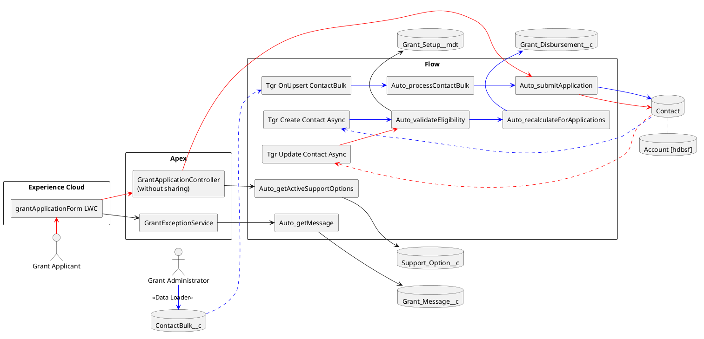

The LWC collects the published form fields and submits them as a Contact-shaped payload. `GrantApplicationController`, declared `without sharing`, passes that payload to `Auto_submitApplication`; the Flow finds the newest Contact with the exact Phone and the `hdbsf` Account, then creates or upserts the Contact. The success message currently exposes the returned Contact Id. The recommended `GrantSubmissionFacade`, allow-listed DTO, proofing boundary, and safe outcome contract are target controls, not source-confirmed implementation.

### 5.2 Layered Architecture

This logical view prevents public presentation code and CSV import tooling from directly owning grant calculations or Salesforce data mutations.

[Layered Architecture](<puml_1/05.02 Layered Architecture_Eng.puml>)

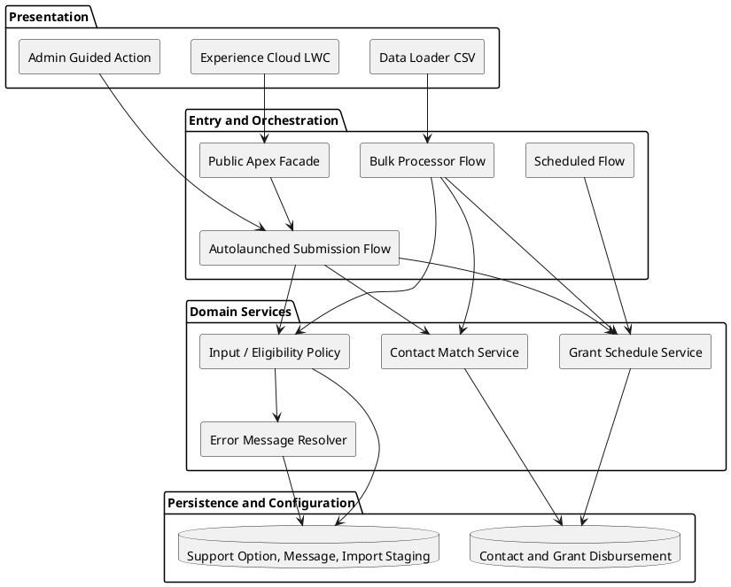

### 5.3 Public Trust Boundary

The public experience is deliberately write-only from the applicant's perspective. This view highlights that public caller convenience cannot relax data protection.

[Public Trust-Boundary View](<puml_1/05.03 Public Trust-Boundary View_Eng.puml>)

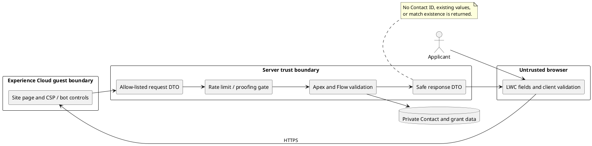

## 6. Business Process Architecture

### 6.1 Persona and User Story Map

This map ties the two personas required by Task 1 to their least-privilege capabilities and operating views.

[Persona and User Story Map](<puml_1/06.01 Persona and User Story Map_Eng.puml>)

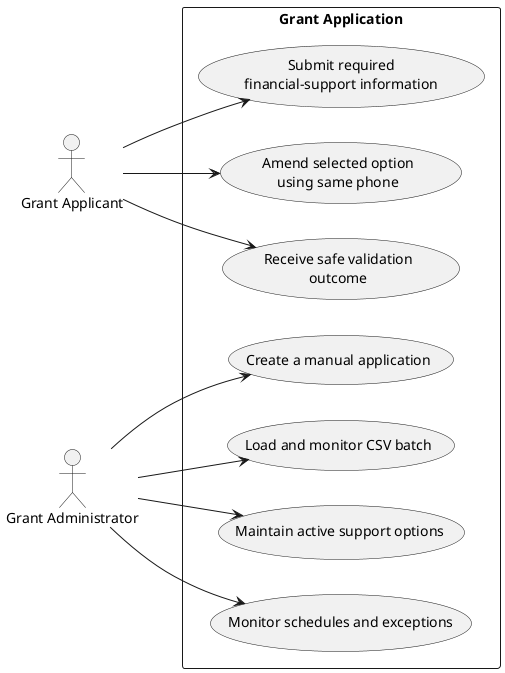

| Persona             | User story                                                                                                                                                 | Responsibilities and workspace                                                                                    |
| ------------------- | ---------------------------------------------------------------------------------------------------------------------------------------------------------- | ----------------------------------------------------------------------------------------------------------------- |
| Grant Applicant     | As a Grant Applicant, I want to submit my information and one support option online, so that Agency X can consider me for financial support.               | Uses only the public LWC; sees field-level guidance and a non-disclosing confirmation/error.                      |
| Grant Applicant     | As a Grant Applicant, I want to submit the same form when my details or option change, so that my financial support can be corrected.                      | Completes proofing before an existing Contact is amended; cannot browse Contact or schedule records.              |
| Grant Administrator | As a Grant Administrator, I want to create one application manually or load a batch, so that valid applicants and schedules are created efficiently.       | Uses a guided action, import staging list views, error queue, Contact, disbursement report, and option catalogue. |
| Grant Administrator | As a Grant Administrator, I want to manage available support options and see schedule exceptions, so that allocation rules remain current and transparent. | Maintains configuration under change control and monitors due, failed, and recalculation outcomes.                |

### 6.2 End-to-End Business Process Overview

The overall path has deliberately separate public/manual and CSV channels, then one common policy and schedule result.

[End-to-End Grant Process](<puml_1/06.02 End-to-End Grant Process_Eng.puml>)

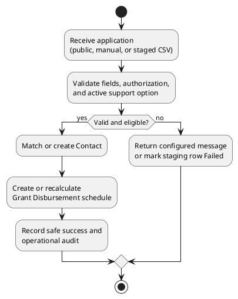

### 6.3 Public Application Submission

The public path enforces client usability validation first, but the server repeats every business validation before mutation. It is the definitive answer to User Story 1.

[Public Application Submission](<puml_1/06.03 Public Application Submission_Eng.puml>)

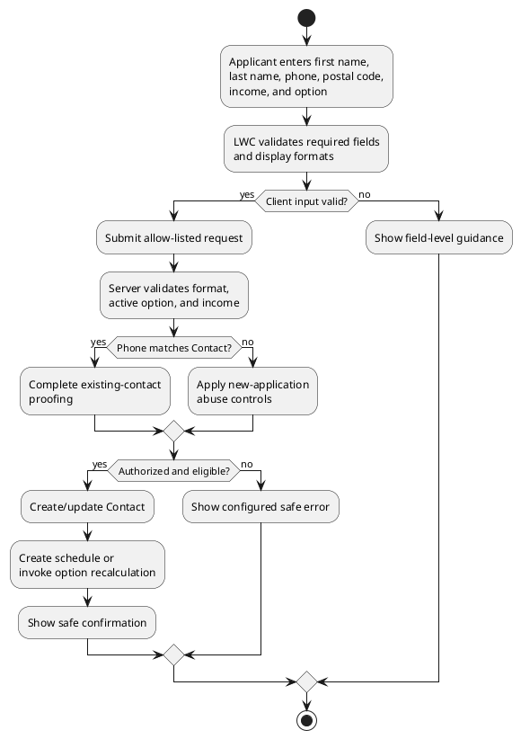

| Step              | Salesforce implementation                                          | Control / result                                                                                                                              |
| ----------------- | ------------------------------------------------------------------ | --------------------------------------------------------------------------------------------------------------------------------------------- |
| Capture           | grantApplicationForm LWC in Experience Cloud                       | Mandatory fields are labelled; option list comes from active Support_Option__c records.                                                       |
| Client validation | JavaScript pattern checks and lightning-input validity             | Phone accepts only 65 space 4 digits space 4 digits; postal code accepts exactly six digits. This improves feedback but is not authoritative. |
| Public call       | AuraEnabled facade accepts GrantSubmissionRequest, not raw Contact | Field allow-list, input size limits, anti-automation control, correlation ID, and no client-supplied Id/AccountId/eligibility/status.         |
| Server validation | Apex/Flow policy and Contact validation rules                      | Required values, strict formats, currency/income constraint, active option, duplicate handling, and message code resolution.                  |
| Eligibility       | Monthly income comparison                                          | Income below SGD 1,800.00 proceeds. Ineligible requests do not create/recalculate grant rows.                                                 |
| Contact action    | ContactMatchService                                                | New canonical phone creates a Contact; existing canonical phone updates only allowed fields after A-02 proofing.                              |
| Schedule          | GrantDisbursementService                                           | Generates a new schedule or atomically replaces only unpaid future rows after an option change.                                               |

### 6.4 Administrator Manual and Bulk Intake

This process gives administrators two input channels without creating a privileged validation bypass. Raw CSV is a staged request, not a direct Contact mutation.

[Administrator Manual and Bulk Intake](<puml_1/06.04 Administrator Manual and Bulk Intake_Eng.puml>)

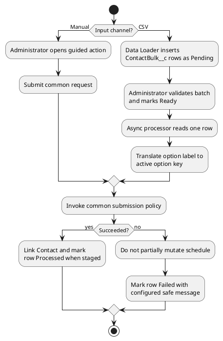

Manual entry uses the same contract as public submission but is available only to a Grant Administrator permission set. CSV mapping targets ContactBulk__c fields such as FirstName__c, LastName__c, Phone__c, MailingPostalCode__c, MonthlyIncome__c, SupportOptionRaw__c, and ImportBatch__c. The operator reviews Pending rows, sets a validated batch to Ready, and monitors Processed/Failed outcomes. Only the async processor may set Contact__c, ProcessedAt__c, ErrorMessage__c, and terminal status.

### 6.5 Support Option Change and Recalculation

This process implements User Story 3 without rewriting paid allocation history. It is serialized per Contact to prevent two channels changing the same schedule concurrently.

[Support Option Change and Recalculation](<puml_1/06.05 Support Option Change and Recalculation_Eng.puml>)

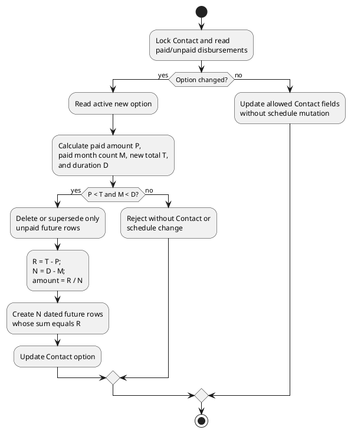

For a new option total **T**, already disbursed amount **P**, number of disbursed monthly rows **M**, and new-option duration **D**, the service permits a change only when P < T and M < D. It creates N = D − M future rows, with a total remaining value R = T − P. The regular amount is R / N, subject to Q-02 rounding policy, and the last row carries any approved residual so the sum is exactly R.

The stated example is preserved: after two SGD 500 disbursements, changing from Option 1 to Option 2 produces P=1,000, T=1,800, D=6, M=2, R=800, N=4 and therefore four future SGD 200 rows. If P is greater than or equal to T, or no months remain, no partial Contact update or schedule replacement occurs.

### 6.6 Monthly Disbursement Process

This process turns an approved schedule into an operational record. It does not represent a bank transfer because no payment system is in scope.

[Monthly Disbursement Process](<puml_1/06.06 Monthly Disbursement Process_Eng.puml>)

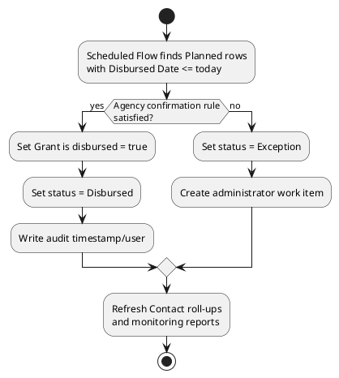

New schedules begin on the first day of the calendar month after the accepted submission. The due-date job must be idempotent: a re-run cannot mark the same row twice or create more rows. The checkbox is true only for the Disbursed state. If Finance cannot confirm the A-05 rule, the row remains Planned or moves to Exception for an authorized administrator; this prevents the system from claiming payment completion without evidence.

### 6.7 Exception and Manual Fallback

This shared exception path ensures a public error remains safe while an internal operator retains enough context to resolve the issue.

[Exception and Manual Fallback](<puml_1/06.07 Exception and Manual Fallback_Eng.puml>)

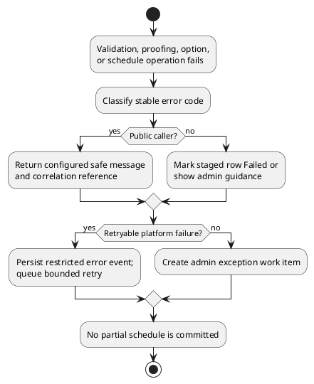

Examples include invalid phone/postal format, required field absent, inactive option, ineligible income, change-total-too-low, no remaining months, proofing failure, duplicate CSV row, and unexpected DML/platform failures. Only stable user messages are administrator-editable; raw exception text, phone values, and stack information must not be exposed on the public site.

## 7. Application Architecture

### 7.1 Application Layer Overview

This application view makes the runtime responsibilities explicit while retaining declarative configuration where it is reliable.

[Application Layer Overview](<puml_1/07.01 Application Layer Overview_Eng.puml>)

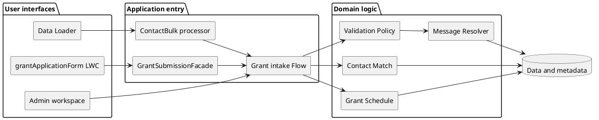

### 7.2 Service Component Layer

The services below are logical responsibilities. Names are target conceptual names unless an implementation component already uses that name; they are not a requirement to create a framework beyond the assessment scope.

[Service / Component Layer Design](<puml_1/07.02 Service Component Layer Design_Eng.puml>)

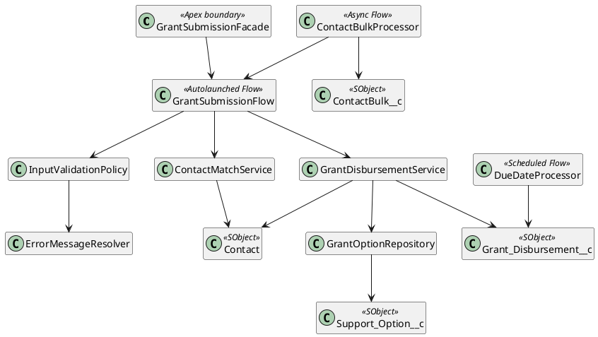

| Component                | Responsibility                                                                   | Transaction rule                                                                                                                                      |
| ------------------------ | -------------------------------------------------------------------------------- | ----------------------------------------------------------------------------------------------------------------------------------------------------- |
| GrantSubmissionFacade    | Public AuraEnabled entry and response mapping.                                   | Enforces input DTO allow-list, caller context, CRUD/FLS policy, rate/OTP gate, and safe response. It never returns Contact data or match information. |
| GrantSubmissionFlow      | Coordinates a single accepted request from public, manual, or bulk channel.      | Calls the same policy/service path and has fault connectors for support logging.                                                                      |
| InputValidationPolicy    | Checks required values, strict formats, income, option activity, and error code. | Has no DML. It can be tested independently and used in bulk collections.                                                                              |
| ContactMatchService      | Finds/create/updates the Contact using canonical phone.                          | Locks the matched Contact when schedule mutation is possible and writes only allow-listed applicant fields.                                           |
| GrantDisbursementService | Builds/recalculates child rows and handles due-date state.                       | Queries child rows FOR UPDATE, validates before DML, deletes/supersedes only unpaid future rows, then inserts a complete replacement set atomically.  |
| ContactBulkProcessor     | Processes Ready staging rows in controlled asynchronous work.                    | One file/phone policy; records terminal status, correlation, Contact link, and safe message per row.                                                  |
| ErrorMessageResolver     | Resolves code to safe language text.                                             | Does not expose internal exception details; default message is used only if configuration is unavailable.                                             |

### 7.3 Public Submission Sequence

This sequence shows the public runtime path including safe existing-contact proofing and an atomic schedule mutation.

[Public Submission Sequence](<puml_1/07.03 Public Submission Sequence_Eng.puml>)

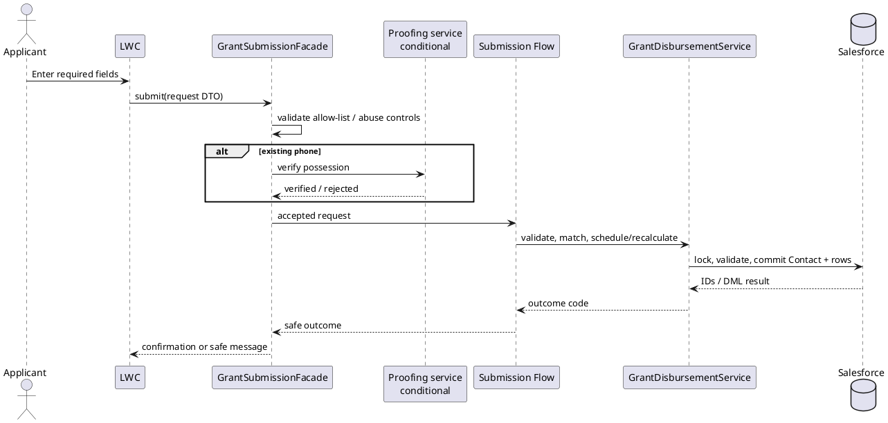

No call is successful until the Contact mutation and the full required Grant Disbursement schedule commit together. If a validation or DML error occurs, the service rolls the transaction back. A correlation reference, not a Salesforce record Id, is the appropriate public support reference.

### 7.4 Error Handling Strategy

This decision tree distinguishes expected business failures from retryable service faults and irrecoverable defects.

[Error Handling Strategy](<puml_1/07.04 Error Handling Strategy_Eng.puml>)

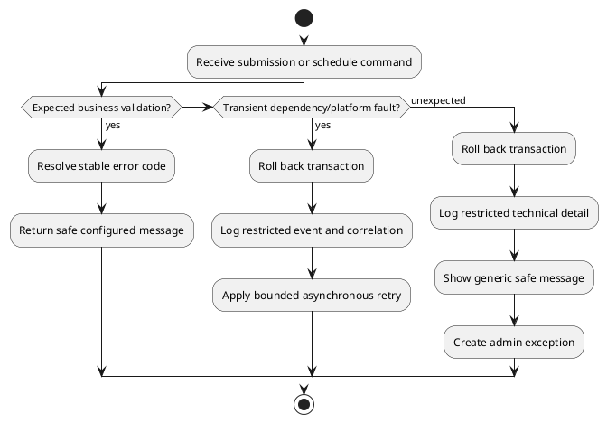

Expected failure messages include INVALID_PHONE_FORMAT, INVALID_POSTAL_CODE, REQUIRED_FIELD_MISSING, SUPPORT_OPTION_UNAVAILABLE, INCOME_NOT_ELIGIBLE, OPTION_TOTAL_TOO_LOW, OPTION_NO_REMAINING_MONTHS, UPDATE_NOT_AUTHORIZED, and DUPLICATE_PHONE_IN_BATCH. A validation failure leaves both Contact and disbursements unchanged. Retry is reserved for a verified transient dependency such as the conditional proofing provider; it is never used to retry a business rejection or a non-idempotent schedule operation blindly.

### 7.5 Configurable Business Rules

This data model places changing administrative policy outside hard-coded LWC labels and Apex constants, while preserving data integrity.

[Configurable Business Rules](<puml_1/07.05 Configurable Business Rules_Eng.puml>)

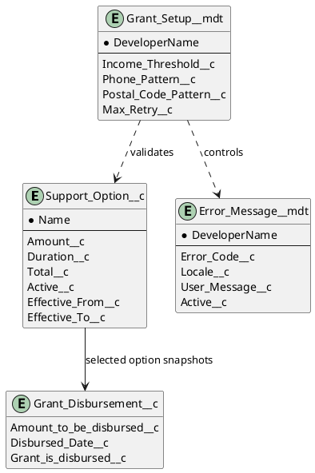

The initial catalogue is explicit: Option 1 = SGD 500 x 3 months (SGD 1,500); Option 2 = SGD 300 x 6 months (SGD 1,800); Option 3 = SGD 200 x 12 months (SGD 2,400). Administrators may add/edit options only through a restricted configuration permission set, with effective dates and change review. Changing a master option does not alter previously created rows: each Grant Disbursement stores its calculated amount and date snapshot. The master cannot be deactivated where it would leave a pending schedule without an agreed migration/recalculation plan.

### 7.6 Declarative and Programmatic Implementation Strategy

| Need                                         | Primary implementation                                       | Reason / guardrail                                                                                                     |
| -------------------------------------------- | ------------------------------------------------------------ | ---------------------------------------------------------------------------------------------------------------------- |
| Form interaction and immediate feedback      | LWC                                                          | Required channel/UI; performs client validation and uses accessible lightning base components.                         |
| Public mutation/security boundary            | Thin Apex facade plus request/response DTO                   | Required for an LWC imperative call, guest-context control, no raw sObject deserialization, proofing, and safe errors. |
| Required field/format enforcement            | LWC, server policy, Contact validation rules                 | Defense in depth ensures UI, manual, API, and staging paths agree.                                                     |
| Option lookup and notification orchestration | Flow                                                         | Administrator-maintainable branching and scheduled/no-code coordination.                                               |
| Contact/schedule calculation                 | Apex service                                                 | Cross-object aggregation, row locking, collection DML, all-or-none schedule replacement, and reusable Unit tests.      |
| Due-date marking                             | Scheduled Flow calling small idempotent service where needed | Clear operational schedule and administrator visibility; no payment system is presumed.                                |
| Bulk                                         | Staging object + asynchronous Flow                           | Isolates CSV source, controls sequencing, and provides row-level outcomes.                                             |
| Error wording                                | Metadata/controlled configuration                            | Lets authorized administrators change safe wording without exposing technical messages.                                |

### 7.7 Automation and Transaction Boundaries

This view identifies which automation is synchronous and where asynchronous processing begins. It avoids an unsafe pattern in which repeated CSV phones race to recalculate the same schedule.

[Automation and Transaction Boundaries](<puml_1/07.06 Automation and Transaction Boundaries_Eng.puml>)

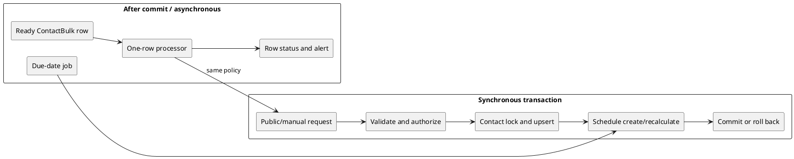

The submission transaction validates completely before removing or creating future rows. The async bulk path starts only after a staging record commits and should process one source file at a time. The due-date operation uses selection criteria and a terminal status/checkbox test so re-execution is harmless.

## 8. Data Architecture

### 8.1 Entity Relationship Diagram

The ERD makes Contact the applicant master and shows the schedule/configuration relationships required by the assessment.

[Entity Relationship Diagram](<puml_1/08.01 Entity Relationship Diagram_Eng.puml>)

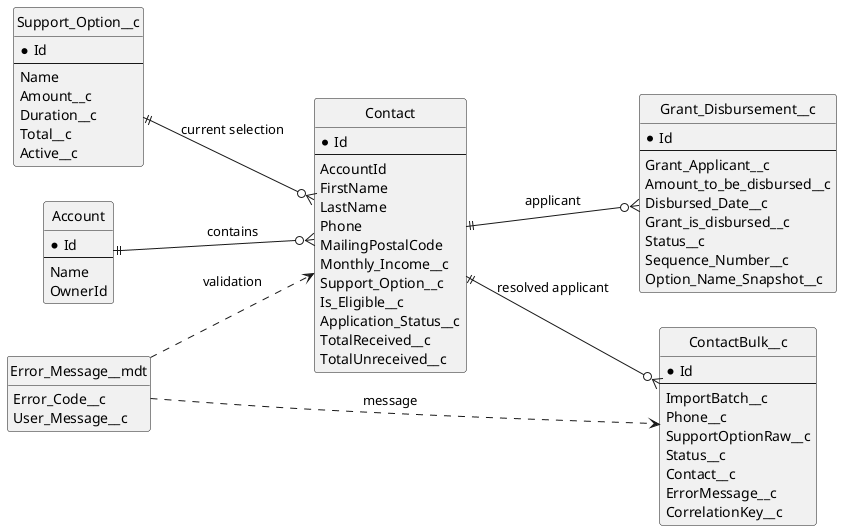

### 8.2 Core Data Model

| Entity                                | Purpose                                                                   | Ownership / key design                                                                                  |
| ------------------------------------- | ------------------------------------------------------------------------- | ------------------------------------------------------------------------------------------------------- |
| Account                               | Required parent strategy for Contact.                                     | Agency X defines a controlled applicant Account model under A-01; it is not exposed to public callers.  |
| Contact                               | Applicant master and current selected option.                             | Canonical Phone is the match key. The submission facade, not the LWC, owns match/upsert.                |
| Support_Option__c                     | Active catalogue of monthly amount, duration, total, and effective dates. | Grant Administrator configuration ownership; historic schedule rows are snapshots.                      |
| Grant_Disbursement__c                 | One planned/actual monthly allocation per Contact.                        | Child lookup to Contact; sequential unique schedule dates per Contact must be protected.                |
| ContactBulk__c                        | Restricted raw CSV staging and row-level results.                         | Data Loader integration/migration user creates source fields only; processor owns terminal fields.      |
| Error_Message__mdt / Grant_Message__c | Configurable safe user messages.                                          | Administrator maintains wording under release/change control; raw technical errors are not stored here. |

### 8.3 Recommended Objects and Fields

| Object                | Field                                                         | Use and validation                                                                                                                                      |
| --------------------- | ------------------------------------------------------------- | ------------------------------------------------------------------------------------------------------------------------------------------------------- |
| Contact               | FirstName, LastName                                           | Required for application; should be server-validated as nonblank.                                                                                       |
| Contact               | Phone                                                         | Required canonical format **65 6812 3456**. Prefer a uniqueness control/matching policy approved in A-03; no phone normalization drift across channels. |
| Contact               | MailingPostalCode                                             | Required exactly six numeric characters; preserve leading zeroes as text.                                                                               |
| Contact               | Monthly_Income__c                                             | Currency/number in SGD, non-negative, eligible only if strictly below the configured SGD 1,800 boundary.                                                |
| Contact               | Support_Option__c                                             | Lookup to an active Support_Option__c. Stores current choice, not historic schedule truth.                                                              |
| Contact               | Is_Eligible__c, Application_Status__c                         | Derived operational status such as Ineligible, Scheduled, Completed, or Exception; restrict public write access.                                        |
| Contact               | TotalReceived__c, TotalUnreceived__c, ReceivedMonths__c       | Roll-ups or recalculated derived fields for reporting and option-change validation; never take client input.                                            |
| Grant_Disbursement__c | Grant_Applicant__c                                            | Required Contact lookup.                                                                                                                                |
| Grant_Disbursement__c | Amount_to_be_disbursed__c                                     | Calculated snapshot; not editable by public users.                                                                                                      |
| Grant_Disbursement__c | Disbursed_Date__c                                             | First day of applicable month, unique in an active schedule per Contact.                                                                                |
| Grant_Disbursement__c | Grant_is_disbursed__c, Status__c                              | Derived lifecycle fields. The checkbox is true only when Status is Disbursed.                                                                           |
| Grant_Disbursement__c | Sequence_Number__c, Option_Name_Snapshot__c                   | Supports deterministic order, audit, and reporting when an option master later changes.                                                                 |
| ContactBulk__c        | ImportBatch__c, Status__c, ErrorMessage__c, CorrelationKey__c | Supports import control, row traceability, idempotency, and operator remediation.                                                                       |

### 8.4 Calculation and Data Integrity Rules

The following invariants must be enforced in the common domain service, backed by validation rules where record-local:

1. A public or imported request cannot supply Contact.Id, AccountId, derived eligibility/status fields, a disbursement Id, a paid indicator, or an amount.
2. A new submission creates **D** rows for its active option, each at the option's configured amount, dated from the first day of the next month through D months.
3. An update with unchanged option can update allowable Contact profile values after authorization; it does not recreate paid or future schedule rows unnecessarily.
4. For a changed option, P is the sum of only Disbursed rows, M is their count, T is selected option Total__c, and D is selected option Duration__c. Reject unless P < T and M < D.
5. When permitted, paid rows are immutable. Existing unpaid future rows are removed or marked Superseded only inside the same transaction that creates the replacement rows. The replacement total is exactly T − P.
6. The transaction locks the Contact and queried active schedule rows. A uniqueness rule/duplicate check prevents duplicate Contact phone matches and duplicate active sequence/date rows.
7. A scheduled job can move Planned to Disbursed once only; no public or generic import user can set Grant_is_disbursed__c.

### 8.5 Applicant Lifecycle

This status model governs the operational Contact application view. It does not invent a separate Grant Application record.

[Applicant Lifecycle](<puml_1/08.05 Applicant Lifecycle_Eng.puml>)

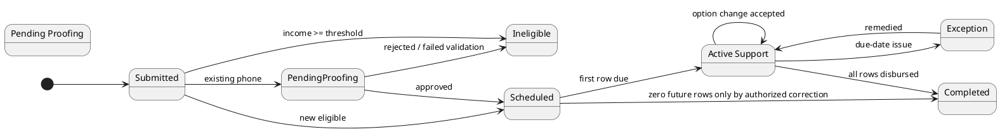

### 8.6 Grant Disbursement Lifecycle

This state model is the authoritative meaning of the required checkbox and supports finance validation without naming a payment integration.

[Grant Disbursement Lifecycle](<puml_1/08.06 Grant Disbursement Lifecycle_Eng.puml>)

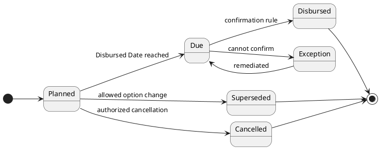

Paid/disbursed rows are immutable for option-recalculation purposes. Superseded is a preferred audit state if policy requires retention; physical deletion of unpaid rows is acceptable only when audit requirements explicitly permit it. The target schema should add Status__c if the existing checkbox alone cannot distinguish planned, exception, superseded, and cancelled states.

## 9. Integration and Bulk-Intake Architecture

### 9.1 Integration Pattern Matrix

Task 1 does not explicitly require an external system integration. This matrix documents the inbound/public, import, and conditional proofing interfaces necessary to operate the design without inventing a financial or identity provider.

| Interface                   | Source / target                                        | Trigger and pattern                                     | Authentication / authorization                                                                                                               | Failure, idempotency, reconciliation                                                                                                              |
| --------------------------- | ------------------------------------------------------ | ------------------------------------------------------- | -------------------------------------------------------------------------------------------------------------------------------------------- | ------------------------------------------------------------------------------------------------------------------------------------------------- |
| Public application          | Browser LWC -> GrantSubmissionFacade                   | Synchronous HTTPS/Apex invocation on form submit.       | Guest site class access only to facade; facade accepts a narrow DTO and rate/abuse controls. Existing Contact updates require A-02 proofing. | Client-supplied correlation ID or server-generated nonce. No Contact ID/match response; error is safe and retryable only before confirmed commit. |
| Manual application          | Administrator guided action -> Submission Flow/service | Synchronous internal Flow/action.                       | Grant Administrator permission set, CRUD/FLS, and option/config access.                                                                      | Request correlation and all-or-none Contact/schedule transaction.                                                                                 |
| CSV intake                  | Data Loader/ETL -> ContactBulk__c -> processor         | Asynchronous staged record processing.                  | Dedicated least-privilege import user; no direct Contact or Grant Disbursement create/update permission for the loader path.                 | ImportBatch + row correlation key; terminal Processed/Failed state; batch counts reconcile source rows to outcome rows.                           |
| Conditional phone proof     | Facade -> OTP provider                                 | Synchronous verification challenge/response.            | Modern Named Credential/External Credential with named principal and least-privilege endpoint scope; provider selection Q-01.                | Provider timeout is retryable only before DML. Challenge ID is never a Contact identifier; retain minimum audit evidence.                         |
| Future payment confirmation | Not designed                                           | Out of scope unless Q-02 identifies a financial system. | TBD.                                                                                                                                         | Do not treat a scheduled checkbox as external-payment settlement.                                                                                 |

### 9.2 CSV Staging Data Flow

This diagram describes the data boundary for the stated bulk-upload requirement. It makes Data Loader a source of requests, not a back door around grant policy.

[CSV Staging Data Flow](<puml_1/09.01 CSV Staging Data Flow_Eng.puml>)

```plantuml
@startuml
left to right direction
skinparam componentStyle rectangle
actor "Grant Administrator" as Admin
component "CSV file\none current row / phone" as CSV
component "Data Loader / approved ETL" as Loader
database "ContactBulk__c\nPending / Ready / Processed / Failed" as Stage
component "After-commit bulk processor" as Processor
component "Common submission service" as Service
database "Contact + Grant Disbursement" as Core
component "Import exception dashboard" as Dashboard
Admin --> CSV
CSV --> Loader
Loader --> Stage : insert source fields
Admin --> Stage : approve batch Ready
Stage --> Processor
Processor --> Service
Service --> Core
Stage --> Dashboard
Core --> Dashboard
@enduml
```

The processor validates the same phone/postal/income/option rules as public submission and uses the same match/schedule service. It does not perform a direct Contact Data Loader upsert. The mapping retains the original source value in SupportOptionRaw__c, maps it to an active option by a governed key/name, and records a row-level safe reason if no unique active option is found. Processing one source file at a time and one row per phone is the deliberate concurrency control in A-06.

### 9.3 Retry, Idempotency, and Reconciliation

This operational flow keeps retry behavior bounded and prevents an imported or public reattempt from duplicating financial allocations.

[Retry, Idempotency, and Reconciliation](<puml_1/09.02 Retry Idempotency Reconciliation_Eng.puml>)

```plantuml
@startuml
start
:Receive correlated request;
if (Outcome already terminal?) then (yes)
  :Return stored safe outcome\nor skip staged row;
  stop
endif
:Execute all-or-none policy;
if (Committed?) then (yes)
  :Persist success correlation\nand schedule totals;
else (no)
  :Roll back Contact/schedule;
  if (Transient external fault?) then (yes)
    :Increment bounded retry count;
    :Retry after backoff;
  else (no)
    :Persist Failed / exception\nwith safe error code;
  endif
endif
:Reconcile source count, terminal\nrow count, Contact links, and\nschedule row/amount totals;
stop
@enduml
```

Idempotency is achieved with a stable channel-specific correlation key. For CSV it is ImportBatch__c plus a source row key/content hash; for a public request it is a server-issued submission nonce held for a short, policy-approved window. A duplicate of a successful correlation returns a safe existing outcome rather than building another schedule. A Contact-level row lock protects valid distinct requests that reach the same applicant close together.

### 9.4 Integration Security and Credential Model

There is no Named Credential to deploy until Q-01 identifies an OTP provider. When it exists, the modern Salesforce Named Credential defines the endpoint and transport; External Credential defines the authentication protocol and principal; a permission-set mapping gives the server integration principal access. Credentials, client secrets, OTP responses, and endpoint tokens never reside in LWC, Flow variables logged to broad audiences, CSV, custom fields, source control, or error-message configuration.

The proofing request should contain only an opaque challenge, phone value over TLS where unavoidable, and purpose. Log provider request IDs, outcome code, timestamps, and correlation—not raw response payloads. Configure connect/read timeouts and a bounded retry policy only after provider contract validation. The design does not require middleware; introduce it only if Agency X needs central API policy, orchestration, transformation, or vendor abstraction.

## 10. Security, Access, Identity, and Compliance

### 10.1 Role-Based Access and Visibility Model

This view separates public request access from internal record access and keeps schedule mutation out of the guest permission model.

[Role-Based Access and Visibility Model](<puml_1/10.01 Role-Based Access and Visibility Model_Eng.puml>)

```plantuml
@startuml
left to right direction
skinparam componentStyle rectangle
package "Personas" {
  [Guest Applicant] as Guest
  [Grant Administrator] as Admin
  [Integration / Import User] as Integration
  [System Administrator] as Sys
}
package "Controls" {
  [Guest page + Apex class allow-list] as GuestControl
  [Permission Set + FLS + sharing] as AdminControl
  [API-only least privilege] as IntControl
  [Break-glass audited access] as SysControl
}
package "Protected assets" {
  [Contact PII and income] as PII
  [Grant schedules] as Schedules
  [Configuration and errors] as Config
  [Import staging / technical logs] as Logs
}
Guest --> GuestControl
Admin --> AdminControl
Integration --> IntControl
Sys --> SysControl
GuestControl --> PII : controlled server write only
AdminControl --> PII
AdminControl --> Schedules
AdminControl --> Config
IntControl --> Logs
SysControl --> PII
SysControl --> Schedules
SysControl --> Config
SysControl --> Logs
@enduml
```

### 10.2 Persona Access Matrix

| Persona                        | Contact                                                                                  | Grant Disbursement                                            | Support Option / messages                                                                          | ContactBulk and technical error                                    | Key restriction                                                                                                      |
| ------------------------------ | ---------------------------------------------------------------------------------------- | ------------------------------------------------------------- | -------------------------------------------------------------------------------------------------- | ------------------------------------------------------------------ | -------------------------------------------------------------------------------------------------------------------- |
| Guest Applicant                | No direct object read. Controlled create/update through the facade only.                 | No direct access.                                             | Read only through server-provided active-option DTO; no configuration access.                      | None.                                                              | Cannot obtain Contact IDs, existing Contact fields, schedule, or match existence. Existing update requires proofing. |
| Grant Administrator            | Read/update applicant fields required by business process; no raw API privileged facade. | Read; update lifecycle only if Finance authorization permits. | Manage active options/messages through a dedicated configuration permission set and change record. | Read own/assigned batches, resolve failures, replay within policy. | Cannot edit paid amount/history or technical error payload without elevated support role.                            |
| Import User                    | No direct Contact/Grant Disbursement write in normal import route.                       | None.                                                         | Read active option lookup only if processor does not supply lookup.                                | Create source staging fields only.                                 | API-only; cannot set terminal status, Contact link, eligibility, paid flag, or error fields.                         |
| System Administrator / Support | Administrative access under audited, time-bound process.                                 | Administrative exception support.                             | Deploy/manage metadata and credential assignment.                                                  | Restricted log/support access.                                     | Break-glass access and change approval required.                                                                     |

### 10.3 Public Submission and Existing-Contact Proofing

This sequence is a security architecture, not a claim that a particular OTP service is already contracted.

[Public Submission Identity Flow](<puml_1/10.03 Public Submission Identity Flow_Eng.puml>)

```plantuml
@startuml
actor Applicant
participant "Experience Cloud LWC" as LWC
participant "GrantSubmissionFacade" as Facade
participant "OTP provider\nTBD" as OTP
database "Contact" as Contact
Applicant -> LWC : Enter application
LWC -> Facade : validate/submit DTO
Facade -> Contact : private phone match
alt no matching Contact
  Facade --> LWC : continue new application
else matching Contact
  Facade -> OTP : send/verify challenge
  OTP --> Facade : verified / rejected
  alt verified
    Facade --> LWC : continue amendment
  else rejected
    Facade --> LWC : safe non-disclosing outcome
  end
end
@enduml
```

The public LWC must not query Contact or schedule records, even to decide which visual path to show. The facade evaluates matching privately. Any OTP provider must be configured behind secure credentials and rate-limited. If Q-01 is not resolved, the safe production fallback is to accept only a new request for manual review rather than automatically update an existing applicant, even though that does not fully meet User Story 3; therefore Q-01 is a go-live blocker.

### 10.4 Security Controls

| Control                       | Design                                                                                                                                                                                                                      |
| ----------------------------- | --------------------------------------------------------------------------------------------------------------------------------------------------------------------------------------------------------------------------- |
| Org-wide defaults and sharing | Set Contact and Grant_Disbursement__c internal sharing to Private unless a documented Agency X operating model requires broader access. Child schedule access is controlled by parent/sharing design.                       |
| Permission sets               | Separate Guest Site, Grant Administrator, Grant Configuration, Import User, Finance/Disbursement Operator, and break-glass System Support permissions. Avoid profile-based broad grants.                                    |
| CRUD/FLS                      | Apex validates accessible/createable/updateable allow-listed fields; strip inaccessible output; Flow runs with explicitly reviewed context. No public setter for derived/financial fields.                                  |
| Guest hardening               | Restrict site pages, CSP trusted sites, class access, object/field permissions, file upload (not required here), rate limits, bot protection, cache headers, and error detail. Guest users have no default record browsing. |
| PII minimization              | Collect only requirement fields. Phone and income are sensitive; mask or exclude them from broad reports, CSV result sharing, debug logs, and public response.                                                              |
| Audit                         | Track configuration changes, option-change outcomes, due-date state changes, import batches, login/API activity where licensed, and administrator actions. Field history/long-term audit entitlement is Q-05.               |
| Secrets                       | Use External Credentials/Named Credentials for any provider. Never hardcode tokens, endpoints with secrets, or credentials in LWC, Apex, Flow, CSV, or Git.                                                                 |
| Secure coding                 | Use request DTOs, parameterized SOQL/bind variables, CRUD/FLS checks, sharing review, no client-controlled dynamic object/field name, collection DML, and defensive exception handling.                                     |

### 10.5 Privacy, Audit, and Segregation of Duty

Monthly income and phone are personal data. The design needs Legal confirmation of purpose limitation, consent/notice, retention, subject-access handling, data residency, backup/archive, and deletion exceptions before production. A Grant Administrator who maintains Support Option amounts should not be the sole approver of their effective-date change or of a disbursement exception; Finance/Operations approval and audit evidence are recommended. The user role that imports CSV should not have permission to mark grants disbursed or change configuration.

## 11. Data Volume and Lifecycle Strategy

### 11.1 Data Volume and Storage Strategy

No historical migration volume, daily submission volume, file size, file upload requirement, retention duration, or source system is supplied. This SADD therefore makes no annual-growth calculation and does not copy any other task's figures. Capacity sizing is a discovery deliverable in Q-04/Q-05.

The initial data footprint is low per application: one Contact update and D Grant_Disbursement__c rows, where D is current option duration. The known initial options create 3, 6, or 12 rows. Storage forecasts must include Contact, schedule, staging rows, technical audit/error records, Reports/Dashboards, and any future proofing evidence—not an unsupported file-storage estimate.

### 11.2 Import Lifecycle and Operational Data Flow

This lifecycle replaces a historical-migration diagram because migration is not a stated requirement. It is directly relevant to the required bulk upload.

[Bulk Data Lifecycle](<puml_1/11.01 Bulk Data Lifecycle_Eng.puml>)

```plantuml
@startuml
left to right direction
database "Validated CSV source" as Source
database "ContactBulk__c\nPending" as Pending
database "ContactBulk__c\nReady" as Ready
database "ContactBulk__c\nProcessed / Failed" as Terminal
database "Contact and active schedule" as Core
database "Archived batch evidence\npolicy TBD" as Archive
Source --> Pending
Pending --> Ready : operator review
Ready --> Core : common policy
Ready --> Terminal : outcome
Terminal --> Archive : retention decision
Core --> Archive : audit/archive decision
@enduml
```

The operator should prevalidate UTF-8 CSV headers, mandatory columns, option labels, duplicate phones within the source, and row count before insert. Data Loader result files and the ContactBulk__c terminal state are both retained according to Q-03, but access is limited because they can contain PII. Failed rows are corrected as new/replayed rows with a new correlation key only after the original failure has been understood; an operator must not edit a Processed row back to Ready.

### 11.3 Large-Data-Volume Design

| Concern                        | Design response                                                                                                                                                                           |
| ------------------------------ | ----------------------------------------------------------------------------------------------------------------------------------------------------------------------------------------- |
| Unknown volume                 | Capture submissions/day, peak concurrency, batch count/size, scheduling window, retention, and report refresh needs before performance acceptance.                                        |
| Query selectivity              | Query schedules by status/date/contact and use indexed standard fields where possible. Consider a custom external-id/correlation key only after a specific API/import contract is agreed. |
| Data skew / concurrent updates | One source row per phone per active batch; Contact row lock; sequential processor/work partitioning; do not submit competing option changes asynchronously.                               |
| Automation limits              | No DML/SOQL in loops; collection DML; per-row error isolation in the staging processor; tune asynchronous batch size in testing.                                                          |
| Reporting                      | Use filtered reports by status/date/option and archive old staging/error data according to policy.                                                                                        |
| Backup/recovery                | Confirm backup product/RPO/RTO and restore procedure in Q-05. A scheduled report is not a backup.                                                                                         |

### 11.4 Reconciliation, Cutover, and Rollback

For an import batch, acceptance requires: source rows equal Processed + Failed rows; every Processed staging row links to exactly one Contact; each eligible successful current request has exactly D active rows or a recalculated N-row remainder; the active scheduled total equals required option total minus paid amount; no duplicate active sequence/date exists for the Contact; and all Failed rows have a safe code and operator path.

There is no stated legacy migration or production cutover. If one is later added, it must have a separately approved source profile, mapping, deduplication, pilot, load window, reconciliation, validation, rollback checkpoint, and acceptance criteria. Do not treat the Task 1 CSV sample as authorization to migrate an unknown historical system.

## 12. Reporting, Monitoring, and Operational Support

### 12.1 Operational Monitoring Model

This model connects operational data to action-focused monitoring rather than claiming service-level targets the requirement never sets.

[Operational Monitoring Model](<puml_1/12.01 Operational Monitoring Model_Eng.puml>)

```plantuml
@startuml
left to right direction
skinparam componentStyle rectangle
database "Contact and status" as Contact
database "Grant Disbursement\nplanned/due/disbursed/exception" as Disb
database "ContactBulk and errors" as Bulk
component "Operational reports" as Reports
component "Grant Administrator dashboard" as Dashboard
component "Exception work queue" as Queue
Contact --> Reports
Disb --> Reports
Bulk --> Reports
Reports --> Dashboard
Reports --> Queue : overdue, failed, exception
@enduml
```

| Dashboard / report     | Source and calculation                                                                         | Consumer / action                                                                                                                                 |
| ---------------------- | ---------------------------------------------------------------------------------------------- | ------------------------------------------------------------------------------------------------------------------------------------------------- |
| Application outcome    | Contact Application_Status__c and CreatedDate                                                  | Grant Administrator identifies eligible, ineligible, proofing, scheduled, and exception population.                                               |
| Scheduled allocation   | Grant_Disbursement__c grouped by Status__c, Disbursed_Date__c, Support Option snapshot, amount | Finance/administrator sees upcoming and completed allocation amounts; amounts are planning figures unless payment confirmation scope is approved. |
| Due/exception worklist | Planned/Due/Exception schedule rows, due date, correlation                                     | Operator resolves dates that cannot be marked according to A-05.                                                                                  |
| Option-change audit    | Contact option change event, paid total, new total, recalculation outcome/code                 | Configuration/operations review safety and outcome.                                                                                               |
| Import quality         | ContactBulk status/error/batch/processed timestamp                                             | Administrator reconciles CSV results and fixes failed rows.                                                                                       |
| Public reliability     | Restricted facade/Flow faults by code/correlation and proofing outcome category                | Support monitors error trends without exposing PII.                                                                                               |

### 12.2 Outcome Evaluation Model

This model distinguishes financial schedule reporting from business effectiveness targets, which are not provided.

[Outcome Evaluation Model](<puml_1/12.02 Outcome Evaluation Model_Eng.puml>)

```plantuml
@startuml
left to right direction
database "Application data" as App
database "Schedule data" as Schedule
database "Import/error data" as Ops
component "Quality metrics\nvalidity, duplicate, failure rate" as Quality
component "Allocation metrics\nplanned, disbursed, exceptions" as Allocation
component "Configuration metrics\noption uptake/change outcomes" as Config
component "Operations review" as Review
App --> Quality
Ops --> Quality
Schedule --> Allocation
App --> Config
Schedule --> Config
Quality --> Review
Allocation --> Review
Config --> Review
@enduml
```

No target KPI, SLA, approval turnaround, payment completion rate, or service-level threshold is specified. Dashboard values should be descriptive until Agency X approves targets. Do not infer that a planned date equals bank-payment success, or that an ineligible count represents a policy defect.

## 13. Non-Functional Requirements

| Area                        | Design response and validation                                                                                                                                                                                                                                    |
| --------------------------- | ----------------------------------------------------------------------------------------------------------------------------------------------------------------------------------------------------------------------------------------------------------------- |
| Security and privacy        | Private data model, guest write boundary, proofing gate for existing updates, least privilege, field allow-list, credentials outside code, PII minimization, audit. Pen-test public site and complete privacy review before go-live.                              |
| Reliability                 | All-or-none Contact/schedule mutation, paid rows immutable, idempotency keys, staged import terminal states, due-date re-run safety, bounded retries only for transient dependencies.                                                                             |
| Performance and scalability | Bulkified Apex, collection DML, selective queries, async staging, one-phone serialization. Establish load/concurrency targets only after Q-04.                                                                                                                    |
| Availability / recovery     | Salesforce availability is platform-dependent; define RTO/RPO, backup, restore exercises, provider outage behavior, and manual fallback in validation items.                                                                                                      |
| Maintainability             | Configuration-driven options/messages, small cohesive services, Flow for transparent orchestration, no hard-coded financial rules, runbooks, source-controlled metadata.                                                                                          |
| Accessibility               | Use standard Lightning base components, label/help text, keyboard operation, error association, color-independent status, and test the public LWC against Agency X accessibility standard.                                                                        |
| Localization                | Requirement wording is English and amounts are SGD. Support message locale, date format, and language needs are Q-03/Q-04; phone format remains strict.                                                                                                           |
| Observability               | Correlation IDs, restricted event logs, Flow fault records, import status, scheduled job outcome reports; no raw sensitive payload in logs.                                                                                                                       |
| Testability                 | Unit tests cover each option, first-of-next-month date calculation, strict threshold, invalid formats, duplicate/match behavior, allowed/prohibited changes, bulk rows, race/lock failure, due-date idempotency, CRUD/FLS/guest boundary, and safe error mapping. |

## 14. Risks and Mitigation

| ID    | Risk / trigger                                                         | Impact                                                        | Mitigation and contingency                                                                                     | Owner                     |
| ----- | ---------------------------------------------------------------------- | ------------------------------------------------------------- | -------------------------------------------------------------------------------------------------------------- | ------------------------- |
| RK-01 | Public user knows another person's phone number; no proofing selected. | Unauthorized Contact amendment or grant schedule change.      | Q-01 is go-live blocker; use rate-limited OTP/identity proof or route changes to authorized manual review.     | Security / Product        |
| RK-02 | Administrator edits an option already used by active schedules.        | Historic/reporting ambiguity or unintended future allocation. | Snapshot schedule values; effective dates/change approval; prevent unsafe deactivate/edit; test recalculation. | Grant Configuration Owner |
| RK-03 | Two CSV rows or channels change same Contact concurrently.             | Duplicate or incorrect future schedules.                      | One-phone-per-batch policy, correlation keys, Contact lock, sequential staging, all-or-none DML.               | Technical Owner           |
| RK-04 | Scheduled checkbox treated as actual bank settlement.                  | Financial reporting misstatement.                             | Label scope as allocation schedule; add finance confirmation/payment integration only after Q-02.              | Finance                   |
| RK-05 | Bulk importer writes Contacts directly.                                | Validation and schedule rules bypassed.                       | Remove direct object rights from normal import user; map only to staging; reconcile terminal rows.             | Salesforce Admin          |
| RK-06 | Phone normalization differs by UI/import/channel.                      | Duplicate Contacts or incorrect amendments.                   | One canonical policy, shared server validation, test display format, prevalidate CSV.                          | Technical Owner           |
| RK-07 | Guest error exposes PII or technical details.                          | Privacy/security incident.                                    | Safe error-code mapping, generic failure messages, restricted logs, review cache/CSP/class access.             | Security                  |
| RK-08 | Unknown volume/retention/backup requirements are ignored.              | Capacity, recovery, or compliance failure.                    | Complete Q-03 to Q-05 before production sizing and operational acceptance.                                     | Product / Operations      |

## 15. Architectural Decision Records

| ADR     | Decision                                                                               | Requirement / context                                                                                                            | Alternatives considered                                                         | Consequences / trade-offs                                                                                                |
| ------- | -------------------------------------------------------------------------------------- | -------------------------------------------------------------------------------------------------------------------------------- | ------------------------------------------------------------------------------- | ------------------------------------------------------------------------------------------------------------------------ |
| ADR-001 | Use standard Contact as applicant master, not a new Grant Application object.          | Contact is explicitly required; one current application/option is described.                                                     | Create Grant_Application__c for history; store everything only in disbursement. | Simplifies scope and meets requirement. Revisit if policy permits repeated programmes or needs full application history. |
| ADR-002 | Use Grant_Disbursement__c as the monthly allocation schedule.                          | Requirement explicitly calls for monthly Grant Disbursed records with Contact, amount, flag, and date.                           | Tasks, Opportunities, or a single total field.                                  | Preserves month-level transparency; needs lifecycle/retention controls.                                                  |
| ADR-003 | Use Support_Option__c configuration with schedule snapshots.                           | Administrators need to add/edit options.                                                                                         | Hard-code options; Custom Metadata only.                                        | Runtime management is possible; change governance and effective dates are essential.                                     |
| ADR-004 | Centralize Contact upsert and schedule recalculation behind common Flow/Apex services. | Public, manual, and CSV inputs must have same rules; bulk must not bypass validation.                                            | Separate channel-specific logic; direct Contact import.                         | More deliberate architecture but prevents rule drift and duplicate schedules.                                            |
| ADR-005 | Use Apex for lock-safe grant schedule calculation and Flow for orchestration.          | Cross-object paid-total calculation and atomic future-row replacement need bulk-safe behavior; assessment requires Apex quality. | All Flow; all Apex.                                                             | Clear responsibility split; requires Apex tests and Flow fault-path tests.                                               |
| ADR-006 | Treat public existing-phone amendments as proofed operations.                          | Phone match alone is not authorization to change financial-support information.                                                  | Trust phone only; require full authenticated portal before all submissions.     | Adds Q-01 provider/journey dependency; prevents insecure automatic updates.                                              |
| ADR-007 | Use ContactBulk__c staging, not a direct bulk Contact upsert.                          | CSV must yield Contacts and schedules without bypassing validation.                                                              | Data Loader direct Contact upsert.                                              | Extra object/process but row-level observability, common validation, replay control, and privacy safer.                  |
| ADR-008 | Separate planned/disbursed allocation state from bank settlement.                      | Requirement says grants are considered disbursed on date but names no payment system.                                            | Claim payment transfer; mark at creation.                                       | Schedule can be operationally useful without false settlement claim; Finance must approve confirmation rule.             |
| ADR-009 | Keep error messages configurable by stable code and protect technical evidence.        | User-friendly/admin-manageable messages are required.                                                                            | Hard-coded strings; expose raw exception.                                       | More configuration; requires metadata governance and locale strategy.                                                    |

## 16. Deployment, Testing, and Governance

### 16.1 Deployment Architecture

The implementation should move as source-controlled Salesforce metadata through isolated environments. Secrets and provider credentials are created/configured per environment and are never promoted in source.

[Deployment and Quality Pipeline](<puml_1/16.01 Deployment and Quality Pipeline_Eng.puml>)

```plantuml
@startuml
left to right direction
skinparam componentStyle rectangle
component "Git source\nLWC, Apex, Flow, metadata" as Git
component "Static analysis\nformat/lint/security" as Static
component "Scratch / dev org\nunit tests" as Dev
component "Integration test org\npublic, bulk, scheduler" as Test
component "UAT / security approval" as UAT
component "Production deployment" as Prod
component "Post-deploy smoke\nand monitoring" as Smoke
Git --> Static
Static --> Dev
Dev --> Test
Test --> UAT
UAT --> Prod
Prod --> Smoke
@enduml
```

### 16.2 Test and Release Gates

| Gate                   | Evidence required                                                                                                                                                                                             |
| ---------------------- | ------------------------------------------------------------------------------------------------------------------------------------------------------------------------------------------------------------- |
| Build quality          | LWC lint/unit tests, Apex formatting/static analysis, PMD/security review, Flow metadata validation, no secret in repository, and dependency/license review.                                                  |
| Apex coverage          | At least 90% cumulative coverage for all grant Apex code as specified; also require meaningful assertions, not coverage-only execution.                                                                       |
| Functional tests       | New Contact for each initial option; strict income below/at/above 1,800; phone/postal/required-field errors; current Contact update; valid/invalid option changes; schedule dates/amounts; due-date behavior. |
| Bulk tests             | Valid mixed rows, invalid rows, matching phones, inactive option, duplicate phone in file, rerun same batch, a large representative batch, and row-count/amount reconciliation.                               |
| Security tests         | Guest cannot read/browse Contacts or schedules, cannot set protected fields, API facade leaks no match data, proofing/rate limit behavior, FLS/CRUD/sharing tests, session/cache/CSP review.                  |
| Operational acceptance | Administrator can maintain controlled option/message configuration, monitor/replay failed rows, resolve exception schedule rows, and execute backup/restore or documented fallback drill.                     |

### 16.3 Governance

Support option changes, message wording changes, eligibility threshold changes, finance due-date confirmation, public LWC releases, guest permissions, and credential rotation require named owners and auditable change approval. The Grant Administrator owns day-to-day data operations but does not independently approve financial-policy changes. Architecture review must close Q-01 through Q-05, establish RTO/RPO/retention, and validate commercial entitlements before a production release.
