# Solution Architecture Design Document (SADD) — SADD Grant Application: Baseline Source-Grounded dan Target Remediation

## 1. Ringkasan Eksekutif

Dokumen ini mendefinisikan baseline arsitektur dan target remediation Salesforce untuk proses aplikasi bantuan finansial Agency X pada **Salesforce Technical Assessment v3.2 — Task 1**. Baseline ditelusuri terhadap seluruh artefak Salesforce di force-app/main/default: tiga Apex class produksi, sembilan Flow aktif, satu bundle LWC, object/field/validation rule, permission set, sharing rule, layout, list view, custom metadata, dan tab metadata. Cakupan meliputi aplikasi publik Experience Cloud, LWC, Contact sebagai applicant, eligibility, support option, Grant_Disbursement__c, dan CSV staging.

Baseline implementasi memakai Contact sebagai applicant dengan Support_Option__c dan Grant_Disbursement__c. Namun belum ada satu secure submission boundary: LWC publik mengirim raw payload berbentuk Contact ke GrantApplicationController yang dideklarasikan tanpa sharing dan memanggil Auto_submitApplication. Contact disimpan lebih dahulu, lalu Flow record-triggered asynchronous mengevaluasi eligibility/recalculation hanya jika start criteria terpenuhi. CSV staging memakai Auto_submitApplication tetapi memiliki parser label hard-coded yang berbeda. Fakta ini dipisahkan dari target remediation; target tidak dianggap sudah deployed.

Tidak ada authorization org Salesforce lokal yang valid: sf org list melaporkan tidak ada org yang dapat digunakan dan auth file berbasis macOS Keychain tidak valid. Karena itu seluruh pernyataan berlabel **Source-confirmed** adalah fakta repository; active deployment, data, master record, permission efektif, test run, dan package state di org belum terverifikasi.

## 2. Cakupan Requirement

### 2.1 Peta Cakupan Requirement

Peta berikut menunjukkan pemetaan requirement eksplisit ke capability target. Label teknis Salesforce dipertahankan dalam bahasa Inggris agar konsisten dengan metadata dan API.

[Peta Cakupan Requirement](<puml_1/02.01 Requirement Coverage Map_Ind.puml>)

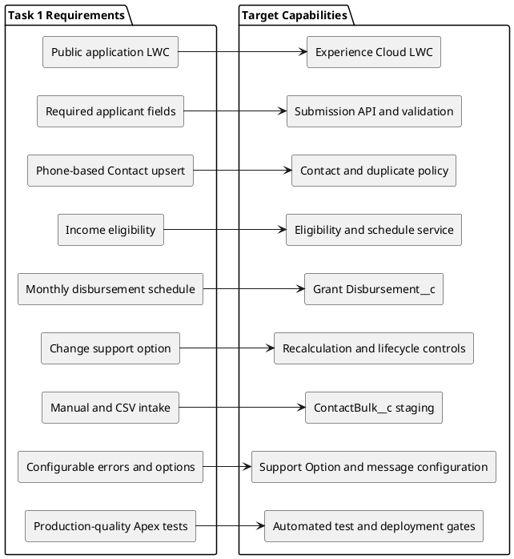

| ID   | Requirement eksplisit                                                              | Respons desain                                                                                     | Bagian                                                                                                                             |
| ---- | ---------------------------------------------------------------------------------- | -------------------------------------------------------------------------------------------------- | ---------------------------------------------------------------------------------------------------------------------------------- |
| R-01 | Form online pada Experience Cloud dengan LWC.                                      | Experience Cloud menampung grantApplicationForm; Apex facade menerima DTO yang diizinkan saja.     | [5](#5-target-solution-architecture), [6.3](#63-pengajuan-aplikasi-publik)                                                         |
| R-02 | Nama, Phone Singapura, postal code, income, dan option wajib.                      | Validasi LWC, policy server, dan Contact validation rule memakai satu kontrak kanonis.             | [6.3](#63-pengajuan-aplikasi-publik), [7.4](#74-strategi-error-handling), [8.3](#83-objek-dan-field-yang-direkomendasikan)         |
| R-03 | Phone baru membuat Contact; phone yang cocok memperbarui Contact.                  | Service Contact match/upsert yang sama untuk semua kanal dan mengunci record ketika jadwal diubah. | [6.3](#63-pengajuan-aplikasi-publik), [7.2](#72-lapisan-servicecomponent), [8](#8-arsitektur-data)                                 |
| R-04 | Income harus kurang dari SGD 1.800.                                                | Eligibility dievaluasi sebelum DML jadwal dengan message code terkonfigurasi.                      | [6.3](#63-pengajuan-aplikasi-publik), [7.5](#75-aturan-bisnis-yang-dapat-dikonfigurasi)                                            |
| R-05 | Opsi 3/6/12 bulan dan tanggal hari pertama bulan berikutnya.                       | Service menghitung schedule dan Scheduled Flow menangani status pada tanggal jatuh tempo.          | [6.6](#66-proses-disbursement-bulanan), [8.6](#86-siklus-hidup-grant-disbursement)                                                 |
| R-06 | Option dapat diubah jika paid total lebih kecil dari total baru; sisa dibagi rata. | Paid record dipertahankan; future unpaid record diganti atomik menggunakan formula P, T, M, D.     | [6.5](#65-perubahan-option-dan-rekalkulasi), [8.4](#84-aturan-kalkulasi-dan-integritas-data)                                       |
| R-07 | Manual dan CSV tidak boleh melewati validasi.                                      | Manual action dan ContactBulk__c staging menjalankan common submission service.                    | [6.4](#64-input-manual-dan-bulk-administrator), [9](#9-arsitektur-integrasi-dan-bulk-intake)                                       |
| R-08 | Pesan error ramah pengguna dan dapat dikelola admin.                               | Error code dipetakan ke Error_Message__mdt/Grant_Message__c; detail teknis terbatas.               | [7.4](#74-strategi-error-handling), [10](#10-security-access-identity-dan-compliance)                                              |
| R-09 | Apex aman, scalable, production ready, minimal 90% test coverage.                  | Service Apex bulk-safe, negative-path test, dan deployment quality gate.                           | [7.6](#76-strategi-deklaratif-dan-programatik), [13](#13-non-functional-requirements), [16](#16-deployment-testing-dan-governance) |

## 3. Ruang Lingkup, Asumsi, Constraint, dan Pertanyaan Terbuka

### 3.1 In Scope

| Area             | Cakupan                                                                                                                |
| ---------------- | ---------------------------------------------------------------------------------------------------------------------- |
| Intake applicant | LWC publik, initial application, amend pada form sama, validasi server, dan konfirmasi yang tidak membocorkan Contact. |
| Applicant master | Contact standar dengan data nama, Phone, postal code, income, option, eligibility, dan status aplikasi.                |
| Grant schedule   | Pembentukan/recalculation Grant_Disbursement__c, lifecycle tanggal jatuh tempo, exception, dan monitoring.             |
| Konfigurasi      | Support_Option__c aktif/nonaktif, jumlah dan durasi; message code aman.                                                |
| Admin input      | Guided manual action dan Data Loader ke ContactBulk__c staging.                                                        |
| Kualitas         | Security least privilege, audit, test, dashboard, dan deployment control.                                              |

### 3.2 Out of Scope

| Area                                                                     | Batasan                                                                                                                               |
| ------------------------------------------------------------------------ | ------------------------------------------------------------------------------------------------------------------------------------- |
| Transfer bank, rekening, payment settlement                              | Tidak ada payment system atau kontrak finansial dalam requirement. Dokumen ini mengelola jadwal alokasi, bukan bukti settlement bank. |
| Separate Grant Application object                                        | Contact dan Grant Disbursed record diminta secara eksplisit; object baru tidak ditambah tanpa kebutuhan multiple application/history. |
| Identity provider, consent/retention detail, production migration/volume | Tidak tersedia pada sumber Task 1; perlu keputusan sebelum go-live.                                                                   |
| Semua domain Task 2                                                      | Tidak relevan terhadap grant application ini.                                                                                         |

### 3.3 Asumsi

| ID   | Asumsi                                                                                                                                                                     |
| ---- | -------------------------------------------------------------------------------------------------------------------------------------------------------------------------- |
| A-01 | Agency X menentukan strategi Account induk/ownership untuk Contact sebelum produksi, karena Contact standar membutuhkan Account.                                           |
| A-02 | Update Contact existing dari situs publik memerlukan proof of possession Phone, misalnya OTP. Phone yang diketahui orang lain bukan otorisasi perubahan bantuan finansial. |
| A-03 | Phone disimpan dalam format wajib **65 6812 3456** tanpa normalisasi implisit; jika normalisasi disetujui, UI, import, dan service memakai aturan sama.                    |
| A-04 | Schedule baru/recalculate dimulai pada tanggal 1 bulan setelah disbursed date terakhir; initial schedule dimulai tanggal 1 bulan setelah accepted submission.              |
| A-05 | Grant_is_disbursed__c bernilai false saat planned dan true hanya jika proses due-date mencatat outcome sesuai aturan Finance. Ini bukan konfirmasi transfer bank.          |
| A-06 | Satu file/batch memiliki satu current row per Phone. Duplikasi Phone ditolak atau diproses serial untuk menghindari race condition.                                        |
| A-07 | Finance menyetujui precision/rounding bila option masa depan menghasilkan sisa yang tidak habis dibagi.                                                                    |

### 3.4 Constraint

| ID   | Constraint                                                                                                                                                 |
| ---- | ---------------------------------------------------------------------------------------------------------------------------------------------------------- |
| C-01 | Monthly Income harus **kurang dari** SGD 1.800,00; tepat SGD 1.800 tidak eligible.                                                                         |
| C-02 | Form publik wajib memakai Experience Cloud dan LWC, tetapi client-side validation bukan security boundary.                                                 |
| C-03 | Existing Phone update dan schedule change hanya terjadi setelah seluruh validasi dan otorisasi server lulus.                                               |
| C-04 | CSV dapat mengandung banyak row sehingga perlu bulk-safe, idempotent, observable, dan tidak mengandalkan order paralel.                                    |
| C-05 | Tidak ada lisensi Salesforce, external-user entitlement, OTP provider, maupun financial integration yang boleh dianggap tersedia tanpa validasi komersial. |

### 3.5 Open Question / Validation Item

| ID   | Keputusan/pemilik                                                                         | Dampak                                                                         |
| ---- | ----------------------------------------------------------------------------------------- | ------------------------------------------------------------------------------ |
| Q-01 | Security memilih provider dan journey OTP/identity proof.                                 | Update existing Contact tidak aman tanpa mekanisme ini; blocker go-live.       |
| Q-02 | Finance mendefinisikan confirmation, failed/reversed payment, cancellation, dan rounding. | Menentukan arti status Disbursed dan rekonsiliasi finansial.                   |
| Q-03 | Legal/Product menentukan consent, privacy basis, retention, audit, residency.             | Phone dan income adalah personal data.                                         |
| Q-04 | Operations memberi volume, concurrency, batch size, dan reporting need.                   | Dibutuhkan untuk sizing/performance/SLA yang belum ada.                        |
| Q-05 | Commercial owner mengonfirmasi lisensi, API/storage, backup, audit/encryption.            | Prototype tidak membuktikan capability produksi.                               |
| Q-06 | Data owner menentukan apakah Contact dapat menerima program baru setelah completed.       | Kebijakan ini menentukan kapan Grant Application object perlu dipertimbangkan. |

### 3.6 Baseline Implementasi yang Dikonfirmasi dari Source

Tabel ini adalah interpretasi as-built force-app/main/default pada saat revisi. Jika ada pernyataan sebelumnya yang menggambarkan target capability, tabel ini menjadi rujukan perilaku implementasi saat ini.

| Area               | Perilaku source-confirmed                                                                                                                                                                                                                                                                | Konsekuensi arsitektur                                                                                                                                                                              |
| ------------------ | ---------------------------------------------------------------------------------------------------------------------------------------------------------------------------------------------------------------------------------------------------------------------------------------- | --------------------------------------------------------------------------------------------------------------------------------------------------------------------------------------------------- |
| Public LWC         | grantApplicationForm diekspos untuk Experience Cloud dan mengirim FirstName, LastName, Phone, MailingPostalCode, Monthly_Income__c, Support_Option__c ke GrantApplicationController.submitApplication. Success toast menampilkan Contact Id yang dikembalikan.                           | Public caller menerima Salesforce record identifier; ini gap security/privacy, bukan safe correlation.                                                                                              |
| Apex boundary      | GrantApplicationController dideklarasikan tanpa sharing, menulis JSON.serializePretty(request) ke debug, menerima raw Contact, memanggil Auto_submitApplication, lalu mengembalikan Id. Tidak ada CRUD/FLS enforcement, field allow-list, rate limit, proofing, atau safe error mapping. | Boundary saat ini belum production least-privilege facade.                                                                                                                                          |
| Contact upsert     | Auto_submitApplication memilih Account terbaru bernama hdbsf, kemudian Contact terbaru dengan Phone yang persis sama dalam Account tersebut; Id/AccountId dimasukkan lalu Contact di-upsert.                                                                                             | Phone tidak unique/tidak dinormalisasi; duplicate terbaru menang. Nama Account adalah hard-coded dependency.                                                                                        |
| Eligibility        | Contact.IsEligible__c adalah formula Monthly_Income__c kurang dari 1800. Grant_Setup memiliki Monthly_Income_Limit__c = 1800, tetapi Flow tidak membaca value tersebut.                                                                                                                  | Threshold masih hard-coded dalam formula; setup income value belum digunakan.                                                                                                                       |
| Create automation  | Tgr_Create_Contact_Async berjalan after commit hanya jika Contact baru eligible atau approved, lalu Auto_validateEligibility memanggil recalculation hanya untuk Contact eligible.                                                                                                       | Contact commit sebelum schedule dan proses asynchronous, bukan satu transaksi atomik.                                                                                                               |
| Update automation  | Tgr_Update_Contact_Async berjalan after commit hanya jika Support_Option__c berubah ke nilai nonblank.                                                                                                                                                                                   | Ubah nama, Phone, postal code, atau income saja tidak memicu recalculation.                                                                                                                         |
| Recalculation      | Auto_recalculateForApplications memakai fresh roll-up TotalReceived__c/ReceivedMonths__c, mempertahankan paid row, menghapus seluruh unpaid row, lalu bulk-create replacement row. Tanggal baru dimulai dari tanggal 1 bulan setelah tanggal Flow saat ini.                              | Tidak ada record lock, lifecycle status, residual correction, maupun latest-paid-date basis. Scale currency nol dapat menghilangkan sisa amount.                                                    |
| Disbursement state | Grant_Disbursement__c hanya memiliki Grant_is_disbursed__c, tanpa Status__c. Default field true, tetapi Flow membuat row baru false. Tidak ada scheduled Flow yang menandai due row true.                                                                                                | Due date hanya plan; transition actual, exception, reversal, dan payment integration belum diimplementasikan.                                                                                       |
| Option             | Support_Option__c hanya berisi Amount__c, Duration__c, formula Total__c. Auto_getActiveSupportOptions mengembalikan semua record berurut Name; tidak ada field Active/effective date.                                                                                                    | LWC bisa menampilkan opsi obsolete karena tidak ada active-state control.                                                                                                                           |
| Bulk intake        | Tgr_OnUpsert_ContactBulk berjalan after commit saat SupportOptionRaw__c nonblank, tanpa memeriksa Status__c. Auto_processContactBulk mengenali dua belas variasi label hard-coded dan mengambil option pertama berdasarkan amount/duration, lalu memanggil Auto_submitApplication.       | Ready gate yang didokumentasikan tidak terdapat pada metadata; replay, concurrency, dan duplicate-option ambiguity masih ada. Success berarti Contact upsert selesai, bukan pasti schedule selesai. |
| Error              | GrantExceptionService/Auto_getMessage memetakan message dari Grant_Message__c Name, tetapi controller mengekspos Flow/Apex error dan bulk menyimpan raw error di ErrorMessage__c.                                                                                                        | Configurable message tersedia, tetapi safe public fault handling belum lengkap.                                                                                                                     |
| Access             | GuestSite_PermSet memberi read/create Contact dan Grant_Disbursement__c, read Account/Grant_Message__c/Support_Option__c, broad field access, dan class access pada dua class. Guest sharing memberi read Account hdbsf serta message/option yang memenuhi kriteria.                     | Metadata yang tersedia belum membuktikan guest operation aman dan memerlukan security review menyeluruh.                                                                                            |

### 3.7 Target Remediation yang Material

Komponen berikut belum ada dan merupakan perbaikan target: request/response DTO publik yang sempit, tanpa return Contact Id, enforcement CRUD/FLS, menghapus raw debug logging, OTP/proofing untuk existing Phone amendment, unique/canonical Phone policy, active/effective option model, configuration governance, contact-level serialization, exact remainder handling, lifecycle/due-date disbursement, Ready/terminal-state gate import, correlation/idempotency, PII-safe log, report/dashboard, dan deployment/security test terverifikasi.

## 4. Pemilihan Produk dan Capability Salesforce

### 4.1 Capability Selection

| Kebutuhan          | Rekomendasi baseline                                              | Alasan/batas                                                                                                          |
| ------------------ | ----------------------------------------------------------------- | --------------------------------------------------------------------------------------------------------------------- |
| Public UI          | Experience Cloud dengan LWC                                       | Requirement eksplisit. Guest page dapat dipakai untuk intake, tetapi update existing wajib memakai proofing boundary. |
| Applicant          | Standard Contact dan strategi Account yang terkontrol             | Contact adalah applicant yang diminta.                                                                                |
| Monthly schedule   | Custom Grant_Disbursement__c                                      | Memuat Contact lookup, amount, date, dan disbursed flag; bukan standard payment ledger.                               |
| Option master      | Support_Option__c                                                 | Admin dapat mengelola option aktif, amount, duration, dan effective date; schedule menyimpan snapshot.                |
| Orchestration      | Autolaunched/record-triggered/scheduled Flow                      | Cocok untuk branching, notification, due-date, dan konfigurasi.                                                       |
| Cross-record rule  | Apex GrantSubmission/GrantDisbursement domain service             | Membutuhkan lock, aggregate paid total, DML atomik, bulk safety, dan test Apex.                                       |
| Bulk               | Data Loader/ETL ke ContactBulk__c staging                         | CSV menjadi request terkontrol, bukan direct Contact upsert.                                                          |
| Message/monitoring | Custom Metadata atau Grant_Message__c, standard reports/dashboard | Wording aman dapat dikelola, technical error tetap restricted.                                                        |

### 4.2 Lisensi dan Validasi Komersial

Trailhead Playground Developer Edition dapat dipakai untuk prototype sesuai assessment. Untuk produksi, Experience Cloud guest user tidak menggunakan external-user license, tetapi authenticated external user membutuhkan license Experience Cloud yang sesuai. Model public intake berbeda dari applicant portal berlogin; template, data access, API capacity, storage, backup, audit, encryption, dan batas user harus divalidasi bersama Salesforce.

Internal Grant Administrator memerlukan capability untuk Contact/custom object, Flow, Apex, reports, dan API/Data Loader sesuai implementasi. OTP/SMS, payment provider, Shield/Field Audit Trail, backup, dan tambahan storage adalah optional/conditional item, bukan entitlement yang diasumsikan.

### 4.3 Keputusan Standard-versus-Custom

| Keputusan        | Pilihan                            | Trade-off                                                                                                     |
| ---------------- | ---------------------------------- | ------------------------------------------------------------------------------------------------------------- |
| Master applicant | Contact                            | Grant Application object lebih baik untuk multiple history tetapi tidak dibutuhkan oleh requirement saat ini. |
| Option           | Support_Option__c                  | Custom Metadata lebih ketat untuk deployment, tetapi kurang tepat jika administrator perlu runtime CRUD.      |
| Validation       | UI + validation rule + Apex policy | LWC saja dapat dilewati; Flow saja sulit menangani locking/recalculation concurrent.                          |
| Bulk             | Staging lalu process               | Direct Contact upsert lebih singkat tetapi dapat membuat schedule berbeda dari public channel.                |

## 5. Target Solution Architecture

Kecuali berlabel **Source-confirmed**, view pada Bagian 5 sampai 16 adalah target remediation yang diturunkan dari baseline [Bagian 3.6](#36-baseline-implementasi-yang-dikonfirmasi-dari-source). View tersebut bukan bukti bahwa kontrolnya sudah ada pada source atau deployed org.

### 5.1 System Landscape yang Dikonfirmasi dari Source

Diagram ini melacak komponen dan alur yang benar-benar ada di repository saat ini. Form publik mengirim request berbentuk Contact mentah ke Apex; Apex memanggil Flow; kemudian Flow record-triggered pada Contact dan objek staging melanjutkan pemrosesan asinkron. Diagram ini **bukan** pernyataan bahwa OTP, validasi DTO, otomatisasi status pembayaran, atau state machine lifecycle sudah tersedia. Semua itu adalah rekomendasi remediasi target pada bagian berikutnya.

[High-Level Solution Architecture](<puml_1/05.01 High-Level Solution Architecture_Ind.puml>)

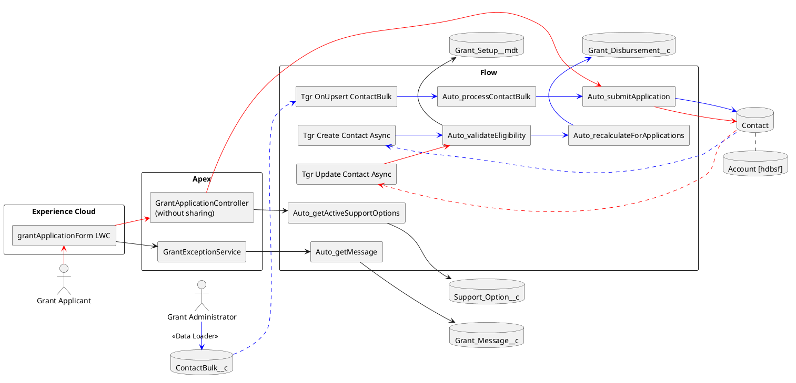

LWC mengumpulkan field form yang dipublikasikan lalu mengirim payload berbentuk Contact. `GrantApplicationController` yang dideklarasikan `without sharing` meneruskan payload itu ke `Auto_submitApplication`; Flow mencari Contact terbaru dengan Phone yang persis sama dan Account `hdbsf`, kemudian membuat atau melakukan upsert Contact. Pesan sukses saat ini mengekspos Contact Id hasil. `GrantSubmissionFacade`, DTO yang di-allow-list, proofing boundary, dan safe outcome contract adalah kontrol target yang direkomendasikan, bukan implementasi yang dikonfirmasi dari source.

### 5.2 Layered Architecture

Layer ini menjaga agar UI dan Data Loader tidak memiliki tanggung jawab kalkulasi grant maupun akses DML langsung.

[Layered Architecture](<puml_1/05.02 Layered Architecture_Ind.puml>)

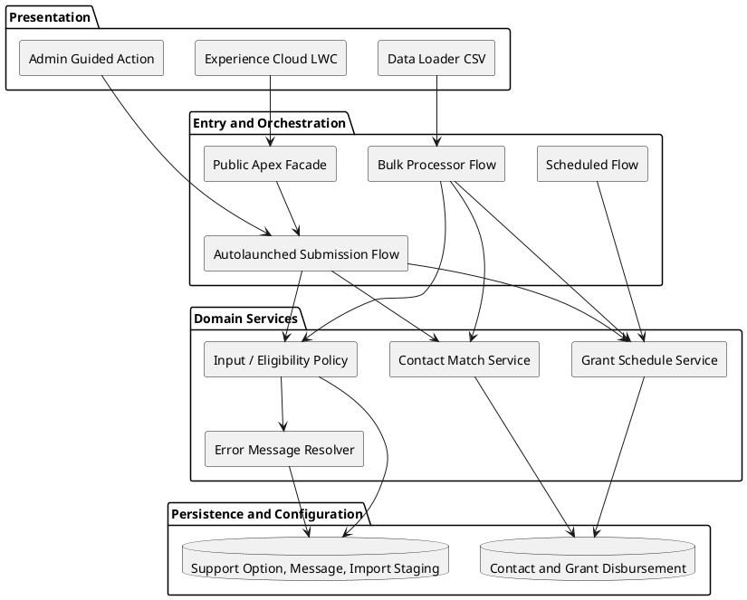

### 5.3 Public Trust Boundary

Boundary ini menegaskan browser tidak boleh memperoleh detail record walaupun dapat mengirim aplikasi.

[Public Trust-Boundary View](<puml_1/05.03 Public Trust-Boundary View_Ind.puml>)

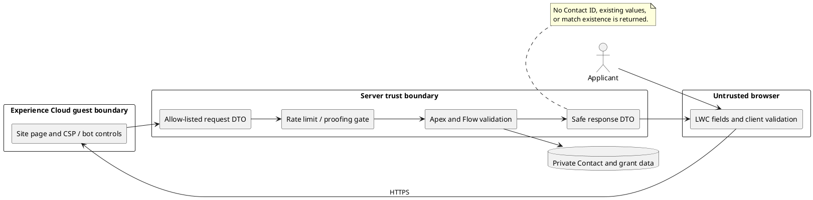

## 6. Business Process Architecture

### 6.1 Persona dan User Story Map

Peta ini memetakan dua persona requirement ke capability minimum.

[Persona and User Story Map](<puml_1/06.01 Persona and User Story Map_Ind.puml>)

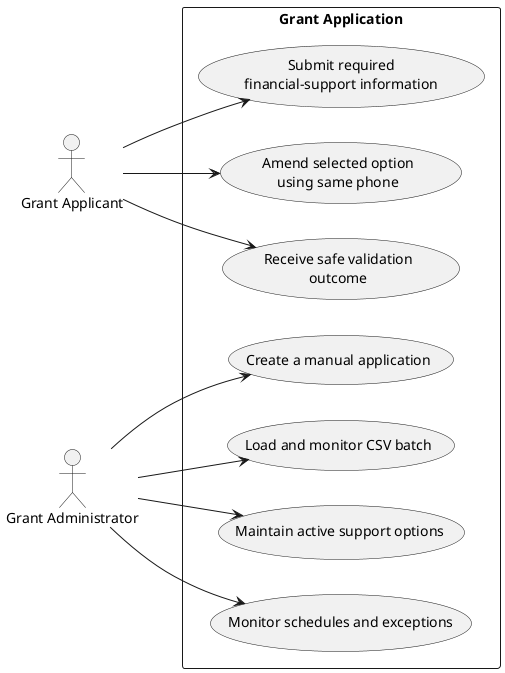

| Persona             | User story                                                                                                                 | Akses/workspace                                                              |
| ------------------- | -------------------------------------------------------------------------------------------------------------------------- | ---------------------------------------------------------------------------- |
| Grant Applicant     | Sebagai Grant Applicant, saya ingin mengirim informasi dan satu option bantuan online agar dapat dipertimbangkan Agency X. | Hanya LWC publik; tidak dapat browse Contact atau schedule.                  |
| Grant Applicant     | Sebagai Grant Applicant, saya ingin mengubah data/option pada form sama agar bantuan tepat.                                | Existing update memerlukan proofing; response tidak mengungkap record match. |
| Grant Administrator | Sebagai Grant Administrator, saya ingin membuat aplikasi manual atau memuat batch agar aplikasi valid diproses efisien.    | Guided action, ContactBulk list view, Contact, schedule report, error queue. |
| Grant Administrator | Sebagai Grant Administrator, saya ingin memelihara option dan memonitor exception agar alokasi transparan.                 | Konfigurasi terbatas dan dashboard operasi.                                  |

### 6.2 Overview Proses End-to-End

Tiga channel intake bertemu pada satu policy dan satu hasil schedule.

[End-to-End Grant Process](<puml_1/06.02 End-to-End Grant Process_Ind.puml>)

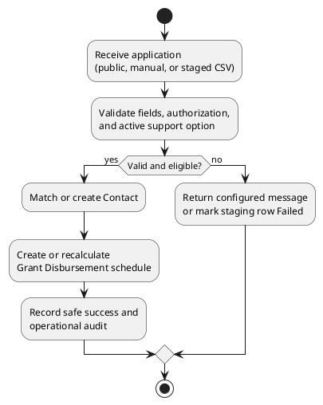

### 6.3 Pengajuan Aplikasi Publik

Client validation membantu usability, sedangkan server mengulang seluruh validasi sebelum ada mutasi Contact maupun schedule.

[Public Application Submission](<puml_1/06.03 Public Application Submission_Ind.puml>)

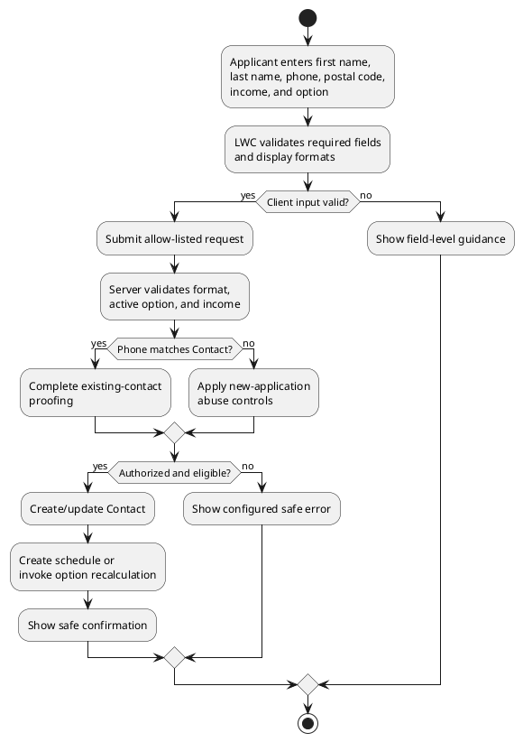

| Tahap              | Implementasi                                                                                                            | Kontrol                                                                |
| ------------------ | ----------------------------------------------------------------------------------------------------------------------- | ---------------------------------------------------------------------- |
| Capture            | grantApplicationForm LWC menampilkan First Name, Last Name, Phone, Mailing Postal Code, Monthly Income, Support Option. | Semua field wajib; active option dipasok dari server.                  |
| Client validation  | lightning-input dan JavaScript pattern.                                                                                 | Phone hanya 65 spasi 4 digit spasi 4 digit; postal code enam digit.    |
| Server submission  | Apex facade menerima GrantSubmissionRequest, bukan raw Contact.                                                         | Menolak Id/AccountId/eligibility/status/amount dari client.            |
| Policy             | Server memeriksa format, income, option aktif, duplicate handling, dan message code.                                    | Lulus hanya jika income < SGD 1.800.                                   |
| Contact & schedule | Match service membuat/mengubah Contact lalu schedule service membentuk/recalculate child row.                           | Transaksi all-or-none; public response hanya confirmation/correlation. |

### 6.4 Input Manual dan Bulk Administrator

Data Loader memasukkan request ke staging, bukan langsung ke Contact.

[Administrator Manual and Bulk Intake](<puml_1/06.04 Administrator Manual and Bulk Intake_Ind.puml>)

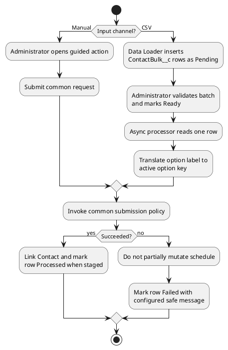

CSV memetakan FirstName__c, LastName__c, Phone__c, MailingPostalCode__c, MonthlyIncome__c, SupportOptionRaw__c, dan ImportBatch__c ke ContactBulk__c. Processor saja yang menetapkan Contact__c, ProcessedAt__c, ErrorMessage__c, correlation, dan terminal status. Administrator memeriksa Pending row lalu menandai batch Ready; row Processed tidak dikembalikan ke Ready.

### 6.5 Perubahan Option dan Rekalkulasi

Paid allocation tidak boleh diubah. Hanya future unpaid row yang diganti setelah validasi total dan remaining month lulus.

[Support Option Change and Recalculation](<puml_1/06.05 Support Option Change and Recalculation_Ind.puml>)

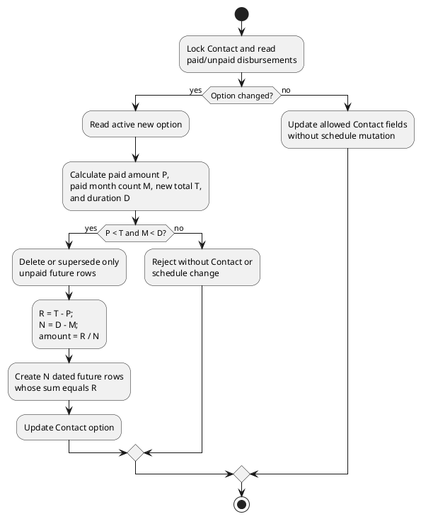

P adalah total Amount_to_be_disbursed__c dari row Disbursed, M adalah jumlah row Disbursed, T adalah Total__c option baru, dan D adalah Duration__c option baru. Perubahan hanya boleh jika P < T dan M < D. Sisa R=T−P dibagi N=D−M bulan; final row menerima residual sesuai Q-02 agar total persis R.

Contoh requirement: setelah dua pembayaran SGD 500 pada Option 1, pindah ke Option 2 menghasilkan P=1.000, T=1.800, D=6, M=2, R=800, N=4, sehingga empat future row SGD 200. Jika total paid sama/lebih besar dari T, tidak ada update partial.

### 6.6 Proses Disbursement Bulanan

Scheduled process membuat schedule menjadi operational record; ini bukan integrasi settlement bank.

[Monthly Disbursement Process](<puml_1/06.06 Monthly Disbursement Process_Ind.puml>)

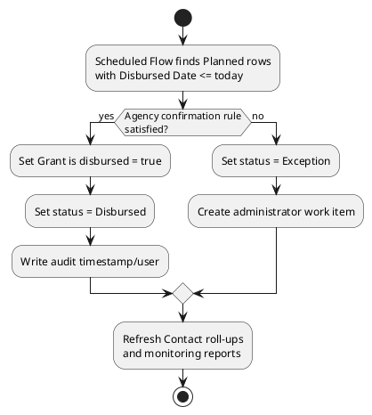

Initial schedule dimulai pada hari pertama bulan setelah accepted submission. Job due-date wajib idempotent: rerun tidak menciptakan row baru dan tidak menandai row dua kali. Checkbox bernilai true hanya pada status Disbursed. Tanpa confirmation Finance, row Planned/Due menjadi Exception dan memerlukan tindakan administrator.

### 6.7 Exception dan Manual Fallback

Kegagalan dibedakan menjadi business rejection, transient fault, dan technical fault; semua mencegah commit partial.

[Exception and Manual Fallback](<puml_1/06.07 Exception and Manual Fallback_Ind.puml>)

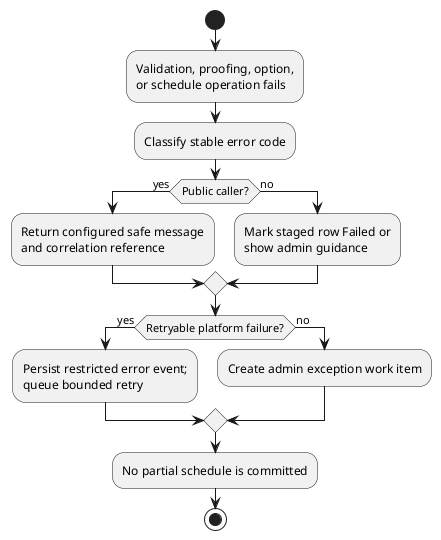

Contoh code: INVALID_PHONE_FORMAT, INVALID_POSTAL_CODE, REQUIRED_FIELD_MISSING, SUPPORT_OPTION_UNAVAILABLE, INCOME_NOT_ELIGIBLE, OPTION_TOTAL_TOO_LOW, OPTION_NO_REMAINING_MONTHS, UPDATE_NOT_AUTHORIZED, dan DUPLICATE_PHONE_IN_BATCH. Raw exception/Phone tidak ditampilkan kepada public caller.

## 7. Application Architecture

### 7.1 Application Layer Overview

[Application Layer Overview](<puml_1/07.01 Application Layer Overview_Ind.puml>)

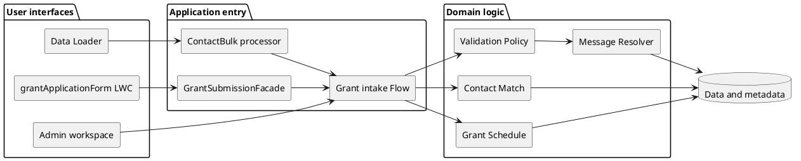

UI tidak menjalankan financial rule. Facade adalah boundary public, Flow mengoordinasi, dan domain service memiliki kalkulasi/state mutation.

### 7.2 Lapisan Service/Component

[Service / Component Layer Design](<puml_1/07.02 Service Component Layer Design_Ind.puml>)

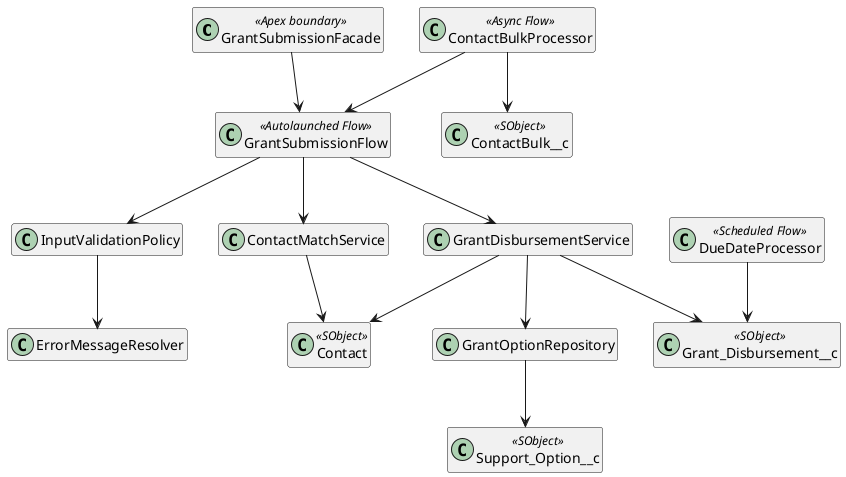

| Component                | Tanggung jawab                                                                                                 |
| ------------------------ | -------------------------------------------------------------------------------------------------------------- |
| GrantSubmissionFacade    | Apex entry untuk LWC; DTO allow-list, context guest, proofing/rate controls, safe response tanpa Contact data. |
| GrantSubmissionFlow      | Orkestrasi request publik/manual/bulk dan fault connector.                                                     |
| InputValidationPolicy    | Required field, strict format, income, option aktif, dan stable error code; tanpa DML.                         |
| ContactMatchService      | Find/create/update Contact berdasarkan canonical Phone; lock bila schedule berubah.                            |
| GrantDisbursementService | Paid-total calculation, row lock, atomik replacement unpaid row, schedule create, dan due-date state.          |
| ContactBulkProcessor     | After-commit processing row Ready serta terminal outcome per row.                                              |
| ErrorMessageResolver     | Message aman berdasarkan code; tidak pernah memaparkan stack/raw payload.                                      |

### 7.3 Public Submission Sequence

[Public Submission Sequence](<puml_1/07.03 Public Submission Sequence_Ind.puml>)

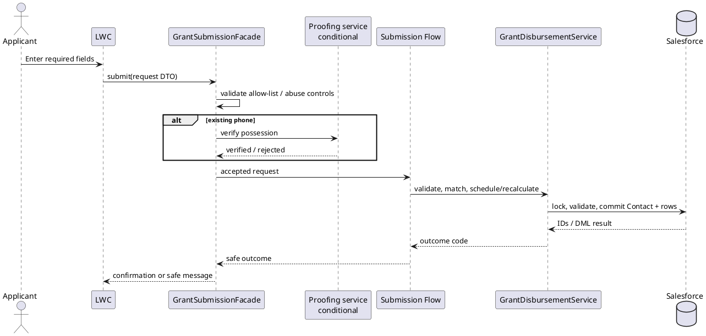

Contact mutation dan seluruh schedule harus commit bersama. Jika DML atau validation gagal, transaction rollback; public caller menerima correlation reference, bukan Salesforce Id.

### 7.4 Strategi Error Handling

[Error Handling Strategy](<puml_1/07.04 Error Handling Strategy_Ind.puml>)

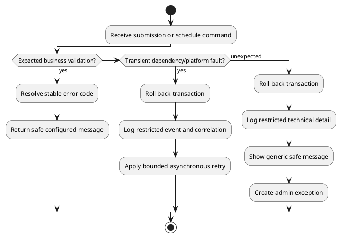

Business failure tidak di-retry. Retry hanya untuk dependency transient yang terbukti idempotent, misalnya provider proofing setelah belum ada DML commit. Error message configuration menyimpan wording aman saja; technical evidence berada pada restricted log/operational record.

### 7.5 Aturan Bisnis yang Dapat Dikonfigurasi

[Configurable Business Rules](<puml_1/07.05 Configurable Business Rules_Ind.puml>)

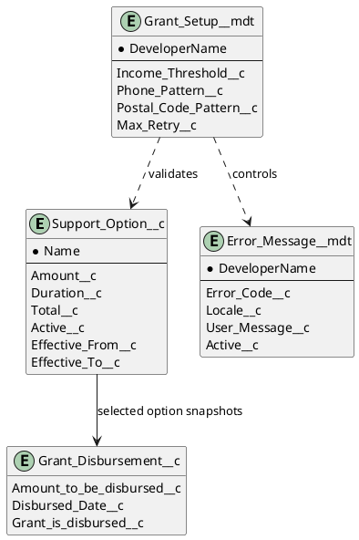

Initial option: Option 1 = SGD 500 x 3 (SGD 1.500), Option 2 = SGD 300 x 6 (SGD 1.800), Option 3 = SGD 200 x 12 (SGD 2.400). Administrator terotorisasi dapat menambah/edit opsi dengan effective date dan approval. Mengubah master tidak mengubah historical schedule karena row schedule menyimpan amount/date snapshot.

### 7.6 Strategi Deklaratif dan Programatik

| Kebutuhan                    | Implementasi                          | Guardrail                                                                |
| ---------------------------- | ------------------------------------- | ------------------------------------------------------------------------ |
| Form/public feedback         | LWC                                   | Required; validation UX dan Lightning accessibility.                     |
| Public mutation              | Thin Apex facade + DTO                | Tidak menerima raw sObject; enforce allow-list, proofing, safe response. |
| Required/format rule         | LWC + server policy + validation rule | Defense in depth untuk UI/manual/API/import.                             |
| Flow branching/due date      | Flow                                  | Mudah dirawat admin dan visible fault path.                              |
| Contact/schedule calculation | Apex domain service                   | Lock, collection DML, calculation/replacement atomik, unit test.         |
| CSV                          | ContactBulk__c + async Flow           | Row outcome, sequencing, common rule.                                    |
| Message                      | Metadata/config object                | Admin dapat mengubah wording aman tanpa source code.                     |

### 7.7 Automation dan Transaction Boundary

[Automation and Transaction Boundaries](<puml_1/07.06 Automation and Transaction Boundaries_Ind.puml>)

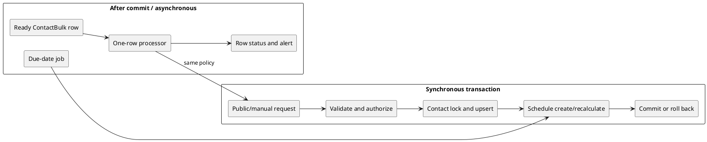

Schedule validation selesai sebelum unpaid row dihapus/diganti. Async processor berjalan sesudah staging commit dan menyerialkan Phone yang sama. Due-date job memilih row Planned/Due secara deterministik agar rerun aman.

## 8. Arsitektur Data

### 8.1 Entity Relationship Diagram

[Entity Relationship Diagram](<puml_1/08.01 Entity Relationship Diagram_Ind.puml>)

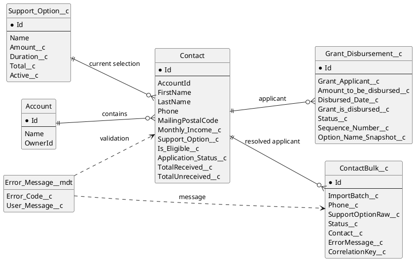

### 8.2 Core Data Model dan Ownership

| Entitas                             | Tujuan dan ownership                                                                                           |
| ----------------------------------- | -------------------------------------------------------------------------------------------------------------- |
| Account                             | Parent model untuk Contact berdasarkan A-01; tidak dapat diakses langsung oleh public.                         |
| Contact                             | Master applicant/current option. Canonical Phone adalah match key dan hanya service yang menulis match/upsert. |
| Support_Option__c                   | Catalogue amount/duration/total/active/effective date; Grant Configuration owner mengelola dengan approval.    |
| Grant_Disbursement__c               | Satu monthly allocation; child Contact, protected dari public edit dan immutable saat paid.                    |
| ContactBulk__c                      | Raw CSV request/status; import user hanya boleh mengisi source field.                                          |
| Error_Message__mdt/Grant_Message__c | Wording error aman; payload teknis tidak disimpan pada configuration.                                          |

### 8.3 Objek dan Field yang Direkomendasikan

| Object                | Field                                                         | Penggunaan                                                                                    |
| --------------------- | ------------------------------------------------------------- | --------------------------------------------------------------------------------------------- |
| Contact               | FirstName, LastName                                           | Mandatory application values, nonblank server validation.                                     |
| Contact               | Phone                                                         | Required exact **65 6812 3456**; canonical match/uniqueness policy A-03.                      |
| Contact               | MailingPostalCode                                             | Required enam karakter digit; leading zero harus dipertahankan.                               |
| Contact               | Monthly_Income__c                                             | SGD, nonnegative; eligible hanya < SGD 1.800.                                                 |
| Contact               | Support_Option__c                                             | Lookup active option saat ini; bukan historical schedule truth.                               |
| Contact               | Is_Eligible__c, Application_Status__c, roll-ups               | Derived/restricted field untuk Scheduled, Active Support, Completed, Exception dan reporting. |
| Grant_Disbursement__c | Grant_Applicant__c                                            | Required Contact lookup.                                                                      |
| Grant_Disbursement__c | Amount_to_be_disbursed__c, Disbursed_Date__c                  | Calculated snapshot dan tanggal hari pertama bulan; tidak ditulis public caller.              |
| Grant_Disbursement__c | Grant_is_disbursed__c, Status__c, Sequence_Number__c          | Lifecycle/idempotency/order. Checkbox true hanya bila Disbursed.                              |
| ContactBulk__c        | ImportBatch__c, Status__c, ErrorMessage__c, CorrelationKey__c | Batch control, row traceability, retry/reconcile.                                             |

### 8.4 Aturan Kalkulasi dan Integritas Data

1. Request publik/import tidak boleh mengirim Contact.Id, AccountId, eligibility/status/roll-up, disbursement Id, paid flag, atau amount.
2. Initial option dengan duration D membuat D row mulai tanggal 1 bulan berikutnya, setiap row dengan amount option.
3. Jika option tidak berubah, hanya Contact field allow-listed yang dapat diubah setelah otorisasi; schedule tidak direcreate.
4. Jika option berubah, P=jumlah row Disbursed, M=count row Disbursed, T=Total__c opsi baru, D=Duration__c. Tolak kecuali P<T dan M<D.
5. Paid row immutable. Unpaid future row dihapus atau diberi Superseded di transaction yang sama dengan insert replacement rows, dengan total tepat T−P.
6. Contact dan active child row di-query FOR UPDATE. Policy unik mencegah duplicate canonical Phone serta duplicate active date/sequence per Contact.
7. Due-date process tidak dapat menandai row dua kali; guest/import user tidak dapat menulis paid/disbursed field.

### 8.5 Siklus Hidup Applicant

[Applicant Lifecycle](<puml_1/08.05 Applicant Lifecycle_Ind.puml>)

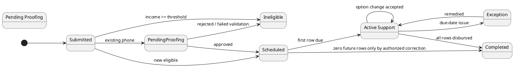

### 8.6 Siklus Hidup Grant Disbursement

[Grant Disbursement Lifecycle](<puml_1/08.06 Grant Disbursement Lifecycle_Ind.puml>)

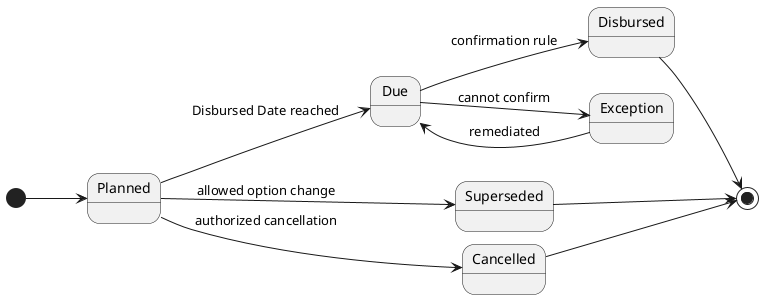

Status__c perlu ditambahkan bila checkbox saat ini tidak cukup membedakan Planned, Exception, Superseded, dan Cancelled. Retensi unpaid Superseded versus delete harus mengikuti audit policy Q-03.

## 9. Arsitektur Integrasi dan Bulk Intake

### 9.1 Integration Pattern Matrix

Task 1 tidak meminta external-system integration. Interface berikut adalah batas publik, input internal, dan proofing conditional yang diperlukan agar solusi aman tanpa menganggap adanya sistem pembayaran.

| Interface               | Source/target dan pattern                                | Auth / otorisasi                                                                                               | Idempotency, failure, reconciliation                                                                        |
| ----------------------- | -------------------------------------------------------- | -------------------------------------------------------------------------------------------------------------- | ----------------------------------------------------------------------------------------------------------- |
| Public application      | Browser LWC ke GrantSubmissionFacade secara synchronous. | Guest hanya mengakses public facade; DTO allow-list dan rate/bot control. Existing update wajib proofing A-02. | Submission nonce/correlation; tidak mengembalikan match/Contact Id; retry hanya sebelum commit.             |
| Manual application      | Admin guided action ke Flow/service secara synchronous.  | Grant Administrator permission set dan CRUD/FLS.                                                               | Correlation dan Contact+schedule transaction all-or-none.                                                   |
| CSV                     | Data Loader/ETL ke ContactBulk__c lalu async processor.  | API import user least privilege; normal path tidak memiliki direct Contact/Disbursement write.                 | ImportBatch+row key; Processed/Failed terminal state; rekonsiliasi source/row/Contact/schedule.             |
| Phone proof conditional | Facade ke OTP provider.                                  | Modern Named Credential + External Credential, named principal, endpoint scope minimum. Provider Q-01.         | Timeout sebelum DML dapat retry terbatas; request menyimpan opaque challenge/correlation, bukan Contact Id. |
| Payment confirmation    | Tidak didesain.                                          | TBD Q-02.                                                                                                      | Schedule checkbox bukan settlement bank.                                                                    |

### 9.2 CSV Staging Data Flow

[CSV Staging Data Flow](<puml_1/09.01 CSV Staging Data Flow_Ind.puml>)

```plantuml
@startuml
left to right direction
skinparam componentStyle rectangle
actor "Grant Administrator" as Admin
component "CSV file\none current row / phone" as CSV
component "Data Loader / approved ETL" as Loader
database "ContactBulk__c\nPending / Ready / Processed / Failed" as Stage
component "After-commit bulk processor" as Processor
component "Common submission service" as Service
database "Contact + Grant Disbursement" as Core
component "Import exception dashboard" as Dashboard
Admin --> CSV
CSV --> Loader
Loader --> Stage : insert source fields
Admin --> Stage : approve batch Ready
Stage --> Processor
Processor --> Service
Service --> Core
Stage --> Dashboard
Core --> Dashboard
@enduml
```

Processor menerapkan Phone/postal/income/option policy yang sama dengan LWC dan memetakan SupportOptionRaw__c ke satu active option yang unik. Satu file diproses pada satu waktu dan hanya satu current row per Phone. Direct Data Loader upsert ke Contact dilarang untuk jalur bisnis normal.

### 9.3 Retry, Idempotency, dan Rekonsiliasi

[Retry, Idempotency, and Reconciliation](<puml_1/09.02 Retry Idempotency Reconciliation_Ind.puml>)

```plantuml
@startuml
start
:Receive correlated request;
if (Outcome already terminal?) then (yes)
  :Return stored safe outcome\nor skip staged row;
  stop
endif
:Execute all-or-none policy;
if (Committed?) then (yes)
  :Persist success correlation\nand schedule totals;
else (no)
  :Roll back Contact/schedule;
  if (Transient external fault?) then (yes)
    :Increment bounded retry count;
    :Retry after backoff;
  else (no)
    :Persist Failed / exception\nwith safe error code;
  endif
endif
:Reconcile source count, terminal\nrow count, Contact links, and\nschedule row/amount totals;
stop
@enduml
```

CSV idempotency key adalah ImportBatch__c dengan source row key/content hash. Public request memakai server-issued nonce dalam window yang disetujui. Duplicate successful retry mengembalikan safe outcome dan tidak membangun schedule kedua. Contact-level lock melindungi request berbeda yang datang berdekatan.

### 9.4 Security Credential Model

Named Credential tidak dibuat sebelum Q-01 memilih OTP provider. Saat provider tersedia, Named Credential memegang endpoint/transport, External Credential memegang authentication protocol/principal, dan permission-set mapping memberikan akses pada server principal. Secret, token, response OTP, dan endpoint credential tidak boleh berada di LWC, Flow log terbuka, CSV, custom field, error message, atau Git.

Payload hanya memuat phone bila benar-benar perlu, opaque challenge, purpose, dan correlation. Simpan provider request Id, outcome code, timestamp, bukan raw response. Middleware tetap optional: hanya dipilih jika Agency X membutuhkan central API policy, transform, orchestration, atau vendor abstraction.

## 10. Security, Access, Identity, dan Compliance

### 10.1 Role-Based Access dan Visibility

[Role-Based Access and Visibility Model](<puml_1/10.01 Role-Based Access and Visibility Model_Ind.puml>)

```plantuml
@startuml
left to right direction
skinparam componentStyle rectangle
package "Personas" {
  [Guest Applicant] as Guest
  [Grant Administrator] as Admin
  [Integration / Import User] as Integration
  [System Administrator] as Sys
}
package "Controls" {
  [Guest page + Apex class allow-list] as GuestControl
  [Permission Set + FLS + sharing] as AdminControl
  [API-only least privilege] as IntControl
  [Break-glass audited access] as SysControl
}
package "Protected assets" {
  [Contact PII and income] as PII
  [Grant schedules] as Schedules
  [Configuration and errors] as Config
  [Import staging / technical logs] as Logs
}
Guest --> GuestControl
Admin --> AdminControl
Integration --> IntControl
Sys --> SysControl
GuestControl --> PII : controlled server write only
AdminControl --> PII
AdminControl --> Schedules
AdminControl --> Config
IntControl --> Logs
SysControl --> PII
SysControl --> Schedules
SysControl --> Config
SysControl --> Logs
@enduml
```

### 10.2 Persona Access Matrix

| Persona                      | Akses                                                                                                                                                          | Larangan utama                                                                                              |
| ---------------------------- | -------------------------------------------------------------------------------------------------------------------------------------------------------------- | ----------------------------------------------------------------------------------------------------------- |
| Guest Applicant              | Tidak ada direct record read; facade dapat create/update allow-listed Contact setelah control; tidak ada Disbursement/config/staging access.                   | Tidak boleh melihat Contact Id, detail existing, match existence, schedule, paid/status/amount.             |
| Grant Administrator          | Contact/application field sesuai operasi; disbursement read dan lifecycle hanya bila Finance berwenang; option/message config melalui permission set terpisah. | Tidak mengubah paid history atau raw technical payload tanpa support elevation.                             |
| Import User                  | Create source field ContactBulk__c saja.                                                                                                                       | Tidak direct-upsert Contact/Disbursement dan tidak set terminal status/Contact link/eligibility/paid field. |
| System Administrator/Support | Administrative access time-bound dan audited.                                                                                                                  | Break-glass/change approval untuk privileged changes.                                                       |

### 10.3 Public Submission Identity Flow

[Public Submission Identity Flow](<puml_1/10.03 Public Submission Identity Flow_Ind.puml>)

```plantuml
@startuml
actor Applicant
participant "Experience Cloud LWC" as LWC
participant "GrantSubmissionFacade" as Facade
participant "OTP provider\nTBD" as OTP
database "Contact" as Contact
Applicant -> LWC : Enter application
LWC -> Facade : validate/submit DTO
Facade -> Contact : private phone match
alt no matching Contact
  Facade --> LWC : continue new application
else matching Contact
  Facade -> OTP : send/verify challenge
  OTP --> Facade : verified / rejected
  alt verified
    Facade --> LWC : continue amendment
  else rejected
    Facade --> LWC : safe non-disclosing outcome
  end
end
@enduml
```

LWC tidak boleh query Contact untuk menentukan jalur. Facade melakukan match secara privat. Jika Q-01 belum selesai, fallback aman adalah new request untuk manual review, bukan auto-update existing Contact; konsekuensinya requirement User Story 3 belum terpenuhi sehingga Q-01 wajib selesai sebelum production approval.

### 10.4 Security Controls

| Control         | Desain                                                                                                                                             |
| --------------- | -------------------------------------------------------------------------------------------------------------------------------------------------- |
| OWD/sharing     | Contact dan Grant_Disbursement__c Private kecuali operating model tertulis membutuhkan lebih luas; child access mengikuti parent/sharing strategy. |
| Permission set  | Pisahkan Guest Site, Grant Administrator, Grant Configuration, Import User, Finance/Disbursement Operator, dan audited break-glass Support.        |
| CRUD/FLS        | Apex mengecek object/field yang allow-listed; Flow execution context direview; derived/financial field bukan public write field.                   |
| Guest hardening | Page/class access minimal, CSP trusted site, bot/rate control, cache/error review, tanpa record browse default.                                    |
| PII             | Kumpulkan field requirement saja; Phone/income dimask atau dikeluarkan dari broad report, result file, debug log, dan public response.             |
| Audit/secrets   | Audit option/recalculation/due-date/import; gunakan Named/External Credential; tidak ada token/secret pada code/CSV/log terbuka.                   |

### 10.5 Privacy, Audit, dan Segregation of Duty

Phone dan income memerlukan keputusan Legal tentang notice, consent/purpose, retention, subject request, residency, backup, dan deletion exception. Administrator yang mengubah amount/duration option tidak seharusnya menjadi satu-satunya approver perubahan tersebut atau exception disbursement. Import user tidak boleh memiliki hak untuk menandai grant disbursed maupun mengubah konfigurasi.

## 11. Data Volume dan Lifecycle Strategy

### 11.1 Data Volume dan Storage

Requirement tidak menyebut historical migration, volume harian, ukuran file, upload file, retention, atau sistem sumber. Karena itu tidak ada annual growth calculation pada SADD ini. Q-04/Q-05 wajib menghasilkan sizing dan performance acceptance criteria sebelum production.

Setiap initial application menghasilkan satu mutasi Contact dan D row Grant_Disbursement__c, dengan D=3, 6, atau 12 untuk initial options. Forecast kemudian harus meliputi Contact, schedule, staging, error/audit, report/dashboard, dan bukti proofing yang disetujui — tanpa mengarang file-storage estimate.

### 11.2 Bulk Data Lifecycle

[Bulk Data Lifecycle](<puml_1/11.01 Bulk Data Lifecycle_Ind.puml>)

```plantuml
@startuml
left to right direction
database "Validated CSV source" as Source
database "ContactBulk__c\nPending" as Pending
database "ContactBulk__c\nReady" as Ready
database "ContactBulk__c\nProcessed / Failed" as Terminal
database "Contact and active schedule" as Core
database "Archived batch evidence\npolicy TBD" as Archive
Source --> Pending
Pending --> Ready : operator review
Ready --> Core : common policy
Ready --> Terminal : outcome
Terminal --> Archive : retention decision
Core --> Archive : audit/archive decision
@enduml
```

Operator memvalidasi UTF-8 header, mandatory column, label option, duplicate Phone dalam source, dan row count sebelum insert. Data Loader result file dan terminal stage row disimpan menurut Q-03 dengan akses terbatas. Failure diperbaiki sebagai replay/new row ber-correlation baru hanya setelah root cause dipahami.

### 11.3 Large Data Volume Design

| Risiko                 | Desain                                                                                                                                               |
| ---------------------- | ---------------------------------------------------------------------------------------------------------------------------------------------------- |
| Volume belum diketahui | Kumpulkan submissions/day, peak concurrency, batch count/size, scheduling window, retention, reporting refresh.                                      |
| Query                  | Filter schedule berdasarkan Status/date/Contact; gunakan indexed standard field dan tambah external-id/correlation key bila kontrak sudah disetujui. |
| Skew/concurrency       | Satu Phone per batch, Contact lock, sequential partitioning; jangan process option change paralel.                                                   |
| Governor limit         | Bulk collection DML, no SOQL/DML in loop, isolated staged-row outcome, test batch tuning.                                                            |
| Backup/recovery        | Konfirmasi product, RTO/RPO, restore exercise; dashboard bukan backup.                                                                               |

### 11.4 Rekonsiliasi, Cutover, dan Rollback

Batch diterima jika source row = Processed + Failed; setiap Processed row punya tepat satu Contact link; request eligible yang sukses memiliki D active row atau N recalculated future row; active schedule total = option total − paid total; tidak ada duplicate active date/sequence; Failed row memiliki safe code dan remediation.

Tidak ada legacy migration/cutover dalam sumber. Jika kemudian ditambahkan, harus memiliki profiling, mapping, dedupe, pilot, load window, reconciliation, rollback checkpoint, dan acceptance criteria sendiri. CSV sample tidak menjadi otorisasi untuk migrasi historical system yang tidak didefinisikan.

## 12. Reporting, Monitoring, dan Operational Support

### 12.1 Operational Monitoring Model

[Operational Monitoring Model](<puml_1/12.01 Operational Monitoring Model_Ind.puml>)

```plantuml
@startuml
left to right direction
skinparam componentStyle rectangle
database "Contact and status" as Contact
database "Grant Disbursement\nplanned/due/disbursed/exception" as Disb
database "ContactBulk and errors" as Bulk
component "Operational reports" as Reports
component "Grant Administrator dashboard" as Dashboard
component "Exception work queue" as Queue
Contact --> Reports
Disb --> Reports
Bulk --> Reports
Reports --> Dashboard
Reports --> Queue : overdue, failed, exception
@enduml
```

| Report                 | Sumber dan tindakan                                                                                                                     |
| ---------------------- | --------------------------------------------------------------------------------------------------------------------------------------- |
| Application outcome    | Contact Application_Status__c: monitor Ineligible, Pending Proofing, Scheduled, Active Support, Completed, Exception.                   |
| Allocation schedule    | Grant Disbursement by Status, date, option snapshot, amount: monitor planned/due/disbursed/exception; bukan bank settlement tanpa Q-02. |
| Due/exception worklist | Planned/Due/Exception date+correlation: operator remediasi.                                                                             |
| Option-change audit    | Option event, paid/new total, recalculation code: review safety dan policy.                                                             |
| Import quality         | ContactBulk status/error/batch/time: reconcile/fix failure.                                                                             |
| Public reliability     | Restricted fault/proofing code/correlation: support trend tanpa PII.                                                                    |

### 12.2 Outcome Evaluation Model

[Outcome Evaluation Model](<puml_1/12.02 Outcome Evaluation Model_Ind.puml>)

```plantuml
@startuml
left to right direction
database "Application data" as App
database "Schedule data" as Schedule
database "Import/error data" as Ops
component "Quality metrics\nvalidity, duplicate, failure rate" as Quality
component "Allocation metrics\nplanned, disbursed, exceptions" as Allocation
component "Configuration metrics\noption uptake/change outcomes" as Config
component "Operations review" as Review
App --> Quality
Ops --> Quality
Schedule --> Allocation
App --> Config
Schedule --> Config
Quality --> Review
Allocation --> Review
Config --> Review
@enduml
```

Tidak ada target KPI/SLA/approval/payment completion pada requirement. Nilai dashboard bersifat descriptive sampai Agency X menyetujui target. Planned date tidak boleh ditafsirkan sebagai bank-payment success.

## 13. Non-Functional Requirements

| Area                       | Desain dan validasi                                                                                                                                                 |
| -------------------------- | ------------------------------------------------------------------------------------------------------------------------------------------------------------------- |
| Security/privacy           | Private model, public write boundary, proofing existing update, least privilege, allow-list, protected credential/PII. Pen-test dan privacy review sebelum go-live. |
| Reliability                | All-or-none schedule, paid row immutable, correlation/idempotency, terminal staging, due-date rerun safety, bounded retry transient only.                           |
| Scalability                | Apex bulkified, collection DML, selective query, async staging, serial per Phone; load target setelah Q-04.                                                         |
| Availability/recovery      | Definisikan RTO/RPO, backup/restore, provider outage dan manual fallback; belum tersedia di requirement.                                                            |
| Maintainability            | Option/message configuration, small cohesive service, Flow orchestration, source-controlled metadata, runbook.                                                      |
| Accessibility/localization | Lightning base components, label/error association, keyboard/color-independent state; locale/date/message policy TBD.                                               |
| Observability/testability  | Correlation, restricted log, Flow faults, import/due outcome; test option, threshold, date, formats, change rule, bulk/idempotency, security/FLS/guest boundary.    |

## 14. Risiko dan Mitigasi

| ID    | Risiko                                             | Dampak                                       | Mitigasi/contingency                                                         | Owner               |
| ----- | -------------------------------------------------- | -------------------------------------------- | ---------------------------------------------------------------------------- | ------------------- |
| RK-01 | Phone diketahui pihak lain, OTP belum dipilih.     | Unauthorized update/schedule change.         | Q-01 blocker; proofing/rate limit atau manual review.                        | Security/Product    |
| RK-02 | Admin mengubah option yang dipakai schedule aktif. | Ambiguitas historical atau allocation salah. | Snapshot/effective date/change approval; guard deactivate/edit.              | Configuration Owner |
| RK-03 | Dua channel/CSV row mengubah Contact sama.         | Duplicate/incorrect future rows.             | One-phone batch, correlation, lock, sequential staging, atomic DML.          | Technical Owner     |
| RK-04 | Checkbox dianggap bank settlement.                 | Financial reporting salah.                   | Scope sebagai schedule; Finance confirmation/integration hanya setelah Q-02. | Finance             |
| RK-05 | Import user direct-upsert Contact.                 | Validation/schedule bypass.                  | Hak import hanya staging; reconcile terminal row.                            | Salesforce Admin    |
| RK-06 | Phone normalization beda antar kanal.              | Duplicate/incorrect update.                  | Single canonical policy dan shared service/test.                             | Technical Owner     |
| RK-07 | Guest error membocorkan PII/detail.                | Privacy incident.                            | Safe code, generic message, restricted log, CSP/cache/class review.          | Security            |
| RK-08 | Volume/retention/backup tidak disepakati.          | Capacity/recovery/compliance failure.        | Tutup Q-03 s.d. Q-05 sebelum acceptance.                                     | Operations/Product  |

## 15. Architectural Decision Records

| ADR     | Keputusan                                                                | Alternatif                                          | Konsekuensi                                                                               |
| ------- | ------------------------------------------------------------------------ | --------------------------------------------------- | ----------------------------------------------------------------------------------------- |
| ADR-001 | Contact menjadi applicant master, tanpa Grant Application object.        | Object aplikasi baru atau seluruh data di schedule. | Sederhana dan sesuai requirement; evaluasi lagi jika multiple program/history dibutuhkan. |
| ADR-002 | Grant_Disbursement__c menjadi monthly allocation schedule.               | Task/Opportunity/total field.                       | Transparan per bulan tetapi memerlukan lifecycle/audit.                                   |
| ADR-003 | Support_Option__c configurable dengan schedule snapshot.                 | Hard-code atau metadata saja.                       | Runtime admin management mungkin; governance/effective date wajib.                        |
| ADR-004 | Flow/Apex common service untuk seluruh channel.                          | Logic per channel/direct import.                    | Mencegah validation drift/duplicate schedule dengan arsitektur lebih disiplin.            |
| ADR-005 | Apex untuk calculation/lock; Flow untuk orchestration.                   | Semua Flow atau semua Apex.                         | Boundary jelas; perlu unit dan fault-path test.                                           |
| ADR-006 | Existing Phone public amendment wajib proofing.                          | Trust Phone atau full authenticated portal.         | Provider/journey Q-01; mencegah insecure auto update.                                     |
| ADR-007 | ContactBulk__c staging untuk CSV.                                        | Direct Contact upsert.                              | Ada object tambahan tetapi observability/replay/privacy/validation lebih baik.            |
| ADR-008 | Pisahkan planned/disbursed allocation dari bank settlement.              | Klaim transfer atau set flag saat create.           | Tidak menyesatkan; Finance perlu rule confirmation.                                       |
| ADR-009 | Error message configurable via stable code, technical detail restricted. | Hard-code/raw exception.                            | Wording dapat dikelola tanpa disclosure.                                                  |

## 16. Deployment, Testing, dan Governance

### 16.1 Deployment Architecture

[Deployment and Quality Pipeline](<puml_1/16.01 Deployment and Quality Pipeline_Ind.puml>)

```plantuml
@startuml
left to right direction
skinparam componentStyle rectangle
component "Git source\nLWC, Apex, Flow, metadata" as Git
component "Static analysis\nformat/lint/security" as Static
component "Scratch / dev org\nunit tests" as Dev
component "Integration test org\npublic, bulk, scheduler" as Test
component "UAT / security approval" as UAT
component "Production deployment" as Prod
component "Post-deploy smoke\nand monitoring" as Smoke
Git --> Static
Static --> Dev
Dev --> Test
Test --> UAT
UAT --> Prod
Prod --> Smoke
@enduml
```

Metadata LWC/Apex/Flow/configuration dipromosikan melalui source-controlled environment. Secret dan credential provider dibuat per environment, tidak pernah dipromosikan dari Git atau CSV.

### 16.2 Test dan Release Gate

| Gate          | Bukti                                                                                                                                                      |
| ------------- | ---------------------------------------------------------------------------------------------------------------------------------------------------------- |
| Build quality | LWC lint/unit test, Apex static/security analysis, Flow metadata validation, secret scan, dependency/license review.                                       |
| Apex coverage | Minimal 90% aggregate coverage untuk seluruh grant Apex sesuai requirement, dengan assertion meaningful.                                                   |
| Functional    | Initial three options, income di bawah/tepat/di atas 1.800, format invalid, existing Contact, valid/invalid option change, schedule date/amount, due-date. |
| Bulk          | Valid/invalid/matching rows, inactive option, duplicate Phone, rerun batch, representative load, count/amount reconciliation.                              |
| Security      | Guest tidak dapat browse Contact/schedule atau menulis protected field; no match leakage; FLS/CRUD/sharing/proofing/rate/cache/CSP review.                 |
| Operational   | Admin mengelola option/message sesuai approval, monitor/replay failed row, remediasi exception, dan melakukan documented recovery drill.                   |

### 16.3 Governance

Option amount/duration, eligibility threshold, message, due-date confirmation, public LWC release, guest permission, dan credential rotation memiliki owner dan approval trail. Grant Administrator mengoperasikan data tetapi bukan satu-satunya approver financial-policy change. Architecture approval sebelum production menutup Q-01 sampai Q-05 dan menyetujui retention/RTO/RPO/entitlement.
