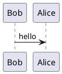

# 1\. Solution Architecture

## 1.1 Overview

The proposed solution is designed following Salesforce Well-Architected principles by separating presentation, orchestration, business logic, integration, and data persistence into independent layers.

The solution leverages Salesforce portal capabilities as the citizen-facing channel, Lightning Web Components (LWC) for the primary user interface, Flow for simple record automation, Apex for reusable business logic, and Custom Metadata Types to support configurable business rules.

The architecture follows the principle of using declarative capabilities whenever possible while reserving Apex for scenarios requiring complex calculations, reusable business logic, or performance-critical processing.

## 1.2 Architecture Principles

The solution is designed based on the following principles.

| Principle                        | Implementation                                                                                 |
| -------------------------------- | ---------------------------------------------------------------------------------------------- |
| Configuration over Customization | Business rules are stored in Custom Metadata Types whenever possible.                          |
| Separation of Concerns           | UI, orchestration, business logic, integration, and persistence are implemented independently. |
| Reusability                      | Business services are implemented as reusable Apex service classes.                            |
| Scalability                      | Business logic is bulkified and designed for large-volume processing.                          |
| Security by Design               | Named Credentials, Sharing Model, Permission Sets, and Experience Cloud Profiles are used.     |
| Maintainability                  | Simple automation uses Flow while complex logic is implemented in Apex.                        |

## 1.3 High-Level Solution Architecture

[1.3 High-Level Solution Architecture.puml](<./1.3 High-Level Solution Architecture.puml>)

## 1.4 Architecture Reasoning

The architecture separates each responsibility into an independent layer.

Experience Cloud provides the public-facing portal for citizens.

Lightning Web Components are responsible only for user experience, client-side validation, and request submission.

Flow orchestrates declarative processes such as notifications, routing, and simple business automation. This allows administrators to modify business processes without requiring code deployment.

Complex business logic, contact matching, grant validation, disbursement schedule generation, and import processing are implemented within Apex service classes. This improves testability, scalability, and maintainability.

Business configuration such as grant options, eligibility thresholds, and future support schemes are externalized into Custom Metadata Types instead of hardcoded Apex logic.

External integration and retry classes are available as extension points. When live REST integration is enabled, it should use Named Credentials so authentication details remain outside Apex code.

## 1.5 Layered Architecture

[1.5 Layered Architecture.puml](<./1.5 Layered Architecture.puml>)

#

## 1.6 Why Flow Instead of Apex?

The solution intentionally follows a declarative-first architecture.

Flow is used for:

- Record orchestration
- Notifications
- Approval routing
- Assignment
- Simple business automation

Apex is reserved for:

- Complex grant calculations
- Redistribution logic
- External REST integrations
- Bulk upload processing
- Performance-critical algorithms
- Reusable enterprise services

This design minimizes technical debt while ensuring future maintainability.

## 1.7 Service Layer Design

[1.7 Service Layer Design.puml](<./1.7 Service Layer Design.puml>)

## 1.8 Business Flow

[1.8 Business Flow.puml](<./1.8 Business Flow.puml>)

##

## **1.9. Scope**

### **In Scope**

This solution addresses the functional and technical requirements described in the GovTech Technical Assessment.

The proposed solution includes:

- Citizen self-service application through Experience Cloud.
- Grant application submission using Lightning Web Components.
- Contact management.
- Grant application management.
- Grant disbursement schedule generation.
- Eligibility validation.
- Contact matching and applicant profile maintenance.
- Administrator-configurable grant options using Custom Metadata Types.
- Configurable user-facing error messages using Custom Metadata Types.
- Integration error object and retry service placeholders for future operational monitoring.
- Security architecture based on Salesforce security best practices.
- Future implementation blueprint for citizen enquiry and feedback case management using Salesforce Service Cloud.
- Future target design for multi-channel case intake, citizen verification, case assignment, supervisor oversight, branch-level reporting, SSO, and historical migration.
- Solution Architecture documentation.

### **Out of Scope**

The following items are intentionally excluded from the current build because they are outside the implemented grant-assessment scope. Where relevant, target designs are documented as future implementation items.

- Payment gateway implementation.
- Live external MDM integration implementation.
- Identity Provider (SSO) implementation.
- Infrastructure provisioning.
- CI/CD pipeline implementation.
- Monitoring platform implementation.
- Salesforce environment strategy.
- License estimation.
- Disaster recovery implementation.
- Production deployment planning.
- External financial system implementation.
- Data migration from legacy systems.
- Supporting document upload implementation.
- Performance testing.
- User training.
- Operational support procedures.
- Service Cloud case management implementation for enquiry and feedback.
- CTI, live chat, mobile messaging, and production email channel configuration.

#

# 2\. Data Architecture

## 2.1 Overview

The proposed data model separates master data from transactional data to improve maintainability, scalability, reporting capability, and future extensibility.

Instead of storing all business information directly within the Contact object, the solution introduces a dedicated _**Grant Application**_ object and _**Grant Disbursement**_ object.

This approach enables multiple grant applications to be associated with a single citizen while preserving application history and supporting future business enhancements without modifying the core Contact record.

## 2.2 Entity Relationship Diagram

[2.2 Entity Relationship Diagram.puml](<./2.2 Entity Relationship Diagram.puml>)

## 2.3 Data Ownership

| Object                              | Purpose                                                                    |
| ----------------------------------- | -------------------------------------------------------------------------- |
| Account                             | Holding account for grant applicants where required                        |
| Contact                             | Citizen master profile                                                     |
| Grant Application                   | Individual application and submitted applicant details                     |
| Grant Disbursement                  | Monthly payment schedule                                                   |
| Grant Support Option Metadata       | Configurable monthly amount and duration                                   |
| Grant Configuration Metadata        | Configurable grant rules such as income threshold                          |
| Grant Error Message Metadata        | Configurable validation and user-facing messages                           |
| Integration Error                   | Operational error tracking for integration/retry scenarios                 |
| Case (Future)                       | Citizen enquiry and feedback records across all channels                   |
| Knowledge (Future)                  | Approved reusable enquiry solutions                                        |
| Salesforce Files (Future)           | Photos and supporting case documents                                       |
| Service Division (Future)           | Branch/division ownership, reporting, and sharing scope                    |
| Case Routing Rule Metadata (Future) | Configurable assignment criteria by channel, language, skill, and division |
| Migration Batch (Future)            | Historical case migration tracking and reconciliation                      |

## 2.4 Why Introduce Grant Application?

Although the requirement only requires **Contact** and **Grant Disbursement** records, introducing a **Grant Application** object significantly improves the overall architecture.

Benefits include:

- Separation between master data and transactional data.
- Preservation of application history.
- Support for multiple applications submitted by the same citizen.
- Improved reporting capabilities.
- Easier implementation of future business requirements.
- Better normalization of the data model.

This design aligns with enterprise CRM modeling practices.

##

## 2.5 Object Relationships

[2.5 Object Relationships.puml](<./2.5 Object Relationships.puml>)

## 2.6 Class Diagram

[3.10 Apex Class Diagram.puml](<./3.10 Apex Class Diagram.puml>)

## 2.7 Application Lifecycle

[2.6 Application Lifecycle.puml](<./2.6 Application Lifecycle.puml>)

## 2.8 Grant Disbursement Lifecycle

[2.7 Grant Disbursement Lifecycle.puml](<./2.7 Grant Disbursement Lifecycle.puml>)

##

## 2.9 Data Validation Strategy

Data validation is implemented using multiple validation layers.

| Layer            | Responsibility                                     |
| ---------------- | -------------------------------------------------- |
| LWC              | User experience validation                         |
| Validation Rules | Standard field validation                          |
| Apex             | Cross-object validation and complex business rules |
| Trigger          | Data integrity enforcement                         |
| Database         | Referential integrity                              |

The layered validation approach prevents invalid data from entering the system while providing immediate feedback to end users.

## 2.10 Configurable Business Rules

The solution avoids hardcoded business logic by externalizing configurable values into Custom Metadata Types.

[2.9 Configurable Business Rules.puml](<./2.9 Configurable Business Rules.puml>)  
Administrators can introduce new grant schemes or modify existing configurations without requiring Apex code changes or deployments.

##

## 2.11 Future Scalability

The proposed data model supports future enhancements including:

- Multiple grant programs.
- Multiple applications per citizen.
- Additional verification stages.
- Appeals and reassessments.
- Payment integrations.
- Audit history.
- Government reporting.
- Historical grant analytics.
- Citizen enquiry and feedback case management.
- Multi-channel Service Cloud routing.
- Branch, supervisor, and agent performance analytics.

The architecture minimizes future schema changes while maintaining backward compatibility.

#

# 3\. Application Architecture

## 3.1 Overview

The application layer is designed following the principles of loose coupling, high cohesion, and separation of responsibilities.

Business logic is encapsulated within reusable Apex service classes while Lightning Web Components (LWC) remain responsible only for user interaction and presentation.

Declarative automation is implemented using Salesforce Flow wherever appropriate, while Apex is reserved exclusively for complex processing that cannot be efficiently implemented using declarative tools.

This architecture minimizes technical debt while improving maintainability and long-term scalability.

## 3.2 Application Layer Overview

[3.2 Application Layer Overview.puml](<./3.2 Application Layer Overview.puml>)

##

## 3.3 Business Service Responsibilities

| Service                                     | Responsibility                                                                 |
| ------------------------------------------- | ------------------------------------------------------------------------------ |
| GrantApplicationService                     | Coordinates submission, validation, applicant linking, and schedule creation   |
| ContactMatchingService                      | Finds or creates applicants by phone and maintains citizen profile data        |
| GrantDisbursementService                    | Creates and recalculates disbursement schedules from active support options    |
| GrantConfigurationService                   | Retrieves active grant configuration such as available grant types             |
| GrantSupportOptionService                   | Retrieves active support options from Custom Metadata                          |
| GrantApplicationBulkUploadService           | Handles imported grant applications through trigger-based bulk-safe processing |
| GrantExceptionService                       | Resolves configurable business and validation messages                         |
| GrantIntegrationService / GrantRetryService | Extension points for future REST integration and retry handling                |
| CaseIntakeService (Future)                  | Normalizes future website, email, phone, chat, and mobile case submissions     |
| CitizenVerificationService (Future)         | Verifies citizen phone or email against the external MDM system                |
| CaseRoutingService (Future)                 | Applies future skill, language, workload, availability, and division routing   |
| FeedbackAnalyticsService (Future)           | Aggregates future feedback trends, satisfaction levels, and improvement areas  |

##

## 3.4 Application Flow

[3.4 Application Flow.puml](<./3.4 Application Flow.puml>)

## 3.5 Contact Matching Flow

[3.9 Contact Matching Flow.puml](<./3.9 Contact Matching Flow.puml>)

## 3.6 Flow vs Apex Decision Matrix

One of the key architectural decisions is determining whether a requirement should be implemented using Salesforce Flow or Apex.

| Requirement                            | Technology                          | Justification                                                                         |
| -------------------------------------- | ----------------------------------- | ------------------------------------------------------------------------------------- |
| Email Notifications                    | Flow                                | Declarative, easy to maintain                                                         |
| Assignment Rules                       | Flow                                | Administrator configurable                                                            |
| Approval Process                       | Flow                                | Native Salesforce capability                                                          |
| Grant Eligibility                      | Apex                                | Income and support option rules require reusable validation                           |
| Payment Schedule Recalculation         | Apex                                | Existing paid disbursements must be preserved when options change                     |
| REST Integration                       | Apex                                | Placeholder service exists; live callouts should be added only when required          |
| Bulk CSV Processing                    | Apex Service + Trigger              | Imported records are normalized and recalculated in bulk-safe logic                   |
| Complex Validation                     | Apex                                | Cross-object validation                                                               |
| Support Option Retrieval               | Custom Metadata \+ Apex             | Configuration-driven solution                                                         |
| Case Assignment (Future)               | Omni-Channel + Flow                 | Standard routing engine with administrator-configurable queues and skills             |
| Citizen MDM Verification (Future)      | Apex + Named Credential             | Secure integration requiring payload mapping, fallback handling, and retries          |
| Branch Performance Dashboards (Future) | Reports/Dashboards or CRM Analytics | Standard analytics first; advanced analytics only if dashboard complexity requires it |

## 3.7 Why Apex Is Used Only When Necessary

The solution intentionally minimizes custom code.

Apex is implemented only when one or more of the following conditions are met:

- Complex payload transformation.
- Performance-critical calculations.
- External REST integrations.
- Bulk data processing.
- Cross-object business validation.
- Reusable enterprise services.
- Scenarios that cannot be implemented declaratively.

All other business automation is implemented using Salesforce Flow to reduce maintenance costs and improve administrator productivity. This approach follows Salesforce's recommendation to favor declarative capabilities before introducing custom code.

## 3.8 Service Interaction Diagram

[3.7 Service Interaction Diagram.puml](<./3.7 Service Interaction Diagram.puml>)

## 3.9 Error Handling Strategy

The application adopts a centralized error handling strategy.

[3.8 Error Handling Strategy.puml](<./3.8 Error Handling Strategy.puml>)

Business exceptions are converted into friendly, configurable messages through `Grant_Error_Message__mdt`.

The project also includes `Integration_Error__c` for operational tracking when integration/retry processing is enabled. The object supports the following information:

- Transaction ID
- Request Payload
- Response Payload
- Stack Trace
- Retry Count
- Processing Status
- Processed Date

This approach simplifies operational monitoring, troubleshooting, and future retry processing.

## 3.10 Retry Strategy

When external integration is enabled, failures should be classified into retryable and non-retryable errors.

[Retry Strategy Diagram](<./7.4 Retry Strategy.puml>)

Retry attempts should be limited to prevent infinite processing loops. Each retry updates the retry counter and processing status to provide complete operational visibility.

## 3.11 Operational Monitoring

The solution includes centralized operational monitoring.

Production incidents for integration/retry scenarios can be captured using the `Integration_Error__c` object.

Captured information includes:

- Transaction Identifier
- Error Category
- Exception Message
- Stack Trace
- Request Payload
- Response Payload
- Retry Count
- Processing Status

Operational dashboards can be built using Salesforce Reports and Dashboards to monitor failed transactions and retry status.

## 3.12 Disaster Recovery Considerations

The proposed solution relies on Salesforce Platform resilience and disaster recovery capabilities.

Additional operational recommendations include:

- Scheduled data exports
- Version-controlled source code repository
- Automated deployment pipeline
- Backup strategy for metadata
- Monitoring of integration endpoints
- Production alerting for failed integrations

# 4\. Non-Functional Requirements

## 4.1 Overview

In addition to satisfying the functional requirements, the proposed solution is designed to meet key non-functional requirements related to performance, scalability, security, maintainability, reliability, and operational excellence.

These architectural considerations ensure that the solution remains sustainable throughout its lifecycle while supporting future business growth.

## 4.2 Performance

The application is designed to minimize server processing time and optimize the use of Salesforce platform resources.

### Design Considerations

- Client-side validation is implemented using Lightning Web Components to reduce unnecessary server round trips.
- Business logic is bulkified to efficiently process multiple records within Salesforce governor limits.
- SOQL and DML operations are optimized to prevent excessive database operations.
- Collections (List, Set, and Map) are used to eliminate nested loops and reduce processing time.
- Guest-user linking is handled asynchronously using Queueable Apex where required.
- External REST integrations are isolated behind dedicated service classes and should be executed only when required.

## 4.3 Scalability

The architecture supports future business growth without requiring major structural changes.

### Design Considerations

- Separation between master data and transactional data.
- Configuration-driven business rules using Custom Metadata Types.
- Reusable Apex service classes.
- Layered application architecture.
- Bulk-safe trigger processing for imported applications.
- Support for additional grant programs without changing application logic.

The proposed design allows new grant schemes, eligibility rules, and business configurations to be introduced through metadata rather than source code modifications.

## 4.4 Security

Security follows Salesforce's defense-in-depth approach.

### Security Controls

- Organization-Wide Defaults
- Role Hierarchy
- Sharing Rules
- Permission Sets
- Field-Level Security
- Experience Cloud Profiles
- Named Credentials
- Secure REST authentication
- Platform Encryption (Future Enhancement)

Sensitive information is protected using Salesforce security mechanisms while external credentials remain outside application code.

## 4.5 Availability

The solution is designed for high availability by leveraging Salesforce Platform services.

External dependencies are isolated through REST integration layers.

Temporary failures from external systems do not impact overall platform availability and are handled through centralized exception management and retry mechanisms.

## 4.6 Reliability

The application incorporates several reliability mechanisms.

- Centralized exception handling
- Retry service placeholder for future integration failures
- Transaction rollback
- Validation before persistence
- Integration error tracking object
- Bulk-safe import processing

These mechanisms improve operational stability and simplify production support.

## 4.7 Maintainability

Maintainability is achieved through clear separation of responsibilities.

Presentation, orchestration, business logic, persistence, and integration are implemented independently.

Configuration is externalized into Custom Metadata whenever possible.

Simple automation uses Flow while complex reusable logic is implemented in Apex.

This minimizes technical debt while improving long-term maintainability.

## 4.8 Extensibility

The architecture is intentionally designed to support future enhancements.

Examples include:

- Additional grant schemes
- New eligibility rules
- Multiple payment providers
- Additional external integrations
- Mobile applications
- AI-assisted citizen support
- Government reporting platforms

These enhancements can be introduced with minimal impact on the existing architecture.

#

# 5\. Architectural Decision Records (ADR)

## 5.1 Purpose

Architectural Decision Records (ADR) document the significant architectural decisions made throughout the solution design process.

Each decision captures the problem being addressed, the selected approach, alternative options considered, and the rationale behind the final decision.

This provides transparency, improves maintainability, and supports future architectural evolution.

### **ADR-001 — Introduce Grant Application as a Separate Transaction Object**

### **Context**

The assessment requires storing citizen information in the Contact object and grant payment schedules in Grant Disbursement records.

A design decision is required regarding whether all application-related information should be stored directly on Contact or separated into a dedicated transactional object.

### **Decision**

Introduce a custom object named **Grant\_Application\_\_c** between Contact and Grant\_Disbursement\_\_c.

### **Alternatives Considered**

| Option                                    | Description                                                    |
| ----------------------------------------- | -------------------------------------------------------------- |
| Store all information directly in Contact | Simpler implementation but mixes master and transactional data |
| Introduce Grant Application object        | Adds one object but provides a cleaner domain model            |

### **Rationale**

Separating application data from citizen master data provides better normalization, preserves application history, supports multiple applications per citizen, improves reporting capabilities, and simplifies future enhancements.

### **Consequences**

Positive:

- Better scalability
- Cleaner data model
- Easier maintenance
- Historical tracking

Trade-off:

- One additional custom object
- Slightly higher implementation complexity

### **ADR-002 — Flow First, Apex When Necessary**

### **Context**

Salesforce offers both declarative automation and programmatic development.

A design decision is required regarding where business logic should be implemented.

### **Decision**

Use Salesforce Flow for orchestration and Apex only for complex business logic.

### **Rationale**

Flow provides better maintainability for administrators and reduces long-term technical debt.

Apex is reserved for scenarios requiring:

- Complex calculations
- External integrations
- Bulk processing
- Performance-critical algorithms
- Cross-object validation

### **Consequences**

Positive:

- Easier administration
- Lower maintenance cost
- Reduced custom code
- Better alignment with Salesforce best practices

Trade-off:

- Logic is distributed between Flow and Apex
- Clear governance is required

### **ADR-003 — Configuration over Hardcoded Business Rules**

### **Context**

The assessment explicitly states that administrators should be able to add new grant options without modifying source code.

### **Decision**

Store grant configuration in **Custom Metadata Types**.

### **Alternatives Considered**

| Option                   | Description                                      |
| ------------------------ | ------------------------------------------------ |
| Hardcoded Apex Constants | Requires deployment for every business change    |
| Custom Metadata Type     | Business configuration managed by administrators |

### **Rationale**

Business rules change more frequently than application logic.

Externalizing configuration enables administrators to manage grant options without requiring code deployment.

### **Consequences**

Positive:

- No deployment required
- Better flexibility
- Easier administration

Trade-off:

- Slightly more complex initial implementation

### **ADR-004 — Layered Service Architecture**

### **Context**

Business logic could be implemented directly inside controllers or triggers.

### **Decision**

Implement a dedicated Service Layer.

### **Rationale**

Each service has a single responsibility.

Services are reusable across LWC, Flow, Queueable Apex, future Batch Apex, Scheduled Apex, and REST APIs.

### **Consequences**

Positive:

- High cohesion
- Loose coupling
- Easier unit testing
- Better scalability

Trade-off:

- Additional classes
- Slightly more project structure

### **ADR-005 — Trigger Handler Pattern**

### **Context**

Business logic can either be written directly inside triggers or delegated to handler classes.

### **Decision**

Use a Trigger Handler framework.

### **Rationale**

Triggers should only dispatch events.

Business logic belongs inside service classes.

### **Consequences**

Positive:

- Cleaner triggers
- Reusable logic
- Easier testing
- Better governance

Trade-off:

- More Apex classes

##

### **ADR-006 — Named Credentials for External Integration**

### **Context**

Citizen verification may require communication with an external Master Data Management system in a future release.

### **Decision**

Keep the integration service separate from the core application service. When live REST integration is enabled, use Named Credentials together with External Credentials.

### **Alternatives Considered**

| Option                             | Description             |
| ---------------------------------- | ----------------------- |
| Hardcoded endpoint and credentials | Security risk           |
| Named Credentials                  | Secure and maintainable |

### **Rationale**

Authentication details should be managed outside application code.

Credentials can be rotated without modifying Apex.

### **Consequences**

Positive:

- Improved security
- Easier credential rotation
- Cleaner Apex code

Trade-off:

- Additional Salesforce configuration

##

### **ADR-007 — Configurable Error Messages and Integration Error Tracking**

### **Context**

Validation, disbursement calculation, external integrations, and import processing may fail unexpectedly.

### **Decision**

Use `Grant_Error_Message__mdt` for friendly user-facing messages and `Integration_Error__c` for operational tracking of integration/retry failures.

### **Stored Information**

- Transaction Id
- Error Type
- Error Message
- Stack Trace
- Request Payload
- Response Payload
- Retry Count
- Processing Status

### **Rationale**

Configurable messages keep the user experience business-friendly, while integration error records simplify production support and enable retry mechanisms when live integrations are added.

### **Consequences**

Positive:

- Easier troubleshooting
- Operational monitoring
- Retry capability
- Audit history

Trade-off:

- Additional storage consumption

### **ADR-008 — Bulk-Safe Import Processing**

### **Context**

Grant applications may be created through data import tools as well as the portal.

### **Decision**

Use trigger-based bulk-safe Apex services to validate imported rows, match or create Contacts, link applications, and recalculate disbursements.

### **Rationale**

The current implementation keeps import handling close to the `Grant_Application__c` lifecycle and uses collection-based SOQL/DML to stay within governor limits. Batch Apex can still be introduced later if file sizes or operational requirements exceed synchronous import limits.

### **Consequences**

Positive:

- Keeps imported data consistent with portal submissions
- Reuses the same support option and disbursement rules
- Avoids unnecessary framework complexity for the current scope

Trade-off:

- Very large imports may require a future Batch Apex wrapper

### **ADR-009 — Enterprise Security Model**

### **Context**

The solution contains multiple user personas including Citizens, Support Agents, Supervisors, and Administrators.

### **Decision**

Implement Salesforce's layered security model.

### **Components**

- Organization-Wide Defaults (OWD)
- Role Hierarchy
- Sharing Rules
- Permission Sets
- Experience Cloud Profiles
- Field-Level Security
- Named Credentials

### **Rationale**

Each layer addresses a different security concern, providing defense in depth.

### **Consequences**

Positive:

- Least privilege access
- Regulatory compliance
- Simplified security governance

Trade-off:

- Additional configuration effort

### **ADR-010 — Future Document Storage Should Use Salesforce Files**

### **Context**

If supporting document upload is added in a future release, the solution needs a modern document storage approach.

### **Decision**

Use Salesforce Files (`ContentVersion`, `ContentDocument`, and `ContentDocumentLink`) instead of legacy Attachments.

### **Alternatives Considered**

| Option           | Description                              |
| ---------------- | ---------------------------------------- |
| Attachment       | Legacy feature with limited capabilities |
| Salesforce Files | Modern file management model             |

### **Rationale**

Salesforce Files supports versioning, sharing, preview, and future integrations while aligning with Salesforce's strategic direction.

### **Consequences**

Positive:

- Modern architecture
- Better file lifecycle management
- Native sharing and version control

Trade-off:

- Slightly more complex data model compared to legacy attachments

## 5.2 ADR Summary

The proposed architecture intentionally prioritizes maintainability, scalability, configurability, and operational excellence over short-term implementation simplicity. Each architectural decision has been evaluated based on long-term business value, Salesforce platform best practices, and enterprise application design principles. The result is a solution that not only satisfies the current assessment requirements but is also prepared to support future enhancements with minimal architectural rework.

# 6\. Assumptions and Constraints

## 6.1 Assumptions

The following assumptions have been made during the solution design.

| ID   | Assumption                                                                                                                    |
| ---- | ----------------------------------------------------------------------------------------------------------------------------- |
| A-01 | If MDM verification is enabled later, the MDM system exposes secure REST APIs.                                                |
| A-02 | In the current implementation, applicant matching primarily uses phone number.                                                |
| A-03 | Authentication for internal Salesforce users can be integrated with the organization's identity provider in a future release. |
| A-04 | Grant eligibility criteria are maintained by business administrators.                                                         |
| A-05 | Grant payment execution is performed by an external financial system.                                                         |
| A-06 | Business administrators are responsible for maintaining Custom Metadata records.                                              |
| A-07 | If supporting document upload is added later, uploaded files comply with Salesforce storage limitations.                      |
| A-08 | External services, when enabled, provide acceptable response times or support asynchronous retry.                             |

##

## 6.2 Constraints

The following technical constraints apply to the proposed solution.

| ID   | Constraint                                                                                                                   |
| ---- | ---------------------------------------------------------------------------------------------------------------------------- |
| C-01 | Salesforce governor limits apply to all Apex transactions.                                                                   |
| C-02 | REST integrations are not active in the current implementation and will depend on external system availability when enabled. |
| C-03 | If file upload is added later, file storage capacity is governed by Salesforce platform limits.                              |
| C-04 | Network latency may impact external API response time.                                                                       |
| C-05 | Queueable Apex and future Batch Apex execution follow Salesforce asynchronous processing limits.                             |
| C-06 | Platform upgrades and releases follow Salesforce release schedules.                                                          |
| C-07 | The assessment excludes implementation of payment gateway functionality.                                                     |
| C-08 | Infrastructure management is outside the scope of the Salesforce solution.                                                   |

##

## 6.3 Design Trade-offs

Several architectural trade-offs were intentionally accepted.

| Decision                                                 | Benefit                                          | Trade-off                        |
| -------------------------------------------------------- | ------------------------------------------------ | -------------------------------- |
| Introduce Grant Application object                       | Better normalization                             | Additional custom object         |
| Use Flow for orchestration                               | Easier administration                            | Multiple automation technologies |
| Use Apex Service Layer                                   | Better scalability and reuse                     | More implementation effort       |
| Custom Metadata                                          | Configuration-driven                             | Additional setup                 |
| Configurable error messages and Integration Error object | Better user experience and operational readiness | Additional metadata and storage  |

#

# 7\. Risks and Mitigation

## 7.1 Overview

Every enterprise solution introduces technical and operational risks.

The proposed architecture includes mitigation strategies to reduce both the likelihood and impact of these risks.

## 7.2 Risk Register

| Risk ID | Risk                                                   | Impact                              | Mitigation                                                               |
| ------- | ------------------------------------------------------ | ----------------------------------- | ------------------------------------------------------------------------ |
| R-01    | External verification service unavailable when enabled | Citizen verification may be delayed | Retry mechanism, integration error tracking, manual verification process |
| R-02    | Duplicate citizen applications                         | Duplicate grant allocation          | Phone-based contact matching and active application reuse                |
| R-03    | Salesforce governor limit exceeded                     | Transaction failure                 | Bulkification, optimized SOQL, efficient collections                     |
| R-04    | Business rules change frequently                       | Frequent deployments                | Store configuration in Custom Metadata                                   |
| R-05    | Large CSV imports                                      | Long processing time                | Bulk-safe import service; add Batch Apex if volume grows                 |
| R-06    | Integration timeout                                    | Delayed application processing      | Timeout handling, retry queue                                            |
| R-07    | Invalid supporting documents if upload is added later  | Application review delay            | Client-side and server-side validation                                   |
| R-08    | Unexpected Apex exception                              | Transaction rollback                | Centralized exception framework                                          |
| R-09    | Unauthorized data access                               | Security breach                     | Salesforce security model, least privilege principle                     |
| R-10    | Future grant scheme changes                            | High maintenance effort             | Metadata-driven architecture                                             |

#

# 8\. Future Implementation - Citizen Enquiry and Feedback Case Management

## 8.1 Purpose

This section documents the future target architecture for a government agency service model that handles citizen enquiries and feedback across website, phone, chat/mobile, and email channels.

The design intentionally builds on the existing architecture by reusing Contact as the citizen profile, Integration Error for operational visibility, Named Credentials for external integrations, Salesforce Files for uploaded evidence, and Custom Metadata for configurable business rules. The future implementation uses Salesforce Service Cloud standard capabilities wherever possible before introducing custom Apex.

## 8.2 Requirement Coverage

| Requirement                                                                 | Future Design Response                                                                                                                                                      |
| --------------------------------------------------------------------------- | --------------------------------------------------------------------------------------------------------------------------------------------------------------------------- |
| Branch Admin monitors all incoming requests across citizen contact channels | Branch Admin receives read-only dashboards scoped by Service Division, channel, queue, SLA, status, and agent performance.                                                  |
| Supervisor oversees agents across enquiry and feedback cases                | Supervisors use Service Console list views, queues, escalations, SLA alerts, and performance dashboards.                                                                    |
| Agent handles day-to-day enquiries and feedback                             | Agents work from Service Console with Case, Contact, Knowledge, Files, activities, and follow-up actions in one workspace.                                                  |
| Enquiry cases                                                               | Implemented as Case record type `Enquiry` with verification, assignment, knowledge search, follow-up, supervisor escalation, and closure confirmation.                      |
| Feedback cases                                                              | Implemented as Case record type `Feedback` with service category, satisfaction level, analysis, response tracking, reporting, and supervisor evaluation.                    |
| Website submissions                                                         | Use Experience Cloud/LWC or Web-to-Case/API-backed intake to create Cases.                                                                                                  |
| Phone calls                                                                 | Use CTI or Service Cloud Voice-compatible integration to screen-pop Contact/Case and create call-origin Cases.                                                              |
| Real-time website/mobile assistance                                         | Use Messaging, Chat, or Digital Engagement capabilities routed into Case.                                                                                                   |
| Email                                                                       | Use Email-to-Case with routing and auto-response rules.                                                                                                                     |
| External MDM verification                                                   | Use Apex integration through Named Credentials/API Gateway to verify phone or email against the MDM system.                                                                 |
| Flexibility for change                                                      | Use Case record types, queues, Omni-Channel routing, Flow, Custom Metadata, and configurable dashboards.                                                                    |
| 10 years / 6M records / 100GB files migration                               | Use a staged migration approach with profiling, cleansing, pilot loads, Bulk API, file strategy, reconciliation, and cutover.                                               |
| 5,000 new cases and 100MB uploads daily                                     | Use standard Case and Salesforce Files with storage capacity sizing, bulk-safe automation, and monitoring of file growth.                                                   |
| SSO using Microsoft Active Directory                                        | Use Salesforce SSO with Microsoft AD/Entra ID for internal Branch Admin, Supervisor, and Agent users through SAML or OpenID Connect, with permission sets and role mapping. |
| Branch Admin evaluates agent performance                                    | Provide dashboards for volume, backlog, first response, resolution time, SLA breach, reopen rate, feedback score, and Knowledge reuse.                                      |

## 8.3 Future Diagrams

[Future Citizen Case Management Lifecycle](<./8.1 Future Citizen Case Management Lifecycle.puml>)

[Future Historical Case Data Migration Plan](<./8.2 Future Historical Case Data Migration Plan.puml>)

The high-level landscape, ERD, object relationships, and retry strategy diagrams have also been extended with future Service Cloud, MDM, SSO, file, routing, and migration components.

## 8.4 Recommended Salesforce Capabilities

The recommended product baseline is Salesforce Service Cloud for internal users, Experience Cloud for citizen-facing web access, and selected add-ons based on the final channel scope. Final licensing must be validated with Salesforce because packaging and feature availability can change.

| Area                        | Recommended Capability                                                                      | Rationale                                                                                                    |
| --------------------------- | ------------------------------------------------------------------------------------------- | ------------------------------------------------------------------------------------------------------------ |
| Internal case handling      | Service Cloud Enterprise or higher                                                          | Provides standard Case, Service Console, queues, automation, reporting, and service process foundation.      |
| Government-grade compliance | Salesforce Government Cloud or equivalent regulated hosting option, if mandated             | Suitable when procurement, residency, compliance, or public-sector controls require a regulated environment. |
| Citizen portal              | Experience Cloud                                                                            | Enables authenticated or public citizen self-service, case submission, and status visibility.                |
| Multi-channel routing       | Omni-Channel                                                                                | Routes work by queue, skill, workload, capacity, language, and availability.                                 |
| Email channel               | Email-to-Case                                                                               | Converts citizen emails into Cases and preserves email thread history.                                       |
| Website case intake         | Web-to-Case, Experience Cloud, or custom LWC/API                                            | Supports direct submission from agency website with validation and attachment handling.                      |
| Chat/mobile channel         | Messaging, Chat, or Digital Engagement                                                      | Supports real-time assistance and converts conversations into service work.                                  |
| Phone channel               | Open CTI, Service Cloud Voice, or compatible telephony adapter                              | Enables call screen-pop, call logging, and phone-origin Case creation.                                       |
| Reusable answers            | Salesforce Knowledge                                                                        | Enables agents to provide approved solutions and create new knowledge candidates.                            |
| SLA management              | Entitlements and Milestones                                                                 | Tracks first response, follow-up, escalation, and resolution commitments.                                    |
| Reporting                   | Reports and Dashboards; CRM Analytics or Tableau if needed                                  | Standard reporting is sufficient initially; advanced analytics is optional for deeper trend analysis.        |
| Integration                 | Named Credentials, External Credentials, Apex, API Gateway, MuleSoft or existing middleware | Secures and governs integration with MDM and channel platforms.                                              |
| Migration                   | Bulk API, Data Loader, Data Loader CLI, MuleSoft, Informatica, or ETL tooling               | Supports controlled high-volume loading and reconciliation.                                                  |
| Backup/archive              | Salesforce Backup or approved AppExchange backup/archive solution                           | Reduces operational risk for historical records and file retention.                                          |

## 8.5 Future Business Process

### 8.5.1 Enquiry Case Process

| Step                   | Future Process                                                                                                                                          |
| ---------------------- | ------------------------------------------------------------------------------------------------------------------------------------------------------- |
| Initiation             | Citizen submits an enquiry through website, phone, chat/mobile, or email.                                                                               |
| Verification           | Agent or automated service verifies phone/email against MDM and links the Case to the correct Contact.                                                  |
| Case Recording         | Case stores subject, description, channel, category, supporting files/photos, citizen details, and service division.                                    |
| Assignment             | Omni-Channel assigns to an agent based on queue, skill, language, workload, availability, priority, and division.                                       |
| Resolution             | Agent searches Knowledge; if a solution exists, it is shared with the citizen. If not, agent documents a new resolution and proposes Knowledge content. |
| Supervisor Involvement | Supervisor is engaged for complex, escalated, SLA-risk, or policy-sensitive enquiries.                                                                  |
| Follow-Up              | Follow-up tasks or milestones remain active until the citizen confirms the enquiry is fully resolved.                                                   |
| Closure                | Case is closed with resolution summary, citizen confirmation, and audit trail.                                                                          |

### 8.5.2 Feedback Case Process

| Step       | Future Process                                                                                                |
| ---------- | ------------------------------------------------------------------------------------------------------------- |
| Receipt    | Feedback, complaint, or suggestion is received through a supported channel.                                   |
| Recording  | Case captures the service/product area, category, sentiment or satisfaction level, channel, and evidence.     |
| Analysis   | Agent reviews root cause, citizen impact, improvement area, and whether a citizen response is required.       |
| Response   | Agent responds where required and records communication history.                                              |
| Reporting  | Feedback is grouped by service, channel, branch, severity, satisfaction level, and trend for internal review. |
| Evaluation | Supervisor reviews handling quality, SLA performance, agent effectiveness, and citizen satisfaction outcome.  |

## 8.6 Future User Stories

| Persona      | User Story                                                                                                                                                           |
| ------------ | -------------------------------------------------------------------------------------------------------------------------------------------------------------------- |
| Citizen      | As a citizen, I want to submit an enquiry or feedback from my preferred channel so that I can receive support without visiting a branch.                             |
| Citizen      | As a citizen, I want to upload supporting photos or documents so that the agency can understand my issue quickly.                                                    |
| Agent        | As an agent, I want the system to verify citizens by phone or email so that I can avoid duplicate profiles and handle the right citizen record.                      |
| Agent        | As an agent, I want cases routed based on expertise, language, workload, and availability so that work is distributed fairly and citizens receive the right support. |
| Agent        | As an agent, I want to search approved Knowledge articles so that I can provide consistent answers.                                                                  |
| Agent        | As an agent, I want to create a draft solution when no answer exists so that future similar enquiries can be resolved faster.                                        |
| Supervisor   | As a supervisor, I want to monitor queue backlog and escalations so that I can intervene before SLA breaches occur.                                                  |
| Supervisor   | As a supervisor, I want to evaluate feedback handling and agent outcomes so that service quality can be improved.                                                    |
| Branch Admin | As a Branch Admin, I want dashboards by division, channel, and agent so that I can monitor demand and operational performance.                                       |

## 8.7 Future Data Model

The future implementation should use the standard Case object as the primary transactional record. Enquiry and Feedback should be implemented as Case record types instead of separate custom objects because Salesforce Service Cloud features such as Omni-Channel, Email-to-Case, Knowledge, entitlements, queues, service console, and reporting are optimized around Case.

Key future entities include:

- `Contact`: citizen master profile.
- `Case`: enquiry and feedback transaction record.
- `Service_Division__c`: branch or division ownership, reporting, and sharing scope.
- `User` and `Group`: agent, supervisor, branch admin, and queue ownership.
- `Knowledge__kav`: approved reusable answers and agent-authored draft solutions.
- `ContentVersion`, `ContentDocument`, and `ContentDocumentLink`: photos and supporting files.
- `CaseRoutingRule__mdt`: configurable routing criteria for record type, channel, language, skill, and division.
- `Migration_Batch__c`: migration batch tracking for historical loads and reconciliation.
- `Integration_Error__c`: operational tracking for MDM, channel, or file-processing failures.

## 8.8 Future Sharing and Security Design

The future security model should follow least privilege access.

| Role                    | Access Design                                                                                                                      |
| ----------------------- | ---------------------------------------------------------------------------------------------------------------------------------- |
| Branch Admin            | Read-only access to Cases, dashboards, and reports within assigned Service Division. No direct case resolution responsibility.     |
| Supervisor              | Read/write access to team Cases, queues, escalations, feedback evaluation, and agent performance dashboards.                       |
| Agent                   | Read/write access to owned Cases, queue-assigned Cases, related Contact details required for service, Knowledge, and linked Files. |
| Citizen                 | Access only to their own submitted Cases through Experience Cloud, where authenticated access is enabled.                          |
| System Integration User | API-only least privilege access for MDM, migration, and channel integrations.                                                      |

Recommended controls:

- Case Organization-Wide Default set to Private or Controlled by Parent only where the parent model supports the required isolation.
- Role hierarchy aligned to division and support management structure.
- Queues for initial triage and workload balancing.
- Criteria-based sharing or restriction rules for branch/division visibility.
- Permission Sets for Agent, Supervisor, Branch Admin, Integration User, and Migration User.
- Field-Level Security for sensitive citizen information.
- Platform Encryption for sensitive personally identifiable information if compliance requires it.
- Salesforce Shield Event Monitoring if audit and security monitoring requirements are high.
- Internal SSO with Microsoft AD/Entra ID using SAML or OpenID Connect and controlled session policies.

## 8.9 Future Integration Considerations

| Integration                | Design Consideration                                                                                                                                                                                       |
| -------------------------- | ---------------------------------------------------------------------------------------------------------------------------------------------------------------------------------------------------------- |
| MDM citizen verification   | Verify by phone or email during intake. Use synchronous lookup when response time is acceptable; fall back to asynchronous verification and manual review when unavailable.                                |
| Microsoft Active Directory | Use Microsoft AD/Entra ID as Identity Provider for internal SSO. Map groups to Salesforce profiles, permission sets, roles, and public groups through SAML/OIDC attributes or identity governance tooling. |
| Website/mobile             | Use Experience Cloud/LWC or API-based intake with validation, file upload controls, bot protection, and transaction logging.                                                                               |
| Email                      | Use Email-to-Case, routing addresses, thread identifiers, auto-response rules, and spam controls.                                                                                                          |
| Phone                      | Use Open CTI or Service Cloud Voice-compatible adapter for screen-pop, call logging, and automatic Case creation.                                                                                          |
| Chat/messaging             | Route conversations through Messaging/Chat/Digital Engagement into Omni-Channel and Case.                                                                                                                  |
| Files                      | Validate file type and size, scan for malware where required, and link files to Case using Salesforce Files.                                                                                               |
| Reporting                  | Feed standard dashboards first; use CRM Analytics/Tableau if cross-system or advanced trend analytics are required.                                                                                        |

All external integrations should use Named Credentials or an approved middleware security model. Failures should create or update `Integration_Error__c` with transaction ID, payload summary, retry count, status, and related Case where applicable.

## 8.10 Future Assignment, SLA, and Operational Model

Case assignment should use Omni-Channel as the primary routing mechanism.

Routing criteria:

- Case record type: Enquiry or Feedback.
- Channel: website, phone, chat/mobile, or email.
- Service division or branch.
- Agent skill or expertise.
- Preferred language.
- Priority or severity.
- Agent workload and capacity.
- Agent availability.

Operational controls:

- Queues for initial triage by division and service category.
- Supervisor escalation rules for complex, aged, or SLA-risk cases.
- Entitlements and Milestones for first response, follow-up, and resolution commitments.
- Auto-response templates for acknowledgement and status updates.
- Follow-up tasks until citizen confirmation is received.
- Case closure validation requiring resolution summary and confirmation status.

## 8.11 Future Reporting and Performance Evaluation

Branch Admin and Supervisor dashboards should provide operational oversight without requiring direct involvement in day-to-day resolution.

Recommended KPIs:

- New cases by channel, division, category, and record type.
- Open backlog by age, priority, queue, and owner.
- First response time.
- Average resolution time.
- SLA breach count and breach rate.
- Reopened case rate.
- Follow-up overdue count.
- Agent case volume and closure rate.
- Knowledge article usage and new solution contribution.
- Feedback satisfaction level and trend by service area.
- Complaints versus suggestions ratio.
- MDM verification success and failure rate.

## 8.12 Future Data Migration Plan

The migration scope includes 10 years of historical data, approximately 6 million records, and 100GB of files.

Recommended phases:

| Phase      | Activity                                                                                                                                                              |
| ---------- | --------------------------------------------------------------------------------------------------------------------------------------------------------------------- |
| Discovery  | Identify source systems, entities, record counts, file locations, data quality issues, retention rules, and ownership mapping.                                        |
| Profiling  | Analyse duplicates, missing phone/email, invalid citizen identifiers, unsupported file types, orphaned records, and channel history gaps.                             |
| Mapping    | Map source citizens to Contact, service requests to Case, documents to Salesforce Files or archive links, users to owners, and branches to Service Division.          |
| Cleansing  | Standardize phone/email, deduplicate citizen profiles, normalize service categories, and define exception handling.                                                   |
| Pilot Load | Load representative samples, validate transformations, reconcile counts, confirm file links, and tune batch sizes.                                                    |
| Full Load  | Use Bulk API or ETL tooling for Cases and Contacts, with controlled batches and migration tracking records.                                                           |
| File Load  | Load files as Salesforce Files when storage and compliance allow, or store in approved external archive with secure links when long-term storage is more appropriate. |
| Delta Load | Freeze or limit legacy writes, migrate final changes, and reconcile before go-live.                                                                                   |
| Validation | Reconcile record counts, ownership, sharing, audit fields, reports, file links, and sample citizen histories.                                                         |
| Cutover    | Switch channels to Salesforce, monitor migration exceptions, and keep rollback checkpoints until acceptance.                                                          |

The daily expected volume of 5,000 new Cases and 100MB of new file uploads should be included in storage forecasting, API capacity planning, dashboard performance testing, and backup/archive planning.

## 8.13 Future Non-Functional Considerations

| Area            | Consideration                                                                                                                         |
| --------------- | ------------------------------------------------------------------------------------------------------------------------------------- |
| Scalability     | Standard Case is suitable for high case volumes, but automation must remain bulk-safe and dashboard/report filters must be selective. |
| Storage         | Historical and daily files require explicit Salesforce file storage sizing or an external archive strategy.                           |
| Performance     | MDM verification should have timeout handling, caching where appropriate, and asynchronous fallback.                                  |
| Flexibility     | Record types, Flow, queues, Omni-Channel, Custom Metadata, and Knowledge allow process changes without heavy code changes.            |
| Security        | SSO, least privilege access, field-level security, encryption, and audit logging protect citizen data.                                |
| Reliability     | Integration errors, retry strategy, dead-letter handling, and operational dashboards support production support.                      |
| Maintainability | Standard Service Cloud features reduce custom code and align the implementation with Salesforce platform practices.                   |

## 8.14 Future ADR - Use Standard Case for Enquiry and Feedback

### Context

The future requirement introduces citizen enquiries, complaints, suggestions, multi-channel intake, routing, supervisor oversight, and branch-level reporting.

### Decision

Use the standard Salesforce Case object with separate record types for Enquiry and Feedback.

### Rationale

Standard Case provides native compatibility with Service Cloud Console, Omni-Channel, queues, Email-to-Case, Web-to-Case, Knowledge, entitlements, milestones, reports, dashboards, and common CTI/messaging integrations. This avoids rebuilding case-management capabilities as custom objects.

### Consequences

Positive:

- Faster implementation using standard Salesforce capabilities.
- Better compatibility with Service Cloud features.
- Strong reporting and operational visibility.
- Lower long-term maintenance.

Trade-off:

- Requires careful record type, page layout, sharing, and lifecycle configuration.
- Some agency-specific fields and validations are still required.
