# Dokumen Desain Arsitektur Solusi (SADD) - Tugas 2

## 1. Ringkasan Eksekutif

Dokumen ini mendefinisikan arsitektur solusi Salesforce untuk sebuah instansi pemerintah yang mengelola pertanyaan dan umpan balik warga melalui situs web, telepon, bantuan realtime melalui situs web atau aplikasi seluler instansi, serta saluran email.

Solusi yang direkomendasikan menggunakan Salesforce Service Cloud sebagai platform utama manajemen kasus, Experience Cloud untuk pengajuan dan pemantauan status kasus warga berbasis situs web, Omni-Channel untuk penugasan pekerjaan, Digital Engagement untuk bantuan realtime dari situs web atau aplikasi seluler, Salesforce Knowledge untuk jawaban yang dapat digunakan kembali, Salesforce Files untuk foto/dokumen pendukung, Reports and Dashboards untuk pengawasan operasional, serta Microsoft Active Directory / Microsoft Entra ID untuk Single Sign-On internal.

SADD ini hanya membahas persyaratan Tugas 2 dalam `SF Technical Assessment (task2).md`. Seluruh proses di luar manajemen kasus pertanyaan dan umpan balik warga tidak termasuk dalam cakupan.

> **Catatan terminologi:** Nama produk, feature, object, field, Record Type, Case Status, access mode, dan komponen arsitektur dipertahankan dalam bahasa Inggris jika istilah tersebut memetakan langsung ke konfigurasi Salesforce. Dalam narasi bisnis, “pertanyaan” merujuk pada Case Record Type `Enquiry`, sedangkan “umpan balik” merujuk pada Case Record Type `Feedback`.

## 2. Cakupan Persyaratan

### 2.1 Peta Cakupan Persyaratan

Peta ini menelusuri setiap persyaratan asesmen ke kapabilitas Salesforce atau mekanisme arsitektur yang menanganinya, sehingga memberikan gambaran awal mengenai kelengkapan solusi.

[Peta Cakupan Persyaratan](<../puml task2/02.01 Requirement Coverage Map.puml>)

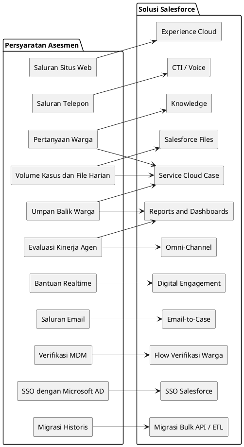

| Persyaratan Asesmen                                                  | Respons Desain                                                                                                                                                                                                    |
| -------------------------------------------------------------------- | ----------------------------------------------------------------------------------------------------------------------------------------------------------------------------------------------------------------- |
| Admin Cabang memantau permintaan yang masuk dalam divisi             | Visibilitas divisi read-only pada [Bagian 10.2](#102-model-akses) serta KPI permintaan/kinerja pada [Bagian 12.3](#123-dashboard-admin-cabang).                                                                   |
| Supervisor mengawasi Agen untuk kedua jenis Case dan seluruh saluran | User story proses Supervisor dan tanggung jawab eskalasi pada [Bagian 6.1](#61-peta-user-story), akses pada [Bagian 10.2](#102-model-akses), serta KPI operasional pada [Bagian 12.4](#124-dashboard-supervisor). |
| Agen menangani Pertanyaan dan Umpan Balik dari setiap saluran        | Penanganan Pertanyaan dan Umpan Balik secara terperinci pada [Bagian 6.3](#63-proses-kasus-pertanyaan) dan [Bagian 6.4](#64-proses-kasus-umpan-balik).                                                            |
| Proses Pertanyaan tujuh tahap                                        | Proses dari inisiasi hingga penutupan yang dikonfirmasi warga dibahas pada [Bagian 6.3](#63-proses-kasus-pertanyaan).                                                                                             |
| Proses Umpan Balik enam tahap                                        | Proses dari penerimaan hingga evaluasi Supervisor dibahas pada [Bagian 6.4](#64-proses-kasus-umpan-balik).                                                                                                        |
| Saluran situs web, telepon, web/seluler realtime, dan email          | Arsitektur serta kontrol saluran dibahas pada [Bagian 5.1](#51-gambaran-umum-arsitektur) dan [Bagian 9.4](#94-integrasi-saluran).                                                                                 |
| Integrasi dengan MDM eksternal untuk verifikasi warga                | Pola dan kontrol verifikasi deklaratif dibahas pada [Bagian 9.1](#91-pola-integrasi-verifikasi-warga) dan [Bagian 9.3](#93-verifikasi-mdm).                                                                       |
| Fleksibilitas untuk beradaptasi terhadap perubahan                   | Metadata yang dapat dikonfigurasi dan pembagian implementasi dibahas pada [Bagian 7.5](#75-aturan-bisnis-yang-dapat-dikonfigurasi) dan [Bagian 7.6](#76-strategi-implementasi-deklaratif-dan-programatik).        |
| Migrasi data 10 tahun / 6 juta record / file 100 GB                  | Migrasi Bulk API/file secara bertahap dan rekonsiliasi dibahas pada [Bagian 11.2](#112-rencana-migrasi-data-kasus-historis).                                                                                      |
| Mengelola 5.000 Case baru dan unggahan 100 MB setiap hari            | Pertumbuhan tahunan, bulk-safe automation, penyimpanan, pelaporan, dan kontrol arsip dibahas pada [Bagian 11.3](#113-desain-volume-besar).                                                                        |
| Implementasi SSO menggunakan Microsoft Active Directory              | SSO Salesforce melalui AD FS atau Entra ID dibahas pada [Bagian 10.3](#103-alur-autentikasi-sso-dengan-microsoft-active-directory).                                                                               |
| Admin Cabang mengevaluasi kinerja Agen di seluruh saluran            | Metrik tingkat divisi berdasarkan Agen, saluran, dan jenis Case dibahas pada [Bagian 12.2](#122-model-evaluasi-kinerja-agen) dan [Bagian 12.3](#123-dashboard-admin-cabang).                                      |
| Lisensi, edisi, fitur Salesforce, dan alat pihak ketiga              | Dibahas pada [Bagian 4](#4-pemilihan-produk-dan-kapabilitas-salesforce).                                                                                                                                          |
| Diagram lanskap sistem                                               | Dibahas pada [Bagian 5](#5-arsitektur-solusi-target).                                                                                                                                                             |
| Proses bisnis dan user story                                         | Dibahas pada [Bagian 6](#6-arsitektur-proses-bisnis).                                                                                                                                                             |
| Pertimbangan integrasi                                               | Dibahas pada [Bagian 9](#9-arsitektur-integrasi).                                                                                                                                                                 |
| Model data, berbagi data, dan desain keamanan                        | Dibahas pada [Bagian 8](#8-arsitektur-data) dan [Bagian 10](#10-keamanan-akses-dan-identitas).                                                                                                                    |
| Rencana migrasi data                                                 | Dibahas pada [Bagian 11](#11-strategi-migrasi-data-dan-volume-besar).                                                                                                                                             |

## 3. Cakupan, Asumsi, dan Batasan

### 3.1 Dalam Cakupan

| Area               | Cakupan                                                                                                                   |
| ------------------ | ------------------------------------------------------------------------------------------------------------------------- |
| Pertanyaan warga   | Menangkap, memverifikasi, menugaskan, menyelesaikan, menindaklanjuti, dan menutup Case pertanyaan.                        |
| Umpan balik warga  | Menangkap keluhan, saran, tingkat kepuasan, analisis, respons, pelaporan, dan evaluasi Supervisor.                        |
| Saluran            | Pengajuan kasus melalui situs web, telepon, bantuan realtime melalui situs web atau aplikasi seluler instansi, dan email. |
| Peran internal     | Admin Cabang, Supervisor, dan Agen.                                                                                       |
| Verifikasi warga   | Desain integrasi dengan Master Data Management (MDM) eksternal menggunakan telepon atau email.                            |
| Penugasan          | Routing berdasarkan Skill, bahasa, workload, availability, Priority, saluran, dan divisi.                                 |
| Pelaporan          | Dashboard Admin Cabang dan Supervisor untuk volume, SLA, backlog, kepuasan, saluran, serta kinerja Agen.                  |
| Keamanan           | Role Hierarchy, Permission Set, Sharing, akses Queue, Field-Level Security, SSO, dan Integration User.                    |
| Migrasi            | Rencana untuk data historis 10 tahun, sekitar 6 juta record, dan file sebesar 100 GB.                                     |
| Pertumbuhan harian | Desain untuk 5.000 Case baru dan unggahan file sebesar 100 MB per hari.                                                   |

### 3.2 Di Luar Cakupan

| Area                               | Alasan                                                                             |
| ---------------------------------- | ---------------------------------------------------------------------------------- |
| Proses asesmen Tugas 1             | Bukan bagian dari persyaratan pertanyaan dan umpan balik warga.                    |
| Payment gateway                    | Tidak diperlukan untuk manajemen kasus pertanyaan dan umpan balik.                 |
| Domain CRM nonwarga                | Desain ini hanya berfokus pada permintaan layanan warga.                           |
| Pengadaan vendor secara terperinci | Rekomendasi produk merupakan panduan arsitektur dan memerlukan validasi komersial. |
| Penyediaan jaringan fisik          | Pengaturan Salesforce serta identitas/jaringan hanya dibahas pada tingkat desain.  |

### 3.3 Asumsi

| ID   | Asumsi                                                                                                                                                                                                                                                      |
| ---- | ----------------------------------------------------------------------------------------------------------------------------------------------------------------------------------------------------------------------------------------------------------- |
| A-01 | Pengguna internal instansi melakukan autentikasi melalui Microsoft AD / Microsoft Entra ID.                                                                                                                                                                 |
| A-02 | MDM eksternal menyediakan API aman untuk pencarian warga berdasarkan telepon dan email.                                                                                                                                                                     |
| A-03 | Pertanyaan dan umpan balik diimplementasikan sebagai Salesforce Case Record Type.                                                                                                                                                                           |
| A-04 | Instansi memiliki divisi atau cabang yang dapat dipetakan ke Role, Queue, Public Group, dan Report.                                                                                                                                                         |
| A-05 | Record sumber historis memiliki identifier yang memadai untuk mendukung rekonsiliasi migrasi.                                                                                                                                                               |
| A-06 | Strategi penyimpanan file akan divalidasi terhadap batas penyimpanan Salesforce sebelum migrasi produksi.                                                                                                                                                   |
| A-07 | Aplikasi seluler diperlakukan sebagai saluran bantuan realtime melalui Digital Engagement atau channel/API adapter; aplikasi tersebut tidak diasumsikan menyematkan Experience Cloud atau menggunakan mobile webview.                                       |
| A-08 | Channel adapter dapat membuat Case awal sebelum verifikasi MDM; Case tetap berstatus `Verification Pending` dan tidak dapat melanjutkan ke penugasan normal hingga verifikasi berhasil atau hasil `Manual Review` yang diotorisasi dicatat.                 |
| A-09 | API outbound dalam cakupan menyediakan kontrak REST/JSON yang kompatibel dengan Flow HTTP Callout atau skema OpenAPI yang didukung External Services; kontrak yang tidak didukung memerlukan normalisasi API Gateway, bukan kode custom callout Salesforce. |
| A-10 | Verifikasi warga diterapkan pada Case `Enquiry` dan `Feedback` melalui proses intake bersama; hal ini memperluas langkah verifikasi Pertanyaan yang eksplisit menjadi kebijakan kontrol identitas lintas saluran yang konsisten.                            |

### 3.4 Batasan

| ID   | Batasan                                                                                              |
| ---- | ---------------------------------------------------------------------------------------------------- |
| C-01 | Batas Salesforce Flow, HTTP Callout, External Services, dan integrasi berlaku pada setiap transaksi. |
| C-02 | Waktu respons MDM menentukan apakah verifikasi dapat sepenuhnya sinkron.                             |
| C-03 | Kapasitas penyimpanan data/file Salesforce harus dihitung untuk pertumbuhan historis dan harian.     |
| C-04 | Desain keamanan harus melindungi informasi identitas pribadi warga.                                  |
| C-05 | Migrasi harus mempertahankan auditabilitas, ownership, tautan file, dan rekonsiliasi jumlah record.  |

## 4. Pemilihan Produk dan Kapabilitas Salesforce

### 4.1 Pemilihan Kapabilitas

| Area Persyaratan                     | Kapabilitas yang Direkomendasikan                                                                   | Alasan                                                                                                                              |
| ------------------------------------ | --------------------------------------------------------------------------------------------------- | ----------------------------------------------------------------------------------------------------------------------------------- |
| Penanganan kasus internal            | Service Cloud Enterprise atau lebih tinggi                                                          | Menyediakan Case, Service Console, Queue, automation, reporting, dan fondasi proses layanan.                                        |
| Hosting sektor publik                | Salesforce Government Cloud atau opsi teregulasi yang setara, apabila diwajibkan                    | Mendukung persyaratan kepatuhan sektor publik dan residensi data ketika diwajibkan oleh kebijakan.                                  |
| Akses warga melalui situs web        | Experience Cloud                                                                                    | Mendukung pengajuan kasus melalui situs web, visibilitas status, unggahan file, serta pola akses warga terautentikasi/publik.       |
| Intake situs web                     | Experience Cloud LWC, Web-to-Case, atau formulir berbasis API                                       | Mendukung pengajuan situs web yang terstruktur, validasi, lampiran, dan pelacakan saluran.                                          |
| Intake telepon                       | Integrasi yang kompatibel dengan Open CTI atau Service Cloud Voice                                  | Memungkinkan screen-pop, pencatatan panggilan, dan pembuatan Case yang berasal dari telepon.                                        |
| Bantuan realtime                     | Messaging, Chat, atau Digital Engagement                                                            | Mendukung bantuan realtime bagi warga melalui situs web atau aplikasi seluler instansi dan melakukan routing pekerjaan kepada Agen. |
| Intake email                         | Email-to-Case                                                                                       | Mengonversi email menjadi Case dan mempertahankan riwayat utas email.                                                               |
| Penugasan pekerjaan                  | Omni-Channel                                                                                        | Melakukan routing berdasarkan Queue, Skill, bahasa, Capacity, workload, dan availability.                                           |
| Jawaban yang dapat digunakan kembali | Salesforce Knowledge                                                                                | Menyediakan solusi yang disetujui untuk pertanyaan berulang dan mendukung siklus hidup dari draf hingga persetujuan.                |
| Manajemen SLA                        | Entitlements and Milestones                                                                         | Melacak komitmen respons pertama, tindak lanjut, eskalasi, dan penyelesaian.                                                        |
| Pelaporan                            | Reports and Dashboards; CRM Analytics jika diperlukan                                               | Memenuhi kebutuhan pemantauan Admin Cabang dan Supervisor.                                                                          |
| Identitas                            | SSO Salesforce dengan Microsoft AD melalui AD FS atau Microsoft Entra ID menggunakan SAML atau OIDC | Menggunakan kembali identity provider yang ada dan memusatkan pengelolaan akses.                                                    |
| Integrasi                            | Flow HTTP Callout, External Services, External Credentials, Named Credentials, dan API Gateway      | Menyediakan REST callout outbound deklaratif tanpa endpoint atau kredensial yang di-hardcode.                                       |
| Migrasi                              | Bulk API 2.0, alat ETL, Data Loader, staging database                                               | Mendukung migrasi volume besar yang terkendali dan rekonsiliasi.                                                                    |
| Backup/archive                       | Salesforce Backup atau produk backup/archive AppExchange yang disetujui                             | Mengurangi risiko untuk retensi jangka panjang, file, dan operational recovery.                                                     |

### 4.2 Validasi Lisensi dan Komersial

| Kapabilitas                    | Posisi Lisensi / Komersial                                                                                                                                                                                     |
| ------------------------------ | -------------------------------------------------------------------------------------------------------------------------------------------------------------------------------------------------------------- |
| Lingkungan build asesmen       | Gunakan Trailhead Playground Developer Edition baru yang diwajibkan untuk prototipe; deploy Flow, External Service, metadata, dan konfigurasi melalui metadata Salesforce yang dikontrol dalam source control. |
| Service Cloud                  | Enterprise Edition atau lebih tinggi menjadi baseline untuk Agen internal, Supervisor, dan Admin Cabang; konfirmasikan alokasi fitur dan jumlah pengguna selama discovery.                                     |
| Experience Cloud               | Lisensi login/member pengguna eksternal dan akses guest user harus dihitung berdasarkan asumsi autentikasi warga dan penggunaan portal.                                                                        |
| Digital Engagement / Messaging | Perlakukan sebagai add-on yang bergantung pada validasi saluran, volume percakapan, dan ketersediaan regional.                                                                                                 |
| Telepon                        | Open CTI dapat menggunakan kembali penyedia telepon yang disetujui; konsumsi Service Cloud Voice dan telepon memerlukan validasi komersial terpisah.                                                           |
| Government Cloud               | Bergantung pada kebijakan kepatuhan pemerintah, residensi data, akreditasi, dan pengadaan.                                                                                                                     |
| CRM Analytics                  | Opsional; Reports and Dashboards standar tetap menjadi baseline kecuali persyaratan analitik lanjutan membenarkan lisensi tambahan.                                                                            |
| API Gateway / MuleSoft         | Opsional apabila platform integrasi enterprise yang ada dapat menyediakan normalisasi, throttling, pemantauan, atau orkestrasi; tidak diperlukan untuk kontrak REST MDM langsung yang kompatibel.              |
| Backup, archive, dan storage   | Validasi Salesforce Backup atau produk pihak ketiga yang disetujui, tambahan data/file storage, retention, dan biaya external archive sebelum komitmen produksi.                                               |

## 5. Arsitektur Solusi Target

### 5.1 Gambaran Umum Arsitektur

Diagram ini menunjukkan lanskap target menyeluruh yang mencakup saluran warga, kapabilitas Salesforce, identitas enterprise, integrasi MDM, dan penyimpanan data utama yang digunakan solusi.

[Arsitektur Solusi Tingkat Tinggi](<../puml task2/05.01 High-Level Solution Architecture.puml>)

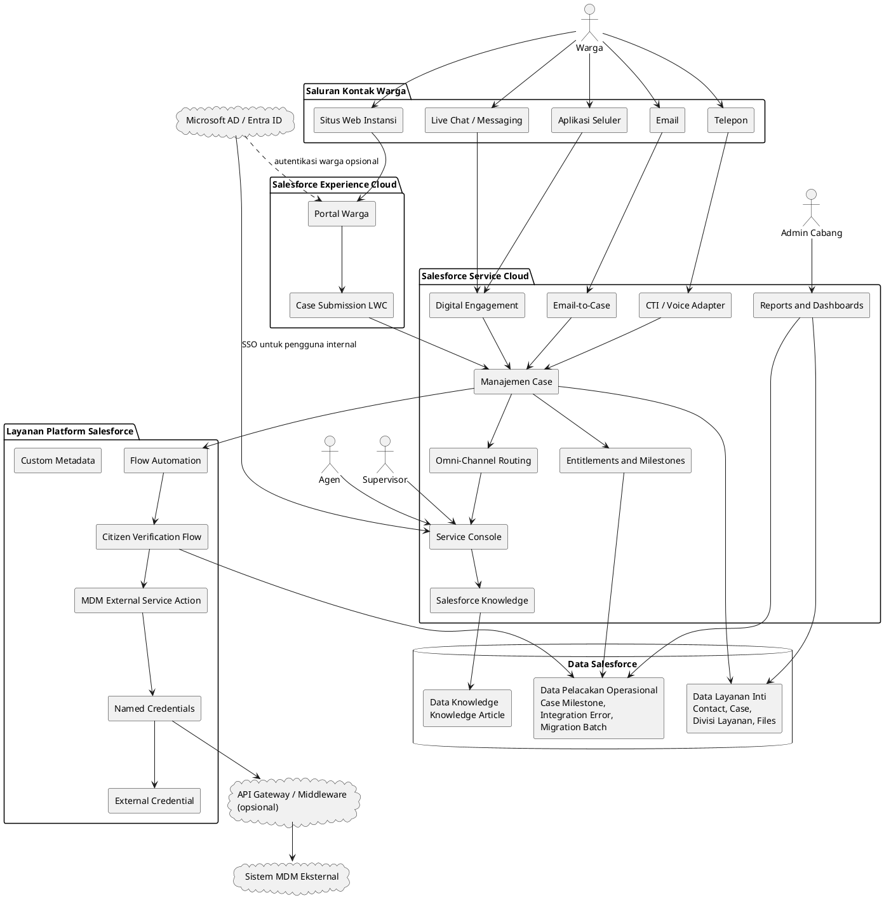

Warga berinteraksi dengan instansi melalui saluran kontak yang didukung. Salesforce menormalisasi interaksi tersebut menjadi record Case dengan atribut saluran, Record Type, prioritas, divisi layanan, identitas warga, SLA, dan ownership yang konsisten.

Agen menggunakan Service Console untuk memverifikasi warga, menangani Case, meninjau file, mencari Knowledge, merespons warga, dan menyelesaikan tindakan tindak lanjut. Supervisor mengelola kondisi Queue, eskalasi, risiko SLA, dan kualitas penanganan. Admin Cabang memantau permintaan dan kinerja tingkat divisi tanpa menyelesaikan Case secara langsung.

Integrasi MDM memverifikasi warga berdasarkan telepon atau email. Microsoft AD / Entra ID mengautentikasi pengguna internal dan memetakan akses melalui Profile, Permission Set, Role, Public Group, Queue, dan Sharing Rule.

### 5.2 Arsitektur Berlapis

Tampilan ini mengatur solusi ke dalam lapisan presentasi, intake, orkestrasi, layanan bisnis, integrasi, dan persistensi untuk memperjelas arah dependensi serta pemisahan tanggung jawab.

[Arsitektur Berlapis](<../puml task2/05.02 Layered Architecture.puml>)

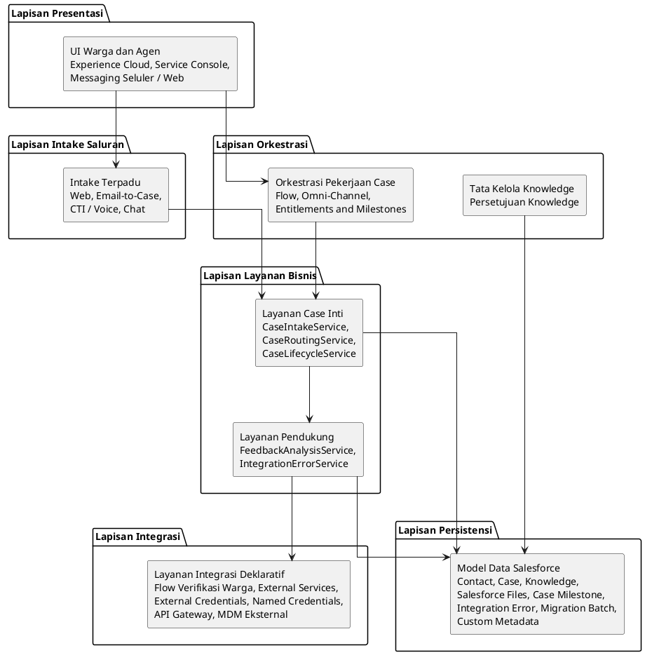

## 6. Arsitektur Proses Bisnis

Asesmen mendefinisikan dua proses bisnis menyeluruh yang utama. Saluran kontak merupakan mekanisme intake yang digunakan bersama oleh kedua proses, bukan proses bisnis yang terpisah.

| Proses Bisnis               | Tahap yang Diperlukan                                                                           |
| --------------------------- | ----------------------------------------------------------------------------------------------- |
| Manajemen Kasus Pertanyaan  | Inisiasi, Verifikasi, Pencatatan Kasus, Penugasan Kasus, Penyelesaian, Tindak Lanjut, Penutupan |
| Manajemen Kasus Umpan Balik | Penerimaan, Pencatatan, Analisis, Respons jika diperlukan, Pelaporan, Evaluasi                  |

### 6.1 Peta User Story

Diagram ini memetakan setiap persona bisnis ke kapabilitas yang mereka butuhkan, membentuk jembatan keterlacakan antara tanggung jawab peran dan proses yang didefinisikan kemudian dalam bagian ini.

[Peta User Story](<../puml task2/06.01 User Story Map.puml>)

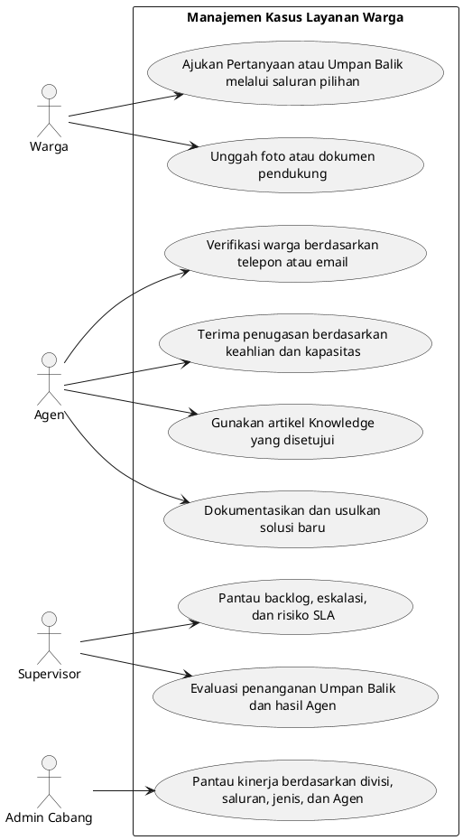

| Persona      | User Story                                                                                                                                                                          |
| ------------ | ----------------------------------------------------------------------------------------------------------------------------------------------------------------------------------- |
| Warga        | Sebagai warga, saya ingin mengajukan pertanyaan atau umpan balik melalui saluran pilihan agar dapat memperoleh bantuan tanpa mengunjungi cabang.                                    |
| Warga        | Sebagai warga, saya ingin mengunggah foto atau dokumen pendukung agar instansi dapat memahami permintaan saya.                                                                      |
| Agen         | Sebagai Agen, saya ingin memverifikasi warga berdasarkan telepon atau email agar saya menangani record warga yang benar.                                                            |
| Agen         | Sebagai Agen, saya ingin Case diarahkan berdasarkan Skill, bahasa, workload, dan availability agar pekerjaan didistribusikan secara adil.                                           |
| Agen         | Sebagai Agen, saya ingin menggunakan artikel Knowledge yang disetujui agar respons tetap konsisten.                                                                                 |
| Agen         | Sebagai Agen, saya ingin mendokumentasikan solusi baru ketika jawaban belum tersedia agar pertanyaan serupa dapat diselesaikan lebih cepat.                                         |
| Supervisor   | Sebagai Supervisor, saya ingin memantau Queue backlog, escalation, dan risiko SLA agar dapat segera melakukan intervensi.                                                           |
| Supervisor   | Sebagai Supervisor, saya ingin membandingkan penanganan Pertanyaan dan Umpan Balik di seluruh saluran agar dapat membina Agen serta mempertahankan kualitas layanan yang konsisten. |
| Supervisor   | Sebagai Supervisor, saya ingin mengevaluasi penanganan umpan balik dan hasil Agen agar kualitas layanan meningkat.                                                                  |
| Admin Cabang | Sebagai Admin Cabang, saya ingin dashboard berdasarkan divisi, saluran, jenis Case, dan Agen agar dapat memantau kinerja operasional.                                               |

### 6.2 Gambaran Umum Proses Bisnis

Proses tingkat tinggi ini membedakan dua perjalanan utama Case—Pertanyaan dan Umpan Balik—sebelum langkah terperinci serta proses pendukung bersama dijelaskan secara terpisah.

[Gambaran Umum Proses Bisnis](<../puml task2/06.02 Business Process Overview.puml>)

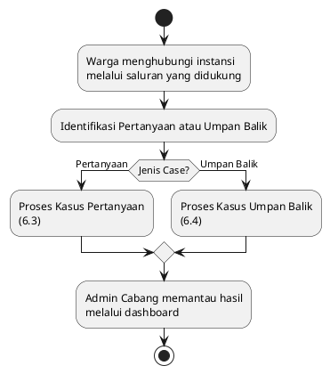

### 6.3 Proses Kasus Pertanyaan

Diagram aktivitas ini mengikuti Pertanyaan sejak inisiasi oleh warga hingga intake, verifikasi, penugasan, penyelesaian berbantuan Knowledge, tindak lanjut, dan penutupan yang dikonfirmasi warga.

[Proses Kasus Pertanyaan](<../puml task2/06.03 Enquiry Case Process.puml>)

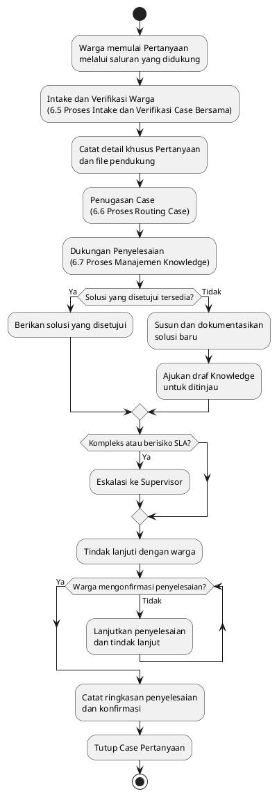

| Langkah             | Desain Salesforce                                                                                                           |
| ------------------- | --------------------------------------------------------------------------------------------------------------------------- |
| Inisiasi            | Warga membuat pertanyaan melalui situs web, telepon, bantuan realtime pada situs web/aplikasi seluler instansi, atau email. |
| Verifikasi          | Agen atau integrasi otomatis memverifikasi telepon/email terhadap MDM dan menautkan Case ke Contact.                        |
| Pencatatan Case     | Case menangkap subjek, deskripsi, origin, kategori layanan, divisi, prioritas, bahasa, serta file/foto pendukung.           |
| Penugasan           | Omni-Channel menugaskan pekerjaan berdasarkan Skill, bahasa, workload, availability, Priority, saluran, dan divisi.         |
| Penyelesaian        | Agen mencari Knowledge. Artikel yang telah disetujui digunakan jika tersedia; solusi baru didokumentasikan jika diperlukan. |
| Dukungan Supervisor | Case yang kompleks, sensitif terhadap kebijakan, berusia lama, atau berisiko SLA dieskalasikan kepada Supervisor.           |
| Tindak Lanjut       | Tugas tindak lanjut dan milestone tetap aktif hingga warga mengonfirmasi penyelesaian.                                      |
| Penutupan           | Case ditutup dengan ringkasan penyelesaian, konfirmasi penutupan, dan audit trail.                                          |

### 6.4 Proses Kasus Umpan Balik

Diagram aktivitas ini mengikuti Umpan Balik sejak penerimaan dan pencatatan hingga analisis, respons opsional kepada warga, pelaporan, evaluasi Supervisor, dan penutupan.

[Proses Kasus Umpan Balik](<../puml task2/06.04 Feedback Case Process.puml>)

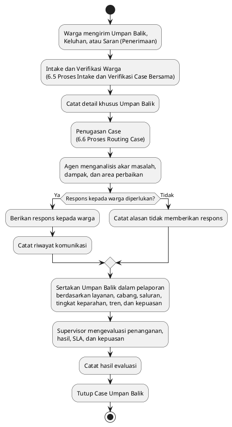

| Langkah    | Desain Salesforce                                                                                              |
| ---------- | -------------------------------------------------------------------------------------------------------------- |
| Penerimaan | Umpan balik, keluhan, atau saran diterima melalui saluran yang didukung.                                       |
| Pencatatan | Case Record Type `Feedback` menangkap area layanan, tingkat kepuasan, kategori, tingkat keparahan, dan bukti.  |
| Analisis   | Agen menilai akar masalah, dampak, area perbaikan, dan kebutuhan respons.                                      |
| Respons    | Agen memberikan respons bila diperlukan dan mencatat riwayat komunikasi.                                       |
| Pelaporan  | Umpan balik dikelompokkan berdasarkan layanan, cabang, saluran, tingkat keparahan, tren, dan tingkat kepuasan. |
| Evaluasi   | Supervisor meninjau kualitas penanganan, kinerja SLA, hasil Agen, dan kepuasan warga.                          |

### 6.5 Proses Intake dan Verifikasi Case Bersama

Subproses bersama ini menormalisasi interaksi dari setiap saluran yang didukung, membuat Case awal, memverifikasi warga terhadap MDM, dan menyiapkan atribut routing yang lengkap.

[Proses Intake dan Verifikasi Case Bersama](<../puml task2/06.05 Shared Case Intake and Verification Process.puml>)

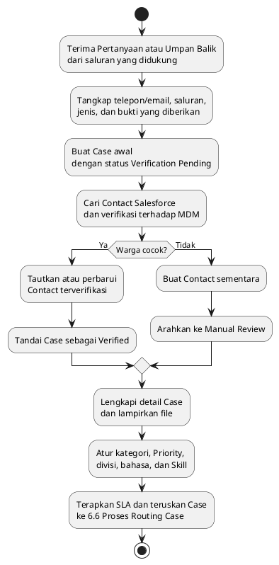

### 6.6 Proses Routing Case

Proses ini menentukan Agen atau Queue terbaik yang tersedia berdasarkan jenis Case, bahasa, Skill, prioritas, workload, dan availability, disertai escalation untuk pekerjaan berisiko tinggi.

[Proses Routing Case](<../puml task2/06.06 Case Routing Process.puml>)

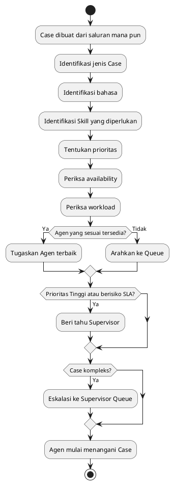

### 6.7 Proses Manajemen Knowledge

Proses ini mengatur penggunaan kembali solusi yang disetujui serta pembuatan, peninjauan, publikasi, dan penggunaan kembali artikel Knowledge baru ketika jawaban yang sesuai belum tersedia.

[Proses Manajemen Knowledge](<../puml task2/06.07 Knowledge Management Process.puml>)

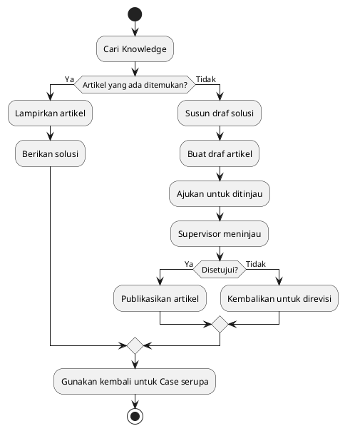

## 7. Arsitektur Aplikasi

### 7.1 Gambaran Umum Lapisan Aplikasi

Diagram ini menyajikan lapisan aplikasi logis dan arah dependensi utama dari antarmuka pengguna serta layanan saluran menuju kontrol platform, layanan bisnis, dan data Salesforce. Diagram ini menetapkan pemisahan tanggung jawab tanpa menentukan urutan runtime suatu transaksi Case individual.

[Gambaran Umum Lapisan Aplikasi](<../puml task2/07.01 Application Layer Overview.puml>)

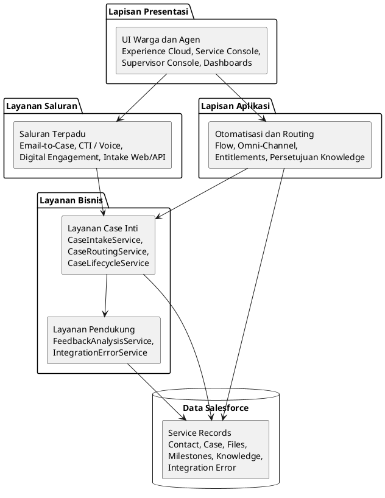

### 7.2 Desain Lapisan Layanan

Diagram ini menguraikan lapisan layanan bisnis menjadi layanan kanonis dengan tanggung jawab yang berbeda dan menunjukkan dependensinya pada kapabilitas platform Salesforce serta kontrak data. Panah merepresentasikan dependensi layanan atau data; panah tidak berarti bahwa setiap dependensi dipanggil dalam satu transaksi.

[Desain Lapisan Layanan](<../puml task2/07.02 Service Layer Design.puml>)

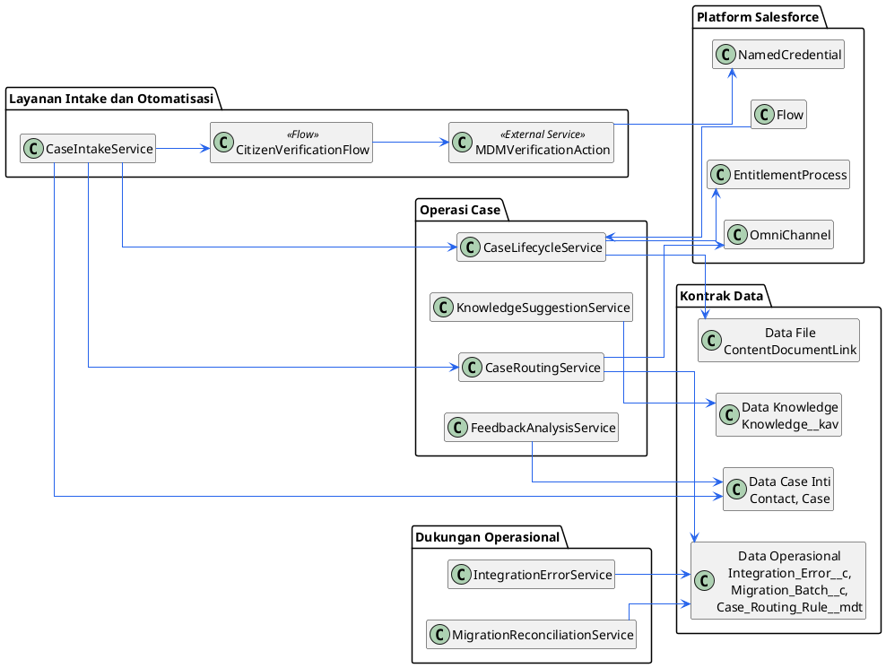

Tanggung jawab layanan aplikasi kanonis dan komponen integrasi deklaratif didefinisikan di bawah ini.

| Komponen                       | Tanggung Jawab                                                                                |
| ------------------------------ | --------------------------------------------------------------------------------------------- |
| CaseIntakeService              | Menormalisasi interaksi situs web, telepon, email, dan bantuan realtime menjadi record Case.  |
| CitizenVerificationFlow        | Mengorkestrasi verifikasi telepon/email dan memperbarui field verifikasi Contact/Case.        |
| MDMVerificationAction          | External Service action yang melakukan REST callout MDM secara aman melalui Named Credential. |
| CaseRoutingService             | Menyiapkan atribut routing yang digunakan oleh Omni-Channel dan Queue.                        |
| CaseLifecycleService           | Memberlakukan transisi siklus hidup, validasi penutupan, dan persyaratan tindak lanjut.       |
| FeedbackAnalysisService        | Mengklasifikasikan umpan balik, kepuasan, tingkat keparahan, dan area perbaikan.              |
| KnowledgeSuggestionService     | Menyarankan artikel yang ada dan membuat kandidat draf artikel bila diperlukan.               |
| IntegrationErrorService        | Menangkap kegagalan MDM/saluran/file dan status retry.                                        |
| MigrationReconciliationService | Melacak batch migrasi, jumlah, tautan file, dan ringkasan pengecualian.                       |

### 7.3 Diagram Interaksi Layanan

Sequence diagram ini menunjukkan kolaborasi runtime antarlayanan aplikasi sejak pengajuan melalui saluran hingga penugasan Agen. Transport MDM dan penanganan kegagalan dijelaskan secara terpisah pada [Bagian 9](#9-arsitektur-integrasi).

[Diagram Interaksi Layanan](<../puml task2/07.03 Service Interaction Diagram.puml>)

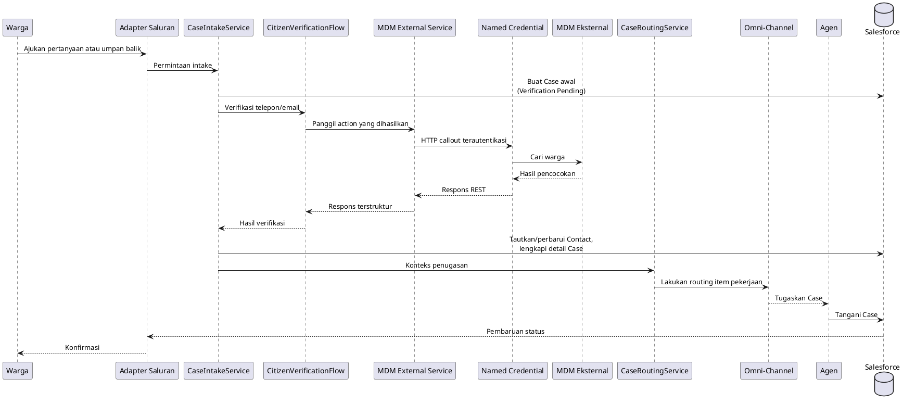

### 7.4 Strategi Penanganan Kesalahan

Diagram aktivitas ini mendefinisikan respons umum tingkat aplikasi terhadap kegagalan layanan. Diagram ini memisahkan penyelesaian transaksi yang berhasil dari kegagalan integrasi yang dapat di-retry dan kesalahan yang tidak dapat di-retry, sekaligus memastikan perubahan yang tidak aman di-roll back serta detail operasional tetap tersedia untuk dukungan dan peninjauan.

[Strategi Penanganan Kesalahan](<../puml task2/07.04 Error Handling Strategy.puml>)

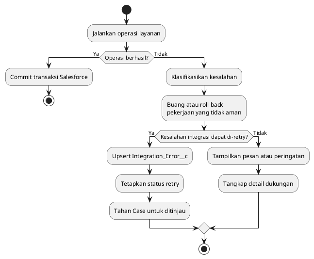

### 7.5 Aturan Bisnis yang Dapat Dikonfigurasi

Diagram ini mengidentifikasi Custom Metadata Type yang digunakan untuk mengeksternalisasi perilaku routing, SLA, klasifikasi umpan balik, dan kesalahan integrasi. Menyimpan aturan tersebut dalam metadata memungkinkan administrator yang berwenang menyesuaikan kebijakan operasional tanpa menanamkan nilai yang sering berubah dalam logika Flow.

[Aturan Bisnis yang Dapat Dikonfigurasi](<../puml task2/07.05 Configurable Business Rules.puml>)

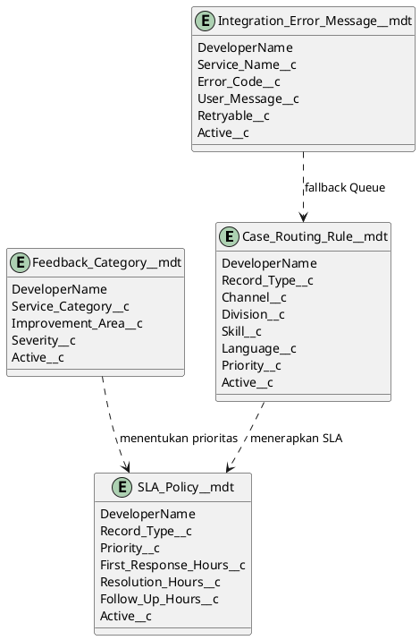

### 7.6 Strategi Implementasi Deklaratif dan Programatik

| Persyaratan                     | Teknologi                                                                   | Alasan                                                                                                 |
| ------------------------------- | --------------------------------------------------------------------------- | ------------------------------------------------------------------------------------------------------ |
| Pembuatan dan pembaruan Case    | Flow, Case assignment, Email-to-Case, intake Web/API                        | Kapabilitas layanan standar Salesforce.                                                                |
| Routing                         | Omni-Channel, Queue, Skill, Capacity                                        | Native routing berdasarkan availability dan workload.                                                  |
| SLA                             | Entitlements and Milestones                                                 | Pelacakan respons dan penyelesaian standar.                                                            |
| Notifikasi                      | Flow dan template email                                                     | Dapat dipelihara oleh administrator.                                                                   |
| Siklus hidup Knowledge          | Proses persetujuan Salesforce Knowledge                                     | Tata kelola artikel standar.                                                                           |
| Verifikasi MDM                  | Flow HTTP Callout, External Services, External Credential, Named Credential | REST callout deklaratif dengan autentikasi aman, pemetaan respons, timeout, dan penanganan fault Flow. |
| Migrasi                         | Bulk API / ETL                                                              | High-volume load dan reconciliation.                                                                   |
| Pelacakan kesalahan operasional | Custom object dan Dashboard                                                 | Diperlukan untuk support visibility.                                                                   |

## 8. Arsitektur Data

### 8.1 Entity Relationship Diagram

ERD ini mendefinisikan standard object Salesforce utama, custom object, metadata, file, dan operational record beserta relationship yang diperlukan untuk manajemen Case.

[Entity Relationship Diagram](<../puml task2/08.01 Entity Relationship Diagram.puml>)

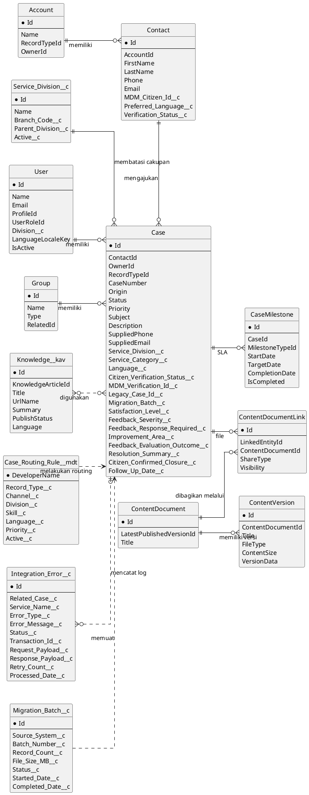

### 8.2 Model Data Inti

| Object                                                 | Tujuan                                                                                         |
| ------------------------------------------------------ | ---------------------------------------------------------------------------------------------- |
| Account                                                | Pengelompokan rumah tangga, organisasi, atau akun instansi secara opsional bila diperlukan.    |
| Contact                                                | Profil induk warga yang ditautkan ke telepon/email terverifikasi dan referensi MDM.            |
| Case                                                   | Transaction record utama untuk pertanyaan dan umpan balik.                                     |
| Case Record Type                                       | Memisahkan siklus hidup, Page Layout, field, dan validasi Pertanyaan serta Umpan Balik.        |
| Service_Division__c                                    | Cakupan cabang/divisi untuk reporting, Queue, ownership, dan Sharing.                          |
| User                                                   | Admin Cabang, Supervisor, Agen, Integration User, dan Migration User.                          |
| Group / Queue                                          | Work Queue untuk triage, penugasan divisi, dan escalation.                                     |
| Knowledge__kav                                         | Solusi yang disetujui dan kandidat draf Knowledge.                                             |
| ContentDocument / ContentVersion / ContentDocumentLink | File pendukung, versi, dan tautannya ke Case.                                                  |
| CaseMilestone                                          | Pelacakan SLA untuk respons, tindak lanjut, dan penyelesaian.                                  |
| Integration_Error__c                                   | Pelacakan operasional untuk transaksi MDM, saluran, atau pemrosesan file yang gagal.           |
| Migration_Batch__c                                     | Pelacakan batch migrasi dan ringkasan rekonsiliasi.                                            |
| Case_Routing_Rule__mdt                                 | Atribut routing yang dapat dikonfigurasi seperti saluran, Skill, bahasa, Priority, dan divisi. |

### 8.3 Field Case yang Direkomendasikan

| Field                          | Tujuan                                                                                                                                                                                 |
| ------------------------------ | -------------------------------------------------------------------------------------------------------------------------------------------------------------------------------------- |
| RecordTypeId                   | Memilih Case Record Type `Enquiry` atau `Feedback` yang didefinisikan pada [Bagian 8.4](#84-desain-case-record-type).                                                                  |
| Origin                         | Website, Phone, Chat, Mobile App, atau Email.                                                                                                                                          |
| Status                         | Nilai dikontrol oleh Support Process yang terkait dengan Case Record Type; lihat [Bagian 8.5](#85-siklus-hidup-kasus-pertanyaan) dan [Bagian 8.6](#86-siklus-hidup-kasus-umpan-balik). |
| Priority                       | Prioritas standar Salesforce ditambah pemetaan tingkat keparahan khusus instansi jika diperlukan.                                                                                      |
| Service_Division__c            | Cakupan cabang atau divisi.                                                                                                                                                            |
| Service_Category__c            | Area layanan/produk instansi.                                                                                                                                                          |
| Language__c                    | Bahasa pilihan untuk routing.                                                                                                                                                          |
| Citizen_Verification_Status__c | Verified, Not Found, Manual Review, Failed.                                                                                                                                            |
| MDM_Verification_Id__c         | Referensi verifikasi eksternal.                                                                                                                                                        |
| Legacy_Case_Id__c              | External ID unik yang digunakan untuk upsert migrasi, lineage, dan rekonsiliasi.                                                                                                       |
| Migration_Batch__c             | Mengidentifikasi batch migrasi yang memuat Case historis.                                                                                                                              |
| Satisfaction_Level__c          | Indikator kepuasan umpan balik.                                                                                                                                                        |
| Feedback_Severity__c           | Dampak atau tingkat keparahan umpan balik yang digunakan untuk prioritas, eskalasi, dan pelaporan.                                                                                     |
| Feedback_Response_Required__c  | Menunjukkan apakah instansi harus merespons warga.                                                                                                                                     |
| Improvement_Area__c            | Klasifikasi umpan balik untuk pelaporan tren.                                                                                                                                          |
| Feedback_Evaluation_Outcome__c | Menyimpan hasil evaluasi Supervisor atas kualitas penanganan, hasil Agen, dan kepuasan warga.                                                                                          |
| Resolution_Summary__c          | Wajib diisi sebelum penutupan.                                                                                                                                                         |
| Citizen_Confirmed_Closure__c   | Mengonfirmasi penerimaan warga untuk penutupan pertanyaan.                                                                                                                             |
| Follow_Up_Date__c              | Memicu tugas tindak lanjut dan pelaporan yang terlambat.                                                                                                                               |

### 8.4 Desain Case Record Type

Solusi menggunakan dua Salesforce Case Record Type untuk memisahkan proses bisnis utama instansi sekaligus mempertahankan model data Case, fondasi routing, model keamanan, dan kerangka reporting yang sama.

| Case Record Type | Support Process                 | Tujuan                                                                     | Proses Utama                                                                                                     | Data dan Kontrol Khusus                                                                                                                                        |
| ---------------- | ------------------------------- | -------------------------------------------------------------------------- | ---------------------------------------------------------------------------------------------------------------- | -------------------------------------------------------------------------------------------------------------------------------------------------------------- |
| `Enquiry`        | `Enquiry Case Support Process`  | Mengelola pertanyaan, kekhawatiran, dan permintaan informasi warga.        | Inisiasi, verifikasi, pencatatan, penugasan, penyelesaian, tindak lanjut, dan penutupan yang dikonfirmasi warga. | Penggunaan Knowledge, ringkasan penyelesaian, tanggal tindak lanjut, eskalasi Supervisor, dan konfirmasi penutupan warga.                                      |
| `Feedback`       | `Feedback Case Support Process` | Mengelola umpan balik, keluhan, dan saran warga mengenai layanan instansi. | Penerimaan, pencatatan, analisis, respons opsional, pelaporan, dan evaluasi Supervisor.                          | Tingkat kepuasan, `Feedback_Severity__c`, `Improvement_Area__c`, `Feedback_Response_Required__c`, klasifikasi pelaporan, dan `Feedback_Evaluation_Outcome__c`. |

Setiap Record Type dikaitkan dengan Salesforce Support Process tersendiri yang mengontrol nilai `Case.Status` yang tersedia. Record Type juga mengontrol Page Layout, required field, Validation Rule, status guidance, dan automation entry criteria. Siklus hidup yang dihasilkan didefinisikan secara terpisah pada [Bagian 8.5](#85-siklus-hidup-kasus-pertanyaan) dan [Bagian 8.6](#86-siklus-hidup-kasus-umpan-balik).

### 8.5 Siklus Hidup Kasus Pertanyaan

Model status ini mendefinisikan transisi `Case.Status` yang diizinkan untuk Record Type `Enquiry` melalui `Enquiry Case Support Process`. Model ini menyelaraskan status operasional dengan verifikasi, penugasan, penyelesaian, tindak lanjut, konfirmasi warga, dan penutupan.

[Siklus Hidup Kasus Pertanyaan](<../puml task2/08.05 Enquiry Case Lifecycle.puml>)

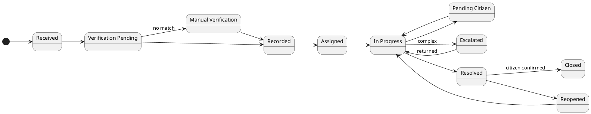

### 8.6 Siklus Hidup Kasus Umpan Balik

Model status ini mendefinisikan transisi `Case.Status` yang diizinkan untuk Record Type `Feedback` melalui `Feedback Case Support Process`. Model ini mencakup verifikasi warga dan penugasan sebelum analisis, respons opsional, reporting, evaluasi Supervisor, dan penutupan.

[Siklus Hidup Kasus Umpan Balik](<../puml task2/08.06 Feedback Case Lifecycle.puml>)

```plantuml
@startuml
left to right direction
skinparam linetype ortho

state "Received" as Received
state "Verification Pending" as VerificationPending
state "Manual Verification" as ManualVerification
state "Recorded" as Recorded
state "Assigned" as Assigned
state "Under Analysis" as UnderAnalysis
state "Response Required" as ResponseRequired
state "No Response Required" as NoResponseRequired
state "Responded" as Responded
state "Reporting" as Reporting
state "Supervisor Evaluation" as SupervisorEvaluation
state "Closed" as Closed

[*] --> Received
Received --> VerificationPending
VerificationPending --> Recorded
VerificationPending --> ManualVerification : no match
ManualVerification --> Recorded
Recorded --> Assigned
Assigned --> UnderAnalysis
UnderAnalysis --> ResponseRequired
UnderAnalysis --> NoResponseRequired
ResponseRequired --> Responded
Responded --> Reporting
NoResponseRequired --> Reporting
Reporting --> SupervisorEvaluation
SupervisorEvaluation --> Closed

@enduml
```

## 9. Arsitektur Integrasi

Arsitektur integrasi mengutamakan pendekatan deklaratif pada kedua arah, dengan pola yang dipilih berdasarkan arah interaksi, konteks autentikasi, dan kompleksitas payload.

| Arah / Skenario                       | Pola Pilihan                                                                                                           | Keamanan dan Penggunaan                                                                                                                         |
| ------------------------------------- | ---------------------------------------------------------------------------------------------------------------------- | ----------------------------------------------------------------------------------------------------------------------------------------------- |
| Payload custom inbound terautentikasi | Aplikasi eksternal memanggil autolaunched Flow melalui Salesforce REST invocable-action endpoint.                      | Autentikasi OAuth 2.0 atau Salesforce session; gunakan Integration User dengan akses least privilege.                                           |
| Interaksi warga anonim inbound        | Halaman publik Experience Cloud memanggil Screen Flow yang diaktifkan.                                                 | Batasi permission Flow, object, field, dan file guest user; terapkan kontrol validasi, spam, dan penyalahgunaan.                                |
| Saluran warga standar inbound         | Email-to-Case, Web-to-Case atau Experience Cloud Flow, Digital Engagement, dan CTI / Service Cloud Voice.              | Gunakan autentikasi saluran native, routing, dan kontrol Omni-Channel jika berlaku.                                                             |
| REST/JSON callout outbound            | Flow HTTP Callout atau External Service action terdaftar yang diamankan oleh External Credential dan Named Credential. | Digunakan untuk verifikasi warga melalui MDM dan API kompatibel di masa mendatang; API Gateway dapat menormalisasi kontrak yang tidak didukung. |
| Federasi identitas                    | SSO Salesforce dengan Microsoft AD / Entra ID melalui SAML atau OpenID Connect.                                        | Pola identitas terpisah; bukan intake saluran warga atau business API callout.                                                                  |
| Migrasi data dan pertukaran massal    | Bulk API 2.0 dengan ETL, staging, rekonsiliasi, dan kredensial migrasi yang dikendalikan.                              | Pola volume besar terpisah; tidak dijalankan sebagai Flow callout transaksional.                                                                |

Middleware bersifat opsional ketika diperlukan mediasi protokol, transformasi kompleks, kebijakan keamanan terpusat, throttling, atau orkestrasi lintas sistem.

### 9.1 Pola Integrasi Verifikasi Warga

Sequence diagram ini menunjukkan jalur verifikasi sinkron deklaratif dari Service Console melalui Flow, External Service action, Named Credential, dan enterprise integration layer menuju MDM eksternal.

[Pola Integrasi Verifikasi Warga](<../puml task2/09.01 Citizen Verification Integration Pattern.puml>)

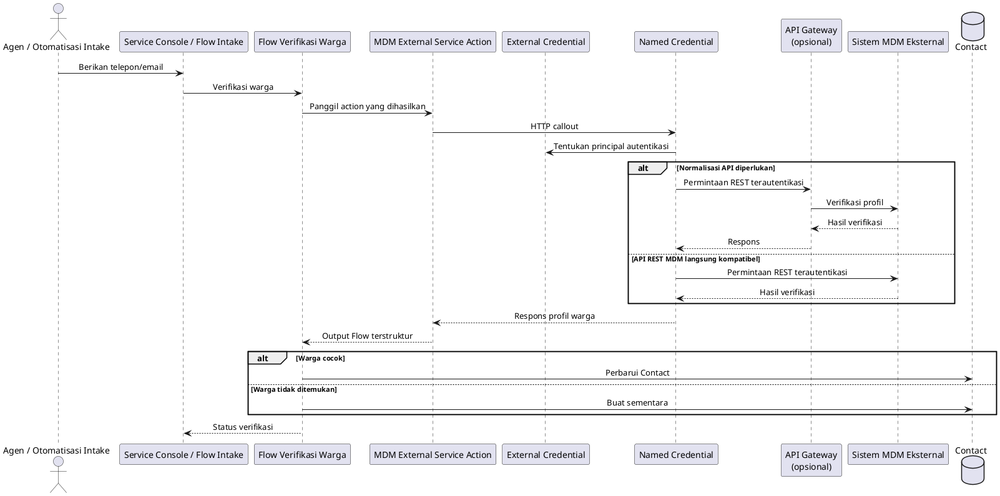

Alur keputusan bisnis untuk Contact matching dan `Manual Review` didefinisikan satu kali pada [Bagian 6.5](#65-proses-intake-dan-verifikasi-case-bersama). Bagian ini berfokus pada technical call sequence dan integration boundary.

### 9.2 Strategi Retry

Diagram aktivitas ini mendefinisikan cara kegagalan integrasi sementara dan permanen diklasifikasikan, di-retry dalam batas yang terkendali, ditampilkan kepada tim dukungan, dan direkonsiliasi setelah pemulihan.

[Strategi Retry](<../puml task2/09.02 Retry Strategy.puml>)

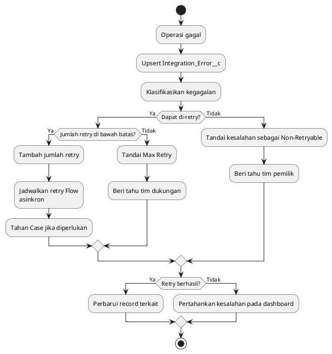

### 9.3 Verifikasi MDM

Verifikasi MDM diperlukan selama intake dan penanganan kasus. Salesforce mengirim telepon atau email ke MDM eksternal melalui lapisan integrasi yang aman dan menerima status kecocokan warga, pengenal warga, serta atribut profil yang diperlukan untuk pelayanan kasus.

| Area Desain          | Keputusan                                                                                                        |
| -------------------- | ---------------------------------------------------------------------------------------------------------------- |
| Gaya integrasi       | Pencarian sinkron ketika waktu respons MDM dapat diterima; fallback asinkron ketika tidak tersedia.              |
| Pemanggilan          | Flow HTTP Callout atau External Service action terdaftar; tidak ada Apex callout dalam baseline design.          |
| Keamanan             | External Credential mendefinisikan protokol autentikasi dan principal; Named Credential mendefinisikan endpoint. |
| Transport            | REST/JSON melalui API Gateway, yang menormalisasi kontrak MDM yang tidak didukung bila diperlukan.               |
| Penanganan kesalahan | Fault path Flow mencatat `Integration_Error__c` dan memindahkan Case ke Manual Review bila diperlukan.           |
| Retry                | Flow terjadwal atau asinkron hanya mengulangi kegagalan sementara dan membatasi jumlah percobaan retry.          |
| Perlindungan data    | Simpan hanya data respons MDM yang diperlukan di Salesforce.                                                     |

### 9.4 Integrasi Saluran

| Saluran                            | Desain                                                                                                                                                 |
| ---------------------------------- | ------------------------------------------------------------------------------------------------------------------------------------------------------ |
| Situs web                          | Experience Cloud/LWC atau intake kasus berbasis API dengan validasi, kontrol file, dan perlindungan bot.                                               |
| Telepon                            | Adapter yang kompatibel dengan CTI atau Service Cloud Voice untuk screen-pop, log panggilan, dan pembuatan Case.                                       |
| Bantuan situs web/seluler realtime | Messaging, Chat, atau Digital Engagement yang diarahkan melalui Omni-Channel; aplikasi seluler tidak diasumsikan menggunakan Experience Cloud webview. |
| Email                              | Email-to-Case dengan routing address, thread identifier, auto-response, dan kontrol spam.                                                              |
| File                               | Salesforce Files dengan validasi jenis/ukuran file dan pemindaian malware jika diwajibkan oleh kebijakan.                                              |

## 10. Keamanan, Akses, dan Identitas

### 10.1 Model Akses dan Visibilitas Berbasis Peran

Diagram ini memetakan persona internal, eksternal, dan sistem ke kontrol keamanan Salesforce yang mengatur akses ke service record, Knowledge, report, dan data integrasi.

[Model Akses dan Visibilitas Berbasis Peran](<../puml task2/10.01 Role-Based Access and Visibility Model.puml>)

```plantuml
@startuml
left to right direction
skinparam componentStyle rectangle
skinparam linetype ortho
skinparam nodesep 70
skinparam ranksep 70

package "Persona Akses" {
  component InternalUsers [
    <b>Pengguna Internal</b>
    <size:11><color:#64748B>Admin Cabang, Supervisor, Agen</color></size>
  ]
  component ExternalUsers [
    <b>Pengguna Eksternal</b>
    <size:11><color:#64748B>Warga</color></size>
  ]
  component SystemUser [
    <b>Pengguna Sistem</b>
    <size:11><color:#64748B>Integration User</color></size>
  ]
}

package "Kontrol Keamanan Salesforce" {
  component InternalAccess [
    <b>Model Akses Internal</b>
    <size:11><color:#64748B>Hierarki Peran, Sharing Rule,</color></size>
    <size:11><color:#64748B>Queue, Permission Set, FLS</color></size>
  ]
  component CitizenAccess [
    <b>Experience Sharing</b>
    <size:11><color:#64748B>Visibilitas Case warga</color></size>
  ]
  component IntegrationScope [
    <b>Cakupan Integrasi</b>
    <size:11><color:#64748B>Permission API dan FLS</color></size>
  ]
}

package "Protected Records" {
  component ServiceData [
    <b>Data Layanan</b>
    <size:11><color:#64748B>Case, Contact, Files</color></size>
  ]
  component KnowledgeReports [
    <b>Knowledge and Reports</b>
    <size:11><color:#64748B>Artikel yang disetujui, Dashboard</color></size>
  ]
}

InternalUsers --> InternalAccess
ExternalUsers --> CitizenAccess
SystemUser --> IntegrationScope

InternalAccess --> ServiceData
InternalAccess --> KnowledgeReports
CitizenAccess --> ServiceData
IntegrationScope --> ServiceData

@enduml
```

### 10.2 Model Akses

Model akses menerapkan least privilege berdasarkan persona dan memisahkan akses operasional, layanan mandiri warga, integrasi sistem, dan hak istimewa migrasi sementara.

| Peran            | Jenis Akses                 | Desain Akses                                                                                                                                   |
| ---------------- | --------------------------- | ---------------------------------------------------------------------------------------------------------------------------------------------- |
| Admin Cabang     | Read Only                   | Melihat Case, dashboard, dan report untuk divisi yang ditetapkan; tidak memiliki tanggung jawab penyelesaian Case.                             |
| Supervisor       | Read / Write                | Mengelola Case tim dan Escalation Queue, menyelesaikan evaluasi Umpan Balik, serta mengakses performance dashboard.                            |
| Agen             | Read / Write                | Menangani Case milik sendiri dan Case dalam Queue yang ditetapkan serta mengakses detail Contact, Knowledge, dan File tertaut yang diperlukan. |
| Warga            | Buat / Baca milik sendiri   | Mengajukan Case dan hanya melihat Case miliknya melalui Experience Cloud ketika akses portal terautentikasi diaktifkan.                        |
| Integration User | API Only, least privilege   | Membaca atau memperbarui hanya object dan field yang diperlukan oleh MDM, saluran, dan integrasi operasional.                                  |
| Migration User   | Temporary Bulk Read / Write | Memuat data historis dan melakukan rekonsiliasi selama migration window yang disetujui.                                                        |

### 10.3 Alur Autentikasi SSO dengan Microsoft Active Directory

Sequence diagram ini menggambarkan autentikasi terfederasi untuk pengguna internal, mulai dari pengalihan login Salesforce melalui validasi Microsoft AD / Entra ID hingga pembuatan Salesforce session.

[Alur Autentikasi SSO dengan Microsoft Active Directory](<../puml task2/10.03 SSO Authentication Flow with Microsoft Active Directory.puml>)

```plantuml
@startuml
skinparam sequenceMessageAlign center
actor "Pengguna Internal" as User
participant "Login Salesforce" as SFLogin
participant "SAML Identity Provider" as IdP
participant "Microsoft Active Directory / Entra ID" as AD
participant "Salesforce Service Cloud" as SF

User -> SFLogin : Akses Salesforce
SFLogin -> IdP : Alihkan permintaan SSO
IdP -> AD : Autentikasi pengguna
AD --> IdP : Autentikasi berhasil
IdP --> SFLogin : Assertion SAML
SFLogin -> SF : Buat session pengguna
SF --> User : Akses diberikan

@enduml
```

### 10.4 Kontrol Keamanan

| Kontrol              | Desain                                                                                                  |
| -------------------- | ------------------------------------------------------------------------------------------------------- |
| OWD                  | Atur Case menjadi Private kecuali model cabang final mendukung visibilitas yang lebih luas secara aman. |
| Hierarki peran       | Selaraskan dengan struktur cabang/divisi dan manajemen layanan.                                         |
| Queues               | Pisahkan ownership triage, divisi, Skill, dan escalation.                                               |
| Sharing rule         | Sharing berbasis kriteria untuk visibilitas Admin Cabang dan Supervisor tingkat divisi.                 |
| Restriction rule     | Gunakan bila diperlukan untuk mencegah akses lintas divisi.                                             |
| Permission Sets      | Agen, Supervisor, Admin Cabang, Integration User, Migration User.                                       |
| Field-Level Security | Lindungi informasi sensitif warga dan field evaluasi internal.                                          |
| Platform Encryption  | Direkomendasikan untuk informasi identitas pribadi yang sensitif jika diwajibkan oleh kepatuhan.        |
| Event Monitoring     | Direkomendasikan ketika persyaratan audit dan pemantauan keamanan tinggi.                               |
| SSO                  | Microsoft AD / Entra ID melalui SAML atau OpenID Connect.                                               |

## 11. Strategi Migrasi Data dan Volume Besar

### 11.1 Strategi Volume Data Besar dan Penyimpanan File

Diagram ini menyajikan pipeline terkendali untuk profiling, cleansing, staging, loading, reconciliation, indexing, dan retention sekitar 6 juta record serta 100 GB file historis.

[Strategi Volume Data Besar dan Penyimpanan File](<../puml task2/11.01 Large Data Volume and File Storage Strategy.puml>)

```plantuml
@startuml
skinparam componentStyle rectangle
skinparam linetype ortho
skinparam nodesep 60
skinparam ranksep 70

database "Data Legacy\n6 Juta Case, File 100 GB" as LegacyData

package "Pipeline Migrasi" {
  [Profiling dan Cleansing] as ProfileCleanse
  [Deduplikasi] as Deduplicate
  [Staging Data] as StageData
  [Bulk Load] as BulkLoad
  [Migrasi File] as FileMigration
  [Rekonsiliasi] as Reconcile
}

package "Platform Salesforce" {
  database "Core Records\nContact, Case" as CoreRecords
  database "Salesforce Files" as Files
  database "Migration Batch" as MigrationBatch
  [Indeks dan External ID] as Indexes
  [Archiving and Storage Plan] as StoragePlan
}

LegacyData --> ProfileCleanse
ProfileCleanse --> Deduplicate
Deduplicate --> StageData
StageData --> BulkLoad
LegacyData --> FileMigration

BulkLoad --> CoreRecords
BulkLoad --> MigrationBatch
FileMigration --> Files
FileMigration --> Reconcile
BulkLoad --> Reconcile
Reconcile --> MigrationBatch

CoreRecords --> Indexes
CoreRecords --> StoragePlan
Files --> StoragePlan

@enduml
```

### 11.2 Rencana Migrasi Data Kasus Historis

Diagram aktivitas ini mendefinisikan urutan eksekusi migrasi mulai dari ekstraksi legacy dan validasi pilot hingga pemuatan penuh dan delta, rekonsiliasi, penerimaan, serta cutover saluran.

[Rencana Migrasi Data Kasus Historis](<../puml task2/11.02 Historical Case Data Migration Plan.puml>)

```plantuml
@startuml
start

:Ekstrak data legacy;
:Lakukan profiling kualitas dan volume;
:Petakan object target;
:Lakukan cleansing dan deduplikasi;
:Muat data referensi;
:Lakukan pemuatan sampel pilot;

if (Pilot diterima?) then (Ya)
  :Muat batch Case secara massal;
  :Unggah atau arsipkan file;
  :Rekonsiliasi jumlah dan tautan;
  :Jalankan migrasi delta;
else (Tidak)
  :Perbaiki pemetaan atau penyimpanan;
  stop
endif

:Validasi migrasi;
:Lakukan cutover saluran;

stop
@enduml
```

Cakupan migrasi meliputi record historis selama 10 tahun, sekitar 6 juta record, dan file sebesar 100 GB.

| Fase       | Aktivitas                                                                                                                                                        |
| ---------- | ---------------------------------------------------------------------------------------------------------------------------------------------------------------- |
| Discovery  | Identifikasi source system, jumlah record, file storage, retention rule, ownership, dan pemetaan cabang.                                                         |
| Profiling  | Analisis duplikasi, telepon/email yang hilang, pengenal tidak valid, file tanpa induk, dan kesenjangan saluran.                                                  |
| Pemetaan   | Petakan warga ke Contact, permintaan layanan ke Case, file ke Salesforce Files atau tautan arsip eksternal, pengguna ke pemilik, dan cabang ke Service Division. |
| Cleansing  | Standarkan telepon/email, lakukan deduplikasi warga, normalkan kategori, dan definisikan penanganan pengecualian.                                                |
| Pilot Load | Muat data representatif, validasi transformation, rekonsiliasi jumlah, serta verifikasi ownership dan tautan file.                                               |
| Full Load  | Gunakan Bulk API 2.0 atau ETL tool dengan controlled batch dan tracking `Migration_Batch__c`.                                                                    |
| File Load  | Muat ke Salesforce Files jika storage/compliance memungkinkan; jika tidak, gunakan tautan external archive yang disetujui.                                       |
| Delta Load | Bekukan atau batasi legacy write, migrasikan perubahan terakhir, dan lakukan reconciliation sebelum go-live.                                                     |
| Validation | Rekonsiliasi jumlah, tautan file, Sharing, Audit Field, Report, dan sampel riwayat warga.                                                                        |
| Cutover    | Alihkan saluran ke Salesforce, pantau pengecualian, dan pertahankan checkpoint rollback hingga diterima.                                                         |

### 11.3 Desain Volume Besar

| Perhatian              | Desain                                                                                                                   |
| ---------------------- | ------------------------------------------------------------------------------------------------------------------------ |
| 6 juta record historis | Gunakan External ID, selective index, ownership mapping, dan Bulk API batching.                                          |
| File historis 100 GB   | Proyeksikan penyimpanan dan pertimbangkan tautan arsip eksternal untuk file yang lebih lama.                             |
| 5.000 Case harian      | Rencanakan sekitar 1,825 juta Case tambahan per tahun; gunakan bulk-safe automation, selective reporting, dan archiving. |
| Unggahan harian 100 MB | Rencanakan sekitar 36,5 GB penyimpanan file tambahan per tahun sebelum pengurangan melalui retensi atau arsip.           |
| Reporting performance  | Gunakan selective filter berdasarkan tanggal, divisi, Record Type, dan Status.                                           |

## 12. Pelaporan, SLA, dan Evaluasi Kinerja

### 12.1 Pemantauan Operasional dan Manajemen SLA

Diagram ini menunjukkan bagaimana event siklus hidup Case, Milestone, SLA alert, dan Integration Error menyediakan data bagi operational dashboard untuk mengidentifikasi backlog, risiko, dan service exception.

[Pemantauan Operasional dan Manajemen SLA](<../puml task2/12.01 Operational Monitoring and SLA Management.puml>)

```plantuml
@startuml
skinparam componentStyle rectangle
skinparam linetype ortho
skinparam nodesep 70
skinparam ranksep 60

package "Operasi Case" {
  [Event Siklus Hidup Case\nDibuat, Ditugaskan, Menunggu,\nDieskalasikan, Ditutup] as CaseEvents
}

package "Pemantauan SLA" {
  [Entitlements and Milestones] as Milestones
  [Peringatan dan Eskalasi SLA] as SlaAlerts
}

package "Pemantauan Integrasi" {
  [Integration Errors\nMDM, Channel Intake, Retry Queue] as IntegrationErrors
}

package "Management Dashboards" {
  [Operational Dashboards\nKinerja Agen, Volume Saluran,\nKepatuhan SLA, Kepuasan,\nBacklog, Integration Errors] as Dashboards
}

CaseEvents --> Milestones
Milestones --> SlaAlerts
CaseEvents --> Dashboards
Milestones --> Dashboards
SlaAlerts --> Dashboards
IntegrationErrors --> Dashboards

@enduml
```

### 12.2 Model Evaluasi Kinerja Agen

Model ini menelusuri data sumber operasional menjadi metrik kinerja dan scorecard yang disesuaikan dengan kebutuhan pengawasan Admin Cabang, Supervisor, dan Agen.

[Model Evaluasi Kinerja Agen](<../puml task2/12.02 Agent Performance Evaluation Model.puml>)

```plantuml
@startuml
skinparam componentStyle rectangle
skinparam linetype ortho
skinparam nodesep 70
skinparam ranksep 70

database "Sumber Kinerja\nCase, Case Milestone,\nUser, Penggunaan Knowledge" as Sources

package "Dataset Kinerja" {
  [Metrik Kinerja\nVolume, Backlog, Waktu Respons,\nWaktu Penyelesaian, SLA, Tingkat Reopen,\nUmpan Balik, Penggunaan Knowledge] as Metrics
  [Scorecard Kinerja] as Scorecard
}

package "Tampilan Evaluasi" {
  [Division Dashboard] as DivisionDashboard
  [Team Dashboard] as TeamDashboard
  [Daftar Kerja Agen] as AgentWorklist
}

package "Pengguna Evaluasi" {
  [Admin Cabang] as BranchAdmin
  [Supervisor] as Supervisor
  [Agen] as Agent
}

Sources --> Metrics
Metrics --> Scorecard

Scorecard --> DivisionDashboard
Scorecard --> TeamDashboard
Scorecard --> AgentWorklist

DivisionDashboard --> BranchAdmin
TeamDashboard --> Supervisor
AgentWorklist --> Agent

@enduml
```

### 12.3 Dashboard Admin Cabang

| KPI                                                       | Tujuan                                                                                                                                |
| --------------------------------------------------------- | ------------------------------------------------------------------------------------------------------------------------------------- |
| Case baru berdasarkan saluran, divisi, dan Record Type    | Memantau permintaan di seluruh saluran kontak.                                                                                        |
| Backlog terbuka berdasarkan usia dan prioritas            | Mengidentifikasi tekanan operasional.                                                                                                 |
| Jumlah dan tingkat pelanggaran SLA                        | Mengevaluasi kinerja layanan.                                                                                                         |
| Rata-rata waktu respons pertama                           | Mengukur kecepatan respons.                                                                                                           |
| Rata-rata waktu penyelesaian                              | Mengukur efisiensi penutupan.                                                                                                         |
| Volume Case dan tingkat penutupan Agen                    | Mengevaluasi efektivitas Agen.                                                                                                        |
| Efektivitas Agen berdasarkan saluran dan jenis Case       | Membandingkan volume, waktu respons, waktu penyelesaian, pencapaian SLA, tingkat reopen, dan kepuasan setiap Agen di seluruh saluran. |
| Tingkat Case yang dibuka kembali                          | Mengidentifikasi masalah kualitas atau penutupan prematur.                                                                            |
| Tren kepuasan umpan balik                                 | Melacak kepuasan warga dan area peningkatan layanan.                                                                                  |
| Volume umpan balik berdasarkan layanan dan area perbaikan | Mendukung tinjauan internal, analisis tren, dan perencanaan layanan strategis.                                                        |

### 12.4 Dashboard Supervisor

| KPI                             | Tujuan                                         |
| ------------------------------- | ---------------------------------------------- |
| Queue backlog and aging         | Mengelola workload harian.                     |
| Case yang dieskalasikan         | Memfokuskan intervensi Supervisor.             |
| SLA berisiko                    | Mencegah pelanggaran.                          |
| Agent workload and availability | Menyeimbangkan assignment.                     |
| Penggunaan artikel Knowledge    | Meningkatkan konsistensi respons.              |
| Hasil penanganan umpan balik    | Mengevaluasi kualitas Agen dan kepuasan warga. |

## 13. Persyaratan Nonfungsional

| Area                   | Respons Desain                                                                                                |
| ---------------------- | ------------------------------------------------------------------------------------------------------------- |
| Skalabilitas           | Standard Case, Omni-Channel, bulk-safe Flow, controlled HTTP callout, selective report, dan archive strategy. |
| Fleksibilitas          | Record Type, Page Layout, Flow, Custom Metadata, Queue, dan Knowledge memungkinkan perubahan proses.          |
| Keamanan               | SSO, least privilege, sharing, FLS, enkripsi jika diperlukan, dan pemantauan audit.                           |
| Keandalan              | Retry strategy, fallback verifikasi manual, Integration Error tracking, dan operational dashboard.            |
| Kemudahan pemeliharaan | Kapabilitas standar Service Cloud diutamakan sebelum custom code.                                             |
| Kinerja                | Hindari pemrosesan sinkron yang tidak perlu; gunakan retry asinkron untuk sistem eksternal yang lambat.       |
| Ketersediaan           | Ketahanan platform Salesforce dengan penanganan terkendali terhadap gangguan MDM/saluran.                     |
| Kepatuhan              | Minimalkan data MDM yang disimpan, lindungi PII, dan terapkan aturan retensi/arsip.                           |

## 14. Risiko dan Mitigasi

| Risiko                       | Dampak                           | Mitigasi                                                                           |
| ---------------------------- | -------------------------------- | ---------------------------------------------------------------------------------- |
| MDM tidak tersedia           | Verifikasi warga tertunda        | Status `Manual Review`, Retry Queue, dan operational alert.                        |
| Warga duplikat               | Riwayat atau routing tidak tepat | Cocokkan berdasarkan telepon/email/MDM ID dan lakukan deduplikasi selama migrasi.  |
| Volume historis tinggi       | Migrasi atau pelaporan lambat    | Staging, pemuatan pilot, tuning batch, pengindeksan, dan strategi arsip.           |
| Pertumbuhan penyimpanan file | Biaya dan batas penyimpanan      | Proyeksikan riwayat 100 GB ditambah 100 MB harian serta definisikan retensi/arsip. |
| Aturan routing kompleks      | Penugasan tidak tepat            | Gunakan Omni-Channel Skill/Capacity dan configurable routing metadata.             |
| Paparan data lintas divisi   | Masalah privasi atau kepatuhan   | OWD Private, Sharing Rule, Restriction Rule, FLS, dan Audit Log.                   |
| Pelanggaran SLA              | Ketidakpuasan warga              | Entitlements, Milestone, Supervisor alert, dan Dashboard.                          |
| Kustomisasi berlebihan       | Pemeliharaan lebih tinggi        | Gunakan kapabilitas standar Service Cloud sedapat mungkin.                         |

## 15. Catatan Keputusan Arsitektur

Catatan berikut merangkum keputusan arsitektur utama, justifikasinya, serta konsekuensi yang harus dikelola selama implementasi dan operasi.

| ADR     | Keputusan                                                                                                                                                                                                       | Alasan                                                                                                                                                                                 | Konsekuensi / Trade-off                                                                                                                                                                                        |
| ------- | --------------------------------------------------------------------------------------------------------------------------------------------------------------------------------------------------------------- | -------------------------------------------------------------------------------------------------------------------------------------------------------------------------------------- | -------------------------------------------------------------------------------------------------------------------------------------------------------------------------------------------------------------- |
| ADR-001 | Gunakan Salesforce Case dengan Record Type `Enquiry` dan `Feedback` serta Support Process terpisah.                                                                                                             | Standard Case bekerja secara native dengan Service Console, Omni-Channel, Queue, channel intake, Knowledge, Entitlement, Milestone, Report, dan Dashboard.                             | Record Type, Support Process, Page Layout, Validation Rule, dan automation harus tetap selaras; custom object dikhususkan untuk data pendukung, bukan menduplikasi Case.                                       |
| ADR-002 | Gunakan Service Cloud sebagai platform operasional internal bagi Agen, Supervisor, dan Admin Cabang.                                                                                                            | Persyaratan berpusat pada Case dan bergantung pada intake, penugasan, kontrol proses layanan, pengawasan, serta pelaporan kinerja.                                                     | Memerlukan lisensi Service Cloud yang sesuai, kapabilitas administrasi, tata kelola rilis, dan adopsi Service Console oleh pengguna.                                                                           |
| ADR-003 | Lakukan routing Case menggunakan Omni-Channel, Queue, Skill, Capacity, Availability, bahasa, dan Priority.                                                                                                      | Penugasan harus mempertimbangkan Skill, bahasa, workload, dan availability sekaligus mendukung intervensi Supervisor.                                                                  | Kualitas routing bergantung pada pemeliharaan Skill, Capacity setting, Presence Status, Queue membership, dan operational monitoring.                                                                          |
| ADR-004 | Verifikasi warga berdasarkan telepon atau email menggunakan Flow HTTP Callout / External Services yang diamankan oleh External Credential dan Named Credential, dengan normalisasi API Gateway bila diperlukan. | MDM tetap menjadi sumber warga otoritatif, sedangkan pola integrasi deklaratif meningkatkan kemudahan pemeliharaan dan menghindari custom callout code untuk REST API yang kompatibel. | Bergantung pada ketersediaan MDM, kontrak API yang kompatibel, batas Flow callout, pemetaan principal kredensial yang aman, penanganan fault, kontrol retry, dan fallback Manual Review.                       |
| ADR-005 | Implementasikan SSO Salesforce menggunakan SAML atau OpenID Connect dengan Microsoft AD / Entra ID.                                                                                                             | Asesmen mewajibkan penggunaan kembali Microsoft Active Directory yang ada dan tata kelola identitas terpusat.                                                                          | Akses Salesforce bergantung pada ketersediaan identity provider, pemetaan pengguna/peran, rotasi sertifikat atau secret, kontrol deprovisioning, dan prosedur akses darurat yang disetujui.                    |
| ADR-006 | Gunakan artikel Salesforce Knowledge yang disetujui dan buat draf dengan tata kelola ketika solusi yang sesuai belum tersedia.                                                                                  | Penyelesaian pertanyaan memerlukan jawaban yang konsisten dan proses yang dapat digunakan kembali untuk mendokumentasikan solusi baru.                                                 | Memerlukan kepemilikan artikel, approval workflow, tata kelola data category dan bahasa, tinjauan berkala, pengarsipan, dan metrik kualitas.                                                                   |
| ADR-007 | Simpan foto/dokumen pendukung terkini sebagai Salesforce Files dan gunakan tautan arsip yang disetujui ketika retensi atau kapasitas memerlukan penyimpanan eksternal.                                          | Salesforce Files mendukung versioning, sharing, preview, dan audit serta merupakan model lampiran standar.                                                                             | Pertumbuhan file memerlukan proyeksi penyimpanan, validasi jenis/ukuran, kontrol malware, aturan retensi, akses tautan eksternal yang aman, dan pemantauan siklus hidup.                                       |
| ADR-008 | Gunakan migrasi bertahap yang mencakup profiling, cleansing, staging, pilot, full load, file load, delta, validation, reconciliation, dan cutover.                                                              | Enam juta record dan file sebesar 100 GB memerlukan migrasi terkendali dengan acceptance criteria yang dapat diukur.                                                                   | Meningkatkan persiapan dan koordinasi cutover, tetapi mengurangi risiko data quality dan reconciliation; memerlukan perencanaan source freeze/delta, External ID, exception handling, dan rollback checkpoint. |
