# Solution Architecture Design Document (SADD) - Task 2

## 1. Executive Summary

This document defines the Salesforce solution architecture for a government agency that manages citizen enquiries and feedback across website, phone, real-time assistance through the agency website or mobile app, and email channels.

The recommended solution uses Salesforce Service Cloud as the primary case-management platform, Experience Cloud for website-based citizen case submission/status, Omni-Channel for work assignment, Digital Engagement for real-time assistance from the website or mobile app, Salesforce Knowledge for reusable answers, Salesforce Files for supporting photos/documents, Reports and Dashboards for operational oversight, and Microsoft Active Directory / Microsoft Entra ID for internal Single Sign-On.

This SADD only addresses the Task 2 requirement in `SF Technical Assessment (task2).md`. All Processes outside citizen enquiry and feedback case management are excluded.

## 2. Requirement Coverage

### 2.1 Requirement Coverage Map

This map traces each assessment requirement to the Salesforce capability or architectural mechanism that addresses it, providing an initial view of solution completeness.

[Requirement Coverage Map](<../puml task2/02.01 Requirement Coverage Map.puml>)

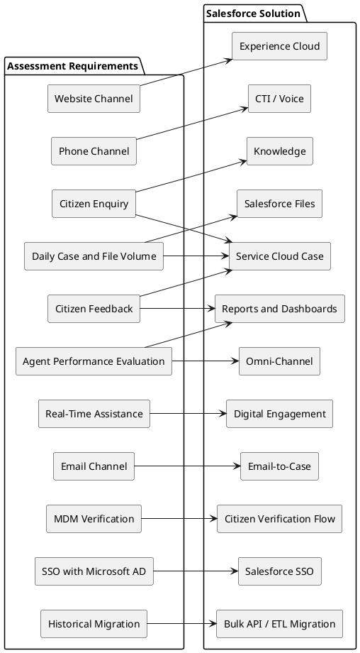

| Assessment Requirement                                         | Design Response                                                                                                                                                                                                  |
| -------------------------------------------------------------- | ---------------------------------------------------------------------------------------------------------------------------------------------------------------------------------------------------------------- |
| Branch Admin monitors incoming requests within the division    | Read-only division visibility in [Section 10.2](#102-access-model) and demand/performance KPIs in [Section 12.3](#123-branch-admin-dashboard).                                                                   |
| Supervisor oversees Agents across both Case types and channels | Supervisor process stories and escalation responsibilities in [Section 6.1](#61-user-story-map), access in [Section 10.2](#102-access-model), and operational KPIs in [Section 12.4](#124-supervisor-dashboard). |
| Agent handles Enquiries and Feedback from every channel        | Detailed Enquiry and Feedback handling in [Section 6.3](#63-enquiry-case-process) and [Section 6.4](#64-feedback-case-process).                                                                                  |
| Enquiry seven-stage process                                    | Initiation through citizen-confirmed closure is covered in [Section 6.3](#63-enquiry-case-process).                                                                                                              |
| Feedback six-stage process                                     | Receipt through Supervisor evaluation is covered in [Section 6.4](#64-feedback-case-process).                                                                                                                    |
| Website, phone, real-time web/mobile, and email channels       | Channel architecture and controls are covered in [Section 5.1](#51-architecture-overview) and [Section 9.4](#94-channel-integrations).                                                                           |
| Integrate with external MDM for citizen verification           | Declarative verification pattern and controls are covered in [Section 9.1](#91-citizen-verification-integration-pattern) and [Section 9.3](#93-mdm-verification).                                                |
| Flexibility to adapt to changes                                | Configurable metadata and implementation allocation are covered in [Section 7.5](#75-configurable-business-rules) and [Section 7.6](#76-declarative-and-programmatic-implementation-strategy).                   |
| Migrate 10 years / 6M records / 100GB files                    | Staged Bulk API/file migration and reconciliation are covered in [Section 11.2](#112-historical-case-data-migration-plan).                                                                                       |
| Manage 5,000 new Cases and 100MB uploads daily                 | Annualized growth, bulk-safe automation, storage, reporting, and archive controls are covered in [Section 11.3](#113-large-volume-design).                                                                       |
| Implement SSO using Microsoft Active Directory                 | Salesforce SSO through AD FS or Entra ID is covered in [Section 10.3](#103-sso-authentication-flow-with-microsoft-active-directory).                                                                             |
| Branch Admin evaluates Agent performance across channels       | Division-level metrics by Agent, channel, and Case type are covered in [Section 12.2](#122-agent-performance-evaluation-model) and [Section 12.3](#123-branch-admin-dashboard).                                  |
| Salesforce licensing, editions, features, third-party tools    | Covered in [Section 4](#4-salesforce-product-and-capability-selection).                                                                                                                                          |
| System landscape diagram                                       | Covered in [Section 5](#5-target-solution-architecture).                                                                                                                                                         |
| Business processes and user stories                            | Covered in [Section 6](#6-business-process-architecture).                                                                                                                                                        |
| Integration considerations                                     | Covered in [Section 9](#9-integration-architecture).                                                                                                                                                             |
| Data model, sharing, and security design                       | Covered in [Section 8](#8-data-architecture) and [Section 10](#10-security-access-and-identity).                                                                                                                 |
| Data migration plan                                            | Covered in [Section 11](#11-data-migration-and-large-volume-strategy).                                                                                                                                           |

## 3. Scope, Assumptions, and Constraints

### 3.1 In Scope

| Area                 | Scope                                                                                                          |
| -------------------- | -------------------------------------------------------------------------------------------------------------- |
| Citizen enquiries    | Capture, verify, assign, resolve, follow up, and close enquiry Cases.                                          |
| Citizen feedback     | Capture complaints, suggestions, satisfaction level, analysis, response, reporting, and supervisor evaluation. |
| Channels             | Website case submission, phone, real-time assistance through the agency website or mobile app, and email.      |
| Internal roles       | Branch Admin, Supervisor, and Agent.                                                                           |
| Citizen verification | Integration design with external Master Data Management (MDM) using phone or email.                            |
| Assignment           | Routing by expertise, language, workload, availability, priority, channel, and division.                       |
| Reporting            | Branch Admin and Supervisor dashboards for volume, SLA, backlog, satisfaction, channel, and agent performance. |
| Security             | Role hierarchy, permission sets, sharing, queue access, field-level security, SSO, and integration users.      |
| Migration            | Plan for 10 years of historical data, approximately 6 million records, and 100GB of files.                     |
| Daily growth         | Design for 5,000 new Cases and 100MB file uploads per day.                                                     |

### 3.2 Out of Scope

| Area                          | Reason                                                                                |
| ----------------------------- | ------------------------------------------------------------------------------------- |
| Task 1 assessment processes   | Not part of the citizen enquiry and feedback requirement.                             |
| Payment gateway               | Not required for enquiry and feedback case management.                                |
| Non-citizen CRM domains       | This design focuses on citizen service requests only.                                 |
| Detailed vendor procurement   | Product recommendations are architectural guidance and require commercial validation. |
| Physical network provisioning | Salesforce and identity/network setup are covered at design level only.               |

### 3.3 Assumptions

| ID   | Assumption                                                                                                                                                                                                                                   |
| ---- | -------------------------------------------------------------------------------------------------------------------------------------------------------------------------------------------------------------------------------------------- |
| A-01 | Internal agency users authenticate through Microsoft AD / Microsoft Entra ID.                                                                                                                                                                |
| A-02 | The external MDM exposes secure APIs for citizen lookup by phone and email.                                                                                                                                                                  |
| A-03 | Enquiry and feedback are implemented as Salesforce Case record types.                                                                                                                                                                        |
| A-04 | The agency has divisions or branches that can be mapped to roles, queues, public groups, and reports.                                                                                                                                        |
| A-05 | Historical source records contain enough identifiers to support migration reconciliation.                                                                                                                                                    |
| A-06 | File storage strategy will be validated against Salesforce storage limits before production migration.                                                                                                                                       |
| A-07 | The mobile app is treated as a real-time assistance channel through Digital Engagement or an API/channel adapter; it is not assumed to embed Experience Cloud or use mobile webview.                                                         |
| A-08 | Channel adapters may create a preliminary Case before MDM verification; the Case remains `Verification Pending` and cannot proceed to normal assignment until verification succeeds or an authorized manual-review outcome is recorded.      |
| A-09 | Outbound APIs in scope expose REST/JSON contracts compatible with Flow HTTP Callout or an OpenAPI schema supported by External Services; unsupported contracts require API Gateway normalization rather than Salesforce custom callout code. |
| A-10 | Citizen verification is applied to both `Enquiry` and `Feedback` Cases through the shared intake process; this extends the explicit Enquiry verification step into a consistent cross-channel identity-control policy.                       |

### 3.4 Constraints

| ID   | Constraint                                                                                          |
| ---- | --------------------------------------------------------------------------------------------------- |
| C-01 | Salesforce Flow, HTTP Callout, External Services, and integration limits apply to each transaction. |
| C-02 | MDM response time determines whether verification can be fully synchronous.                         |
| C-03 | Salesforce data/file storage capacity must be sized for historical and daily growth.                |
| C-04 | Security design must protect citizen personally identifiable information.                           |
| C-05 | Migration must preserve auditability, ownership, file links, and record-count reconciliation.       |

## 4. Salesforce Product and Capability Selection

### 4.1 Capability Selection

| Requirement Area       | Recommended Capability                                                                         | Rationale                                                                                                                 |
| ---------------------- | ---------------------------------------------------------------------------------------------- | ------------------------------------------------------------------------------------------------------------------------- |
| Internal case handling | Service Cloud Enterprise or higher                                                             | Provides Case, Service Console, queues, automation, reporting, and service process foundation.                            |
| Public-sector hosting  | Salesforce Government Cloud or equivalent regulated option, if mandated                        | Supports public-sector compliance and data residency requirements when required by policy.                                |
| Website citizen access | Experience Cloud                                                                               | Supports website-based case submission, status visibility, file upload, and authenticated/public citizen access patterns. |
| Website intake         | Experience Cloud LWC, Web-to-Case, or API-backed form                                          | Supports structured website submission, validation, attachments, and channel tracking.                                    |
| Phone intake           | Open CTI or Service Cloud Voice-compatible integration                                         | Enables screen-pop, call logging, and phone-origin Case creation.                                                         |
| Real-time assistance   | Messaging, Chat, or Digital Engagement                                                         | Supports real-time citizen assistance from the agency website or mobile app and routes work to agents.                    |
| Email intake           | Email-to-Case                                                                                  | Converts emails into Cases and maintains email thread history.                                                            |
| Work assignment        | Omni-Channel                                                                                   | Routes by queue, skill, language, capacity, workload, and availability.                                                   |
| Reusable answers       | Salesforce Knowledge                                                                           | Provides approved solutions for recurring enquiries and supports draft-to-approval lifecycle.                             |
| SLA management         | Entitlements and Milestones                                                                    | Tracks first response, follow-up, escalation, and resolution commitments.                                                 |
| Reporting              | Reports and Dashboards; CRM Analytics if needed                                                | Meets Branch Admin and Supervisor monitoring needs.                                                                       |
| Identity               | Salesforce SSO with Microsoft AD through AD FS or Microsoft Entra ID using SAML or OIDC        | Reuses the existing identity provider and centralizes access management.                                                  |
| Integration            | Flow HTTP Callout, External Services, External Credentials, Named Credentials, and API Gateway | Provides declarative outbound REST callouts without hardcoded endpoints or credentials.                                   |
| Migration              | Bulk API 2.0, ETL tooling, Data Loader, staging database                                       | Supports controlled high-volume migration and reconciliation.                                                             |
| Backup/archive         | Salesforce Backup or approved AppExchange backup/archive product                               | Reduces risk for long retention, files, and operational recovery.                                                         |

### 4.2 License and Commercial Validation

| Capability                     | License / Commercial Posture                                                                                                                                                             |
| ------------------------------ | ---------------------------------------------------------------------------------------------------------------------------------------------------------------------------------------- |
| Assessment build environment   | Use the required new Trailhead Playground Developer Edition for the prototype; deploy Flow, External Service, metadata, and configuration through source-controlled Salesforce metadata. |
| Service Cloud                  | Enterprise Edition or higher is the baseline for internal Agents, Supervisors, and Branch Admins; confirm feature allocations and user counts during discovery.                          |
| Experience Cloud               | External-user login/member licensing and guest-user access must be sized from citizen authentication and portal-usage assumptions.                                                       |
| Digital Engagement / Messaging | Treat as an add-on subject to channel, conversation-volume, and regional availability validation.                                                                                        |
| Telephony                      | Open CTI can reuse an approved telephony provider; Service Cloud Voice and telephony consumption require separate commercial validation.                                                 |
| Government Cloud               | Conditional on government compliance, data residency, accreditation, and procurement policy.                                                                                             |
| CRM Analytics                  | Optional; standard Reports and Dashboards remain the baseline unless advanced analytics requirements justify additional licensing.                                                       |
| API Gateway / MuleSoft         | Optional when the existing enterprise integration platform can provide normalization, throttling, monitoring, or orchestration; not required for a compatible direct MDM REST contract.  |
| Backup, archive, and storage   | Validate Salesforce Backup or an approved third-party product, additional data/file storage, retention, and external archive cost before production commitment.                          |

## 5. Target Solution Architecture

### 5.1 Architecture Overview

This diagram shows the end-to-end target landscape across citizen channels, Salesforce capabilities, enterprise identity, MDM integration, and the principal data stores used by the solution.

[High-Level Solution Architecture](<../puml task2/05.01 High-Level Solution Architecture.puml>)

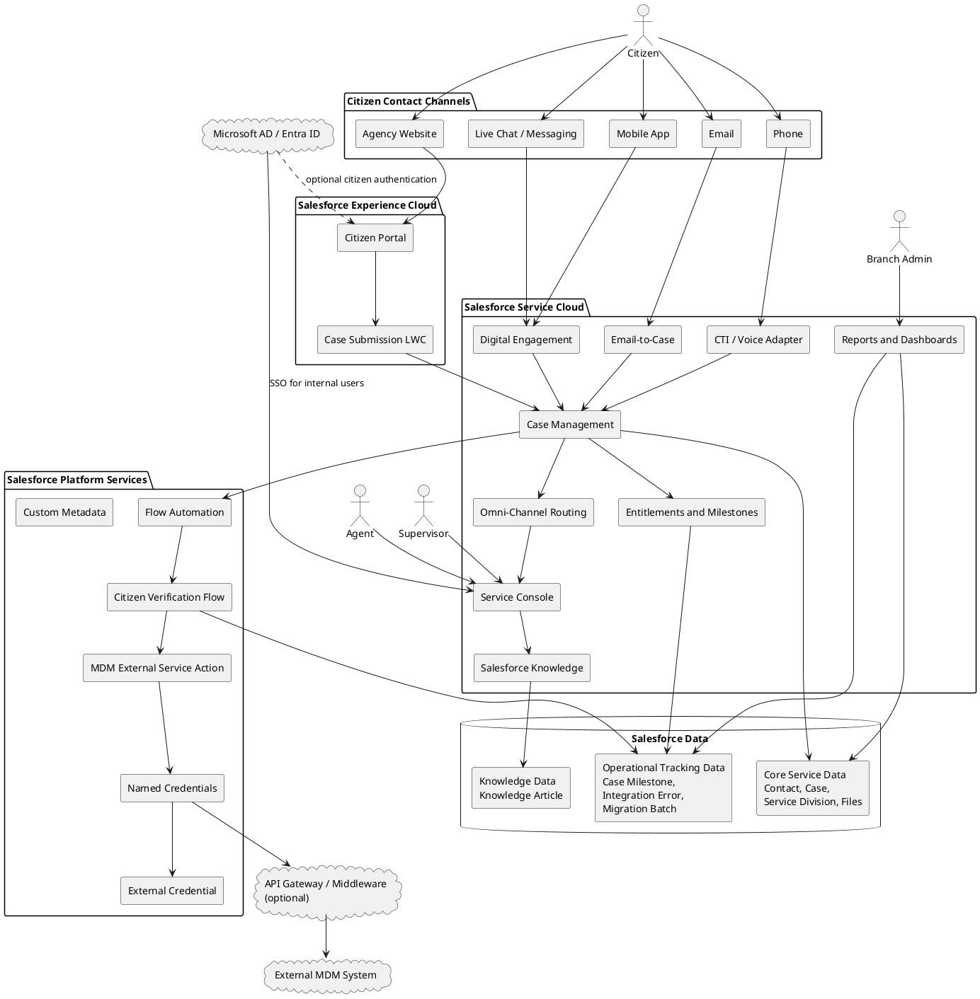

Citizens interact with the agency through supported contact channels. Salesforce normalizes those interactions into Case records with consistent channel, record type, priority, service division, citizen identity, SLA, and ownership attributes.

Agents use Service Console to verify citizens, work Cases, review files, search Knowledge, respond to citizens, and complete follow-up actions. Supervisors manage queue health, escalations, SLA risk, and handling quality. Branch Admins monitor division-level demand and performance without directly resolving Cases.

MDM integration verifies citizens by phone or email. Microsoft AD / Entra ID authenticates internal users and maps access through profiles, permission sets, roles, groups, queues, and sharing rules.

### 5.2 Layered Architecture

This view organizes the solution into presentation, intake, orchestration, business-service, integration, and persistence layers to clarify dependency direction and separation of responsibility.

[Layered Architecture](<../puml task2/05.02 Layered Architecture.puml>)

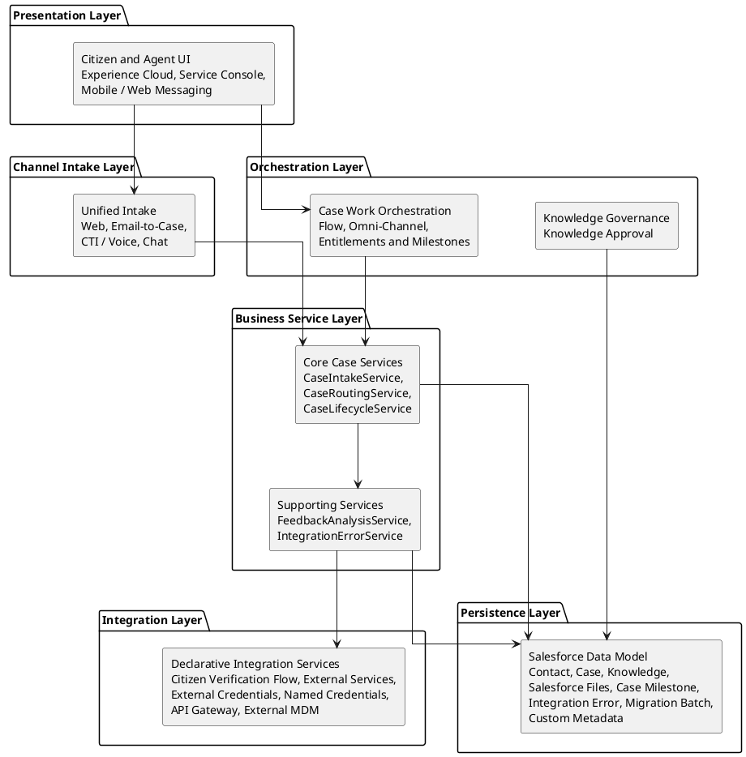

## 6. Business Process Architecture

The assessment defines two primary end-to-end business processes. Contact channels are intake mechanisms shared by both processes, not separate business processes.

| Business Process         | Required Stages                                                                           |
| ------------------------ | ----------------------------------------------------------------------------------------- |
| Enquiry Case Management  | Initiation, Verification, Case Recording, Case Assignment, Resolution, Follow-Up, Closure |
| Feedback Case Management | Receipt, Recording, Analysis, Response when required, Reporting, Evaluation               |

### 6.1 User Story Map

This diagram maps each business persona to the capabilities they need, forming the traceability bridge between role responsibilities and the processes defined later in this section.

[User Story Map](<../puml task2/06.01 User Story Map.puml>)

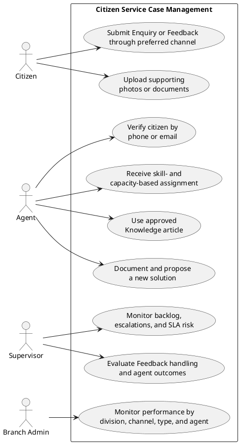

| Persona      | User Story                                                                                                                                           |
| ------------ | ---------------------------------------------------------------------------------------------------------------------------------------------------- |
| Citizen      | As a citizen, I want to submit enquiries or feedback through my preferred channel so that I can receive help without visiting a branch.              |
| Citizen      | As a citizen, I want to upload supporting photos or documents so that the agency can understand my request.                                          |
| Agent        | As an agent, I want citizen verification by phone or email so that I handle the correct citizen record.                                              |
| Agent        | As an agent, I want cases routed by expertise, language, workload, and availability so that work is distributed fairly.                              |
| Agent        | As an agent, I want to use approved Knowledge articles so that responses are consistent.                                                             |
| Agent        | As an agent, I want to document a new solution when no existing answer exists so that similar enquiries can be resolved faster.                      |
| Supervisor   | As a supervisor, I want to monitor queue backlog, escalations, and SLA risk so that I can intervene quickly.                                         |
| Supervisor   | As a supervisor, I want to compare Enquiry and Feedback handling across channels so that I can coach Agents and maintain consistent service quality. |
| Supervisor   | As a supervisor, I want to evaluate feedback handling and agent outcomes so that service quality improves.                                           |
| Branch Admin | As a Branch Admin, I want dashboards by division, channel, case type, and agent so that I can monitor operational performance.                       |

### 6.2 Business Process Overview

This high-level process distinguishes the two primary Case journeys—Enquiry and Feedback—before their detailed steps and shared supporting processes are described separately.

[Business Process Overview](<../puml task2/06.02 Business Process Overview.puml>)

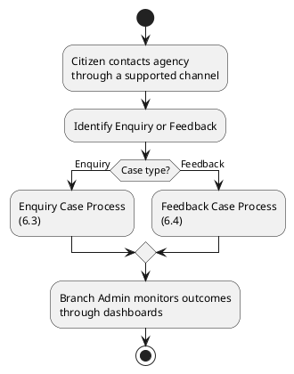

### 6.3 Enquiry Case Process

This activity diagram follows an Enquiry from citizen initiation through intake, verification, assignment, Knowledge-assisted resolution, follow-up, and citizen-confirmed closure.

[Enquiry Case Process](<../puml task2/06.03 Enquiry Case Process.puml>)

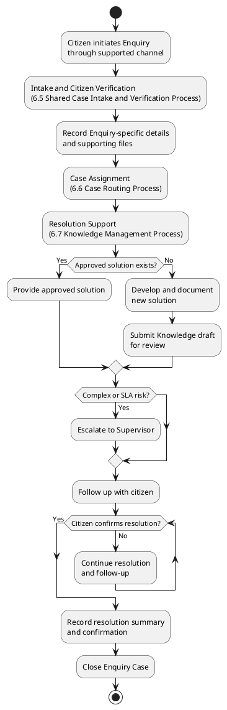

| Step               | Salesforce Design                                                                                                        |
| ------------------ | ------------------------------------------------------------------------------------------------------------------------ |
| Initiation         | Citizen creates an enquiry through website, phone, real-time assistance on the agency website/mobile app, or email.      |
| Verification       | Agent or automated integration verifies phone/email against MDM and links the Case to Contact.                           |
| Case Recording     | Case captures subject, description, origin, service category, division, priority, language, and supporting files/photos. |
| Assignment         | Omni-Channel assigns work using expertise, language, workload, availability, priority, channel, and division.            |
| Resolution         | Agent searches Knowledge. Existing approved articles are used when available; new solutions are documented when needed.  |
| Supervisor Support | Complex, policy-sensitive, aged, or SLA-risk Cases are escalated to Supervisor.                                          |
| Follow-Up          | Follow-up tasks and milestones remain active until the citizen confirms resolution.                                      |
| Closure            | Case is closed with resolution summary, closure confirmation, and audit trail.                                           |

### 6.4 Feedback Case Process

This activity diagram follows Feedback from receipt and recording through analysis, optional citizen response, reporting, supervisor evaluation, and closure.

[Feedback Case Process](<../puml task2/06.04 Feedback Case Process.puml>)

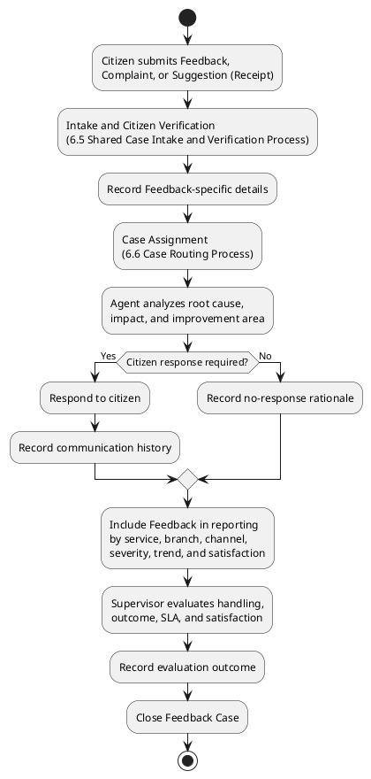

| Step       | Salesforce Design                                                                                        |
| ---------- | -------------------------------------------------------------------------------------------------------- |
| Receipt    | Feedback, complaint, or suggestion is received through a supported channel.                              |
| Recording  | Case record type `Feedback` captures service area, satisfaction level, category, severity, and evidence. |
| Analysis   | Agent assesses root cause, impact, improvement area, and response requirement.                           |
| Response   | Agent responds when required and records communication history.                                          |
| Reporting  | Feedback is grouped by service, branch, channel, severity, trend, and satisfaction level.                |
| Evaluation | Supervisor reviews handling quality, SLA performance, agent outcome, and citizen satisfaction.           |

### 6.5 Shared Case Intake and Verification Process

This shared subprocess normalizes interactions from every supported channel, establishes a preliminary Case, verifies the citizen against MDM, and prepares complete routing attributes.

[Shared Case Intake and Verification Process](<../puml task2/06.05 Shared Case Intake and Verification Process.puml>)

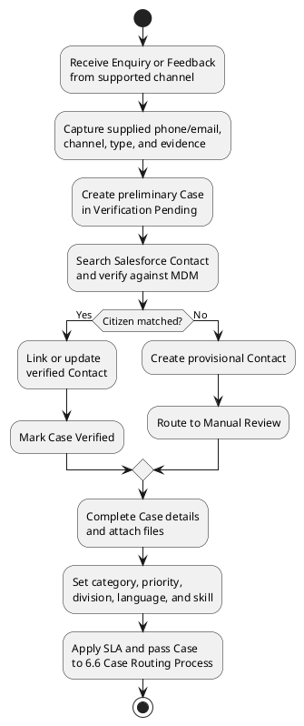

### 6.6 Case Routing Process

This process determines the best available Agent or queue using Case type, language, skill, priority, workload, and availability, with escalation for high-risk work.

[Case Routing Process](<../puml task2/06.06 Case Routing Process.puml>)

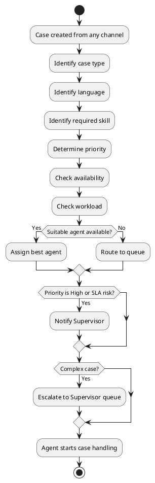

### 6.7 Knowledge Management Process

This process governs reuse of approved solutions and the creation, review, publication, and later reuse of new Knowledge articles when no suitable answer exists.

[Knowledge Management Process](<../puml task2/06.07 Knowledge Management Process.puml>)

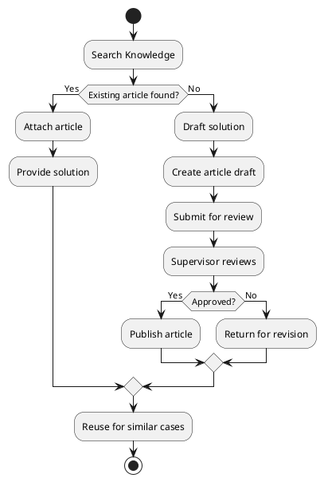

## 7. Application Architecture

### 7.1 Application Layer Overview

This diagram presents the logical application layers and the primary direction of dependency from user interfaces and channel services to platform controls, business services, and Salesforce data. It establishes separation of concerns without prescribing the runtime sequence of an individual Case transaction.

[Application Layer Overview](<../puml task2/07.01 Application Layer Overview.puml>)

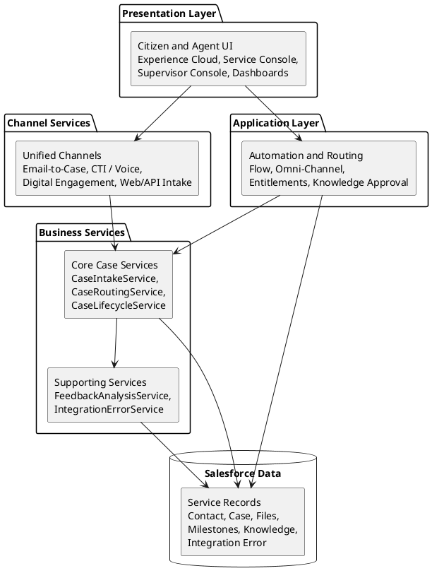

### 7.2 Service Layer Design

This diagram decomposes the business-service layer into canonical services with distinct responsibilities and shows their dependencies on Salesforce platform capabilities and data contracts. The arrows represent service or data dependencies; they do not imply that every dependency is invoked in a single transaction.

[Service Layer Design](<../puml task2/07.02 Service Layer Design.puml>)

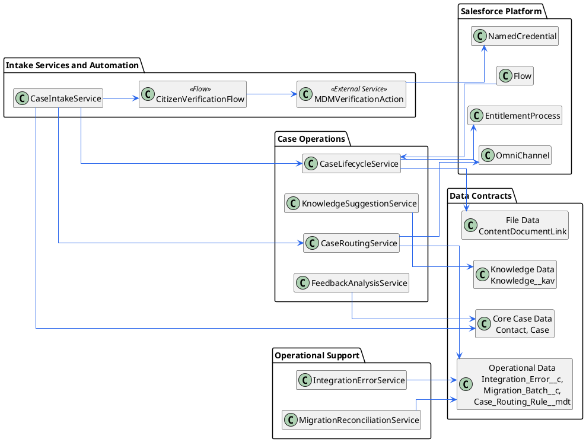

The responsibilities of the canonical application services and declarative integration components are defined below.

| Component                      | Responsibility                                                                               |
| ------------------------------ | -------------------------------------------------------------------------------------------- |
| CaseIntakeService              | Normalize website, phone, email, and real-time assistance interactions into Case records.    |
| CitizenVerificationFlow        | Orchestrate phone/email verification and update Contact/Case verification fields.            |
| MDMVerificationAction          | External Service action that performs the secured MDM REST callout through Named Credential. |
| CaseRoutingService             | Prepare routing attributes used by Omni-Channel and queues.                                  |
| CaseLifecycleService           | Enforce lifecycle transitions, closure validations, and follow-up requirements.              |
| FeedbackAnalysisService        | Classify feedback, satisfaction, severity, and improvement area.                             |
| KnowledgeSuggestionService     | Suggest existing articles and create draft article candidates when needed.                   |
| IntegrationErrorService        | Capture MDM/channel/file failures and retry status.                                          |
| MigrationReconciliationService | Track migration batches, counts, file links, and exception summaries.                        |

### 7.3 Service Interaction Diagram

This sequence shows the runtime collaboration among application services from channel submission through agent assignment. MDM transport and failure handling are detailed separately in [Section 9](#9-integration-architecture).

[Service Interaction Diagram](<../puml task2/07.03 Service Interaction Diagram.puml>)

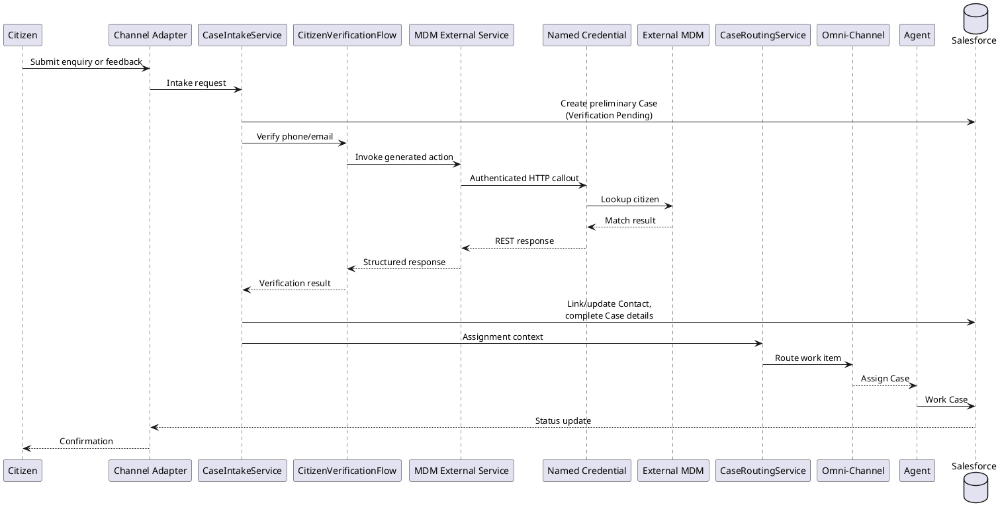

### 7.4 Error Handling Strategy

This activity diagram defines the common application-level response to service failures. It separates successful transaction completion from retryable integration failures and non-retryable errors, while ensuring unsafe changes are rolled back and operational details remain available for support and review.

[Error Handling Strategy](<../puml task2/07.04 Error Handling Strategy.puml>)

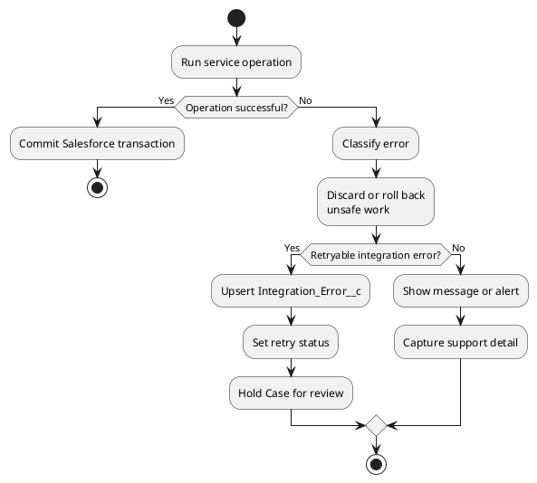

### 7.5 Configurable Business Rules

This diagram identifies the Custom Metadata Types used to externalize routing, SLA, feedback-classification, and integration-error behavior. Keeping these rules in metadata allows authorized administrators to adjust operational policy without embedding frequently changing values in Flow logic.

[Configurable Business Rules](<../puml task2/07.05 Configurable Business Rules.puml>)

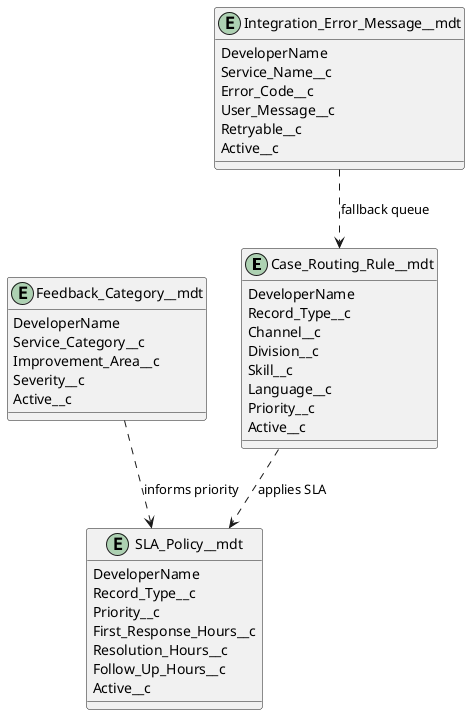

### 7.6 Declarative and Programmatic Implementation Strategy

| Requirement                | Technology                                                                  | Rationale                                                                                                 |
| -------------------------- | --------------------------------------------------------------------------- | --------------------------------------------------------------------------------------------------------- |
| Case creation and updates  | Flow, Case assignment, Email-to-Case, Web/API intake                        | Standard Salesforce service capabilities.                                                                 |
| Routing                    | Omni-Channel, queues, skills, capacity                                      | Native routing by availability and workload.                                                              |
| SLA                        | Entitlements and Milestones                                                 | Standard response and resolution tracking.                                                                |
| Notifications              | Flow and email templates                                                    | Administrator maintainable.                                                                               |
| Knowledge lifecycle        | Salesforce Knowledge approval process                                       | Standard article governance.                                                                              |
| MDM verification           | Flow HTTP Callout, External Services, External Credential, Named Credential | Declarative REST callout with secured authentication, response mapping, timeout, and Flow fault handling. |
| Migration                  | Bulk API / ETL                                                              | High-volume load and reconciliation.                                                                      |
| Operational error tracking | Custom object and dashboards                                                | Required for support visibility.                                                                          |

## 8. Data Architecture

### 8.1 Entity Relationship Diagram

This ERD defines the principal Salesforce standard objects, custom objects, metadata, files, and operational records together with the relationships required for Case management.

[Entity Relationship Diagram](<../puml task2/08.01 Entity Relationship Diagram.puml>)

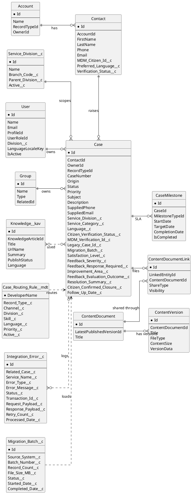

### 8.2 Core Data Model

| Object                                                 | Purpose                                                                                   |
| ------------------------------------------------------ | ----------------------------------------------------------------------------------------- |
| Account                                                | Optional household, organization, or agency account grouping where required.              |
| Contact                                                | Citizen master profile linked to verified phone/email and MDM reference.                  |
| Case                                                   | Primary enquiry and feedback transaction record.                                          |
| Case Record Type                                       | Separates Enquiry and Feedback lifecycle, page layout, fields, and validation.            |
| Service_Division__c                                    | Branch/division scope for reporting, queues, ownership, and sharing.                      |
| User                                                   | Branch Admin, Supervisor, Agent, integration user, and migration user.                    |
| Group / Queue                                          | Work queues for triage, division assignment, and escalation.                              |
| Knowledge__kav                                         | Approved solutions and draft knowledge candidates.                                        |
| ContentDocument / ContentVersion / ContentDocumentLink | Supporting files, versions, and their links to Cases.                                     |
| CaseMilestone                                          | SLA tracking for response, follow-up, and resolution.                                     |
| Integration_Error__c                                   | Operational tracking for failed MDM, channel, or file-processing transactions.            |
| Migration_Batch__c                                     | Migration batch tracking and reconciliation summary.                                      |
| Case_Routing_Rule__mdt                                 | Configurable routing attributes such as channel, skill, language, priority, and division. |

### 8.3 Recommended Case Fields

| Field                          | Purpose                                                                                                                                                                          |
| ------------------------------ | -------------------------------------------------------------------------------------------------------------------------------------------------------------------------------- |
| RecordTypeId                   | Selects the `Enquiry` or `Feedback` Case record type defined in [Section 8.4](#84-case-record-type-design).                                                                      |
| Origin                         | Website, Phone, Chat, Mobile App, or Email.                                                                                                                                      |
| Status                         | Values are controlled by the Support Process associated with the Case record type; see [Section 8.5](#85-enquiry-case-lifecycle) and [Section 8.6](#86-feedback-case-lifecycle). |
| Priority                       | Standard Salesforce priority plus agency-specific severity mapping if required.                                                                                                  |
| Service_Division__c            | Branch or division scope.                                                                                                                                                        |
| Service_Category__c            | Agency service/product area.                                                                                                                                                     |
| Language__c                    | Preferred language for routing.                                                                                                                                                  |
| Citizen_Verification_Status__c | Verified, Not Found, Manual Review, Failed.                                                                                                                                      |
| MDM_Verification_Id__c         | External verification reference.                                                                                                                                                 |
| Legacy_Case_Id__c              | Unique external ID used for migration upsert, lineage, and reconciliation.                                                                                                       |
| Migration_Batch__c             | Identifies the migration batch that loaded the historical Case.                                                                                                                  |
| Satisfaction_Level__c          | Feedback satisfaction indicator.                                                                                                                                                 |
| Feedback_Severity__c           | Feedback impact or severity used for prioritization, escalation, and reporting.                                                                                                  |
| Feedback_Response_Required__c  | Indicates whether the agency must respond to the citizen.                                                                                                                        |
| Improvement_Area__c            | Feedback classification for trend reporting.                                                                                                                                     |
| Feedback_Evaluation_Outcome__c | Stores the Supervisor's evaluation result for handling quality, agent outcome, and citizen satisfaction.                                                                         |
| Resolution_Summary__c          | Required before closure.                                                                                                                                                         |
| Citizen_Confirmed_Closure__c   | Confirms citizen acceptance for enquiry closure.                                                                                                                                 |
| Follow_Up_Date__c              | Drives follow-up tasks and overdue reporting.                                                                                                                                    |

### 8.4 Case Record Type Design

The solution uses two Salesforce Case record types to separate the agency's primary business processes while retaining a common Case data model, routing foundation, security model, and reporting framework.

| Case Record Type | Support Process                 | Purpose                                                                     | Primary Process                                                                                        | Distinct Data and Controls                                                                                                                                          |
| ---------------- | ------------------------------- | --------------------------------------------------------------------------- | ------------------------------------------------------------------------------------------------------ | ------------------------------------------------------------------------------------------------------------------------------------------------------------------- |
| `Enquiry`        | `Enquiry Case Support Process`  | Manage citizen questions, concerns, and requests for information.           | Initiation, verification, recording, assignment, resolution, follow-up, and citizen-confirmed closure. | Knowledge usage, resolution summary, follow-up date, supervisor escalation, and citizen closure confirmation.                                                       |
| `Feedback`       | `Feedback Case Support Process` | Manage citizen feedback, complaints, and suggestions about agency services. | Receipt, recording, analysis, optional response, reporting, and supervisor evaluation.                 | Satisfaction level, `Feedback_Severity__c`, `Improvement_Area__c`, `Feedback_Response_Required__c`, reporting classification, and `Feedback_Evaluation_Outcome__c`. |

Each record type is associated with its own Salesforce Support Process, which controls the available `Case.Status` values. Record types also control the appropriate page layout, required fields, validation rules, status guidance, and automation entry criteria. The resulting lifecycles are defined separately in [Section 8.5](#85-enquiry-case-lifecycle) and [Section 8.6](#86-feedback-case-lifecycle).

### 8.5 Enquiry Case Lifecycle

This state model defines the allowed `Case.Status` transitions for the `Enquiry` record type through the `Enquiry Case Support Process`. It aligns the operational status model with verification, assignment, resolution, follow-up, citizen confirmation, and closure.

[Enquiry Case Lifecycle](<../puml task2/08.05 Enquiry Case Lifecycle.puml>)

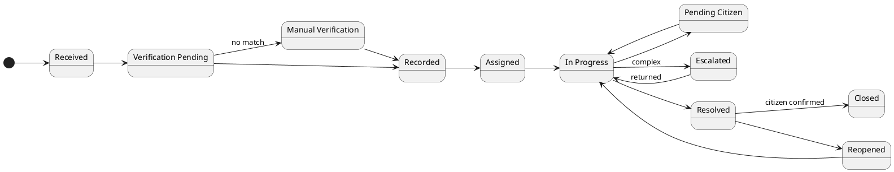

### 8.6 Feedback Case Lifecycle

This state model defines the allowed `Case.Status` transitions for the `Feedback` record type through the `Feedback Case Support Process`. It incorporates citizen verification and assignment before analysis, optional response, reporting, supervisor evaluation, and closure.

[Feedback Case Lifecycle](<../puml task2/08.06 Feedback Case Lifecycle.puml>)

```plantuml
@startuml
left to right direction
skinparam linetype ortho

state "Received" as Received
state "Verification Pending" as VerificationPending
state "Manual Verification" as ManualVerification
state "Recorded" as Recorded
state "Assigned" as Assigned
state "Under Analysis" as UnderAnalysis
state "Response Required" as ResponseRequired
state "No Response Required" as NoResponseRequired
state "Responded" as Responded
state "Reporting" as Reporting
state "Supervisor Evaluation" as SupervisorEvaluation
state "Closed" as Closed

[*] --> Received
Received --> VerificationPending
VerificationPending --> Recorded
VerificationPending --> ManualVerification : no match
ManualVerification --> Recorded
Recorded --> Assigned
Assigned --> UnderAnalysis
UnderAnalysis --> ResponseRequired
UnderAnalysis --> NoResponseRequired
ResponseRequired --> Responded
Responded --> Reporting
NoResponseRequired --> Reporting
Reporting --> SupervisorEvaluation
SupervisorEvaluation --> Closed

@enduml
```

## 9. Integration Architecture

The integration architecture is declarative-first in both directions, with the pattern selected according to interaction direction, authentication context, and payload complexity.

| Direction / Scenario                  | Preferred Pattern                                                                                            | Security and Usage                                                                                             |
| ------------------------------------- | ------------------------------------------------------------------------------------------------------------ | -------------------------------------------------------------------------------------------------------------- |
| Inbound authenticated custom payload  | External application invokes an autolaunched Flow through the Salesforce REST invocable-action endpoint.     | OAuth 2.0 or Salesforce session authentication; use an integration user with least-privilege access.           |
| Inbound anonymous citizen interaction | Public Experience Cloud page invokes an enabled Screen Flow.                                                 | Restricted guest-user Flow, object, field, and file permissions; apply validation, spam, and abuse controls.   |
| Inbound standard citizen channel      | Email-to-Case, Web-to-Case or Experience Cloud Flow, Digital Engagement, and CTI / Service Cloud Voice.      | Use native channel authentication, routing, and Omni-Channel controls where applicable.                        |
| Outbound REST/JSON callout            | Flow HTTP Callout or registered External Service action secured by External Credential and Named Credential. | Used for MDM citizen verification and future compatible APIs; API Gateway can normalize unsupported contracts. |
| Identity federation                   | Salesforce SSO with Microsoft AD / Entra ID through SAML or OpenID Connect.                                  | Separate identity pattern; not a citizen-channel intake or business API callout.                               |
| Data migration and bulk exchange      | Bulk API 2.0 with ETL, staging, reconciliation, and controlled migration credentials.                        | Separate high-volume pattern; not executed as a transactional Flow callout.                                    |

Middleware is optional when protocol mediation, complex transformation, centralized security policy, throttling, or cross-system orchestration is required.

### 9.1 Citizen Verification Integration Pattern

This sequence diagram shows the declarative synchronous verification path from the Service Console through Flow, an External Service action, Named Credential, and the enterprise integration layer to the external MDM.

[Citizen Verification Integration Pattern](<../puml task2/09.01 Citizen Verification Integration Pattern.puml>)

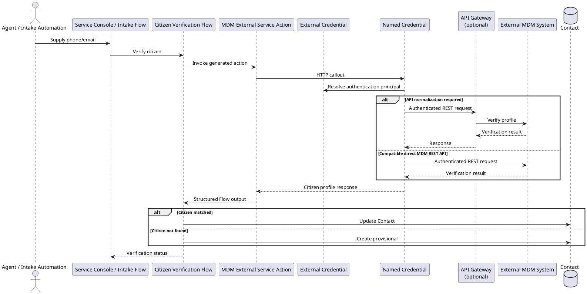

The business decision flow for Contact matching and manual review is defined once in [Section 6.5](#65-shared-case-intake-and-verification-process). This section focuses on the technical call sequence and integration boundary.

### 9.2 Retry Strategy

This activity diagram defines how transient and permanent integration failures are classified, retried within a controlled limit, surfaced to support, and reconciled after recovery.

[Retry Strategy](<../puml task2/09.02 Retry Strategy.puml>)

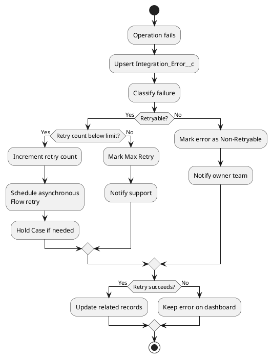

### 9.3 MDM Verification

MDM verification is required during intake and case handling. Salesforce sends phone or email to the external MDM through a secured integration layer and receives citizen match status, citizen identifier, and profile attributes required for case servicing.

| Design Area       | Decision                                                                                                      |
| ----------------- | ------------------------------------------------------------------------------------------------------------- |
| Integration style | Synchronous lookup when MDM response time is acceptable; asynchronous fallback when unavailable.              |
| Invocation        | Flow HTTP Callout or registered External Service action; no Apex callout in the baseline design.              |
| Security          | External Credential defines the authentication protocol and principal; Named Credential defines the endpoint. |
| Transport         | REST/JSON through API Gateway, which normalizes unsupported MDM contracts when required.                      |
| Error handling    | Flow fault paths log `Integration_Error__c` and move the Case to Manual Review when required.                 |
| Retry             | A scheduled or asynchronous Flow retries only transient failures and caps retry attempts.                     |
| Data protection   | Store only required MDM response data in Salesforce.                                                          |

### 9.4 Channel Integrations

| Channel                             | Design                                                                                                                         |
| ----------------------------------- | ------------------------------------------------------------------------------------------------------------------------------ |
| Website                             | Experience Cloud/LWC or API-backed case intake with validation, file controls, and bot protection.                             |
| Phone                               | CTI or Service Cloud Voice-compatible adapter for screen-pop, call log, and Case creation.                                     |
| Real-time website/mobile assistance | Messaging, Chat, or Digital Engagement routed through Omni-Channel; mobile app is not assumed to use Experience Cloud webview. |
| Email                               | Email-to-Case with routing addresses, thread identifiers, auto-response, and spam controls.                                    |
| Files                               | Salesforce Files with file type/size validation and malware scanning where required by policy.                                 |

## 10. Security, Access, and Identity

### 10.1 Role-Based Access and Visibility Model

This diagram maps internal, external, and system personas to the Salesforce security controls that govern access to service records, Knowledge, reports, and integration data.

[Role-Based Access and Visibility Model](<../puml task2/10.01 Role-Based Access and Visibility Model.puml>)

```plantuml
@startuml
left to right direction
skinparam componentStyle rectangle
skinparam linetype ortho
skinparam nodesep 70
skinparam ranksep 70

package "Access Personas" {
  component InternalUsers [
    <b>Internal Users</b>
    <size:11><color:#64748B>Branch Admin, Supervisor, Agent</color></size>
  ]
  component ExternalUsers [
    <b>External Users</b>
    <size:11><color:#64748B>Citizen</color></size>
  ]
  component SystemUser [
    <b>System User</b>
    <size:11><color:#64748B>Integration User</color></size>
  ]
}

package "Salesforce Security Controls" {
  component InternalAccess [
    <b>Internal Access Model</b>
    <size:11><color:#64748B>Role Hierarchy, Sharing Rules,</color></size>
    <size:11><color:#64748B>Queues, Permission Sets, FLS</color></size>
  ]
  component CitizenAccess [
    <b>Experience Sharing</b>
    <size:11><color:#64748B>Citizen case visibility</color></size>
  ]
  component IntegrationScope [
    <b>Integration Scope</b>
    <size:11><color:#64748B>API permissions and FLS</color></size>
  ]
}

package "Protected Records" {
  component ServiceData [
    <b>Service Data</b>
    <size:11><color:#64748B>Case, Contact, Files</color></size>
  ]
  component KnowledgeReports [
    <b>Knowledge and Reports</b>
    <size:11><color:#64748B>Approved articles, dashboards</color></size>
  ]
}

InternalUsers --> InternalAccess
ExternalUsers --> CitizenAccess
SystemUser --> IntegrationScope

InternalAccess --> ServiceData
InternalAccess --> KnowledgeReports
CitizenAccess --> ServiceData
IntegrationScope --> ServiceData

@enduml
```

### 10.2 Access Model

The access model applies least privilege by persona and separates operational access, citizen self-service, system integration, and temporary migration privileges.

| Role             | Access Type                 | Access Design                                                                                                    |
| ---------------- | --------------------------- | ---------------------------------------------------------------------------------------------------------------- |
| Branch Admin     | Read-only                   | View Cases, dashboards, and reports for the assigned division; no Case resolution responsibility.                |
| Supervisor       | Read / Write                | Manage team Cases and escalation queues, complete Feedback evaluation, and access performance dashboards.        |
| Agent            | Read / Write                | Work owned and assigned-queue Cases and access required Contact details, Knowledge, and linked Files.            |
| Citizen          | Create / Read own           | Submit Cases and view only their own Cases through Experience Cloud when authenticated portal access is enabled. |
| Integration User | API-only, least privilege   | Read or update only the objects and fields required by MDM, channel, and operational integrations.               |
| Migration User   | Temporary bulk Read / Write | Load historical data and perform reconciliation during the approved migration window.                            |

### 10.3 SSO Authentication Flow with Microsoft Active Directory

This sequence illustrates federated authentication for internal users, from Salesforce login redirection through Microsoft AD / Entra ID validation to creation of the Salesforce session.

[SSO Authentication Flow with Microsoft Active Directory](<../puml task2/10.03 SSO Authentication Flow with Microsoft Active Directory.puml>)

```plantuml
@startuml
skinparam sequenceMessageAlign center
actor "Internal User" as User
participant "Salesforce Login" as SFLogin
participant "SAML Identity Provider" as IdP
participant "Microsoft Active Directory / Entra ID" as AD
participant "Salesforce Service Cloud" as SF

User -> SFLogin : Access Salesforce
SFLogin -> IdP : Redirect SSO request
IdP -> AD : Authenticate user
AD --> IdP : Authentication success
IdP --> SFLogin : SAML assertion
SFLogin -> SF : Create user session
SF --> User : Access granted

@enduml
```

### 10.4 Security Controls

| Control              | Design                                                                                   |
| -------------------- | ---------------------------------------------------------------------------------------- |
| OWD                  | Set Case to Private unless the final branch model supports safe broader visibility.      |
| Role hierarchy       | Align to branch/division and service management structure.                               |
| Queues               | Separate triage, division, skill, and escalation ownership.                              |
| Sharing rules        | Criteria-based sharing for division-level Branch Admin and Supervisor visibility.        |
| Restriction rules    | Use where needed to prevent cross-division access.                                       |
| Permission sets      | Agent, Supervisor, Branch Admin, Integration User, Migration User.                       |
| Field-Level Security | Protect sensitive citizen information and internal evaluation fields.                    |
| Platform Encryption  | Recommended for sensitive personally identifiable information if compliance requires it. |
| Event Monitoring     | Recommended when audit and security monitoring requirements are high.                    |
| SSO                  | Microsoft AD / Entra ID through SAML or OpenID Connect.                                  |

## 11. Data Migration and Large Volume Strategy

### 11.1 Large Data Volume and File Storage Strategy

This diagram presents the controlled pipeline for profiling, cleansing, staging, loading, reconciling, indexing, and retaining approximately 6 million records and 100GB of historical files.

[Large Data Volume and File Storage Strategy](<../puml task2/11.01 Large Data Volume and File Storage Strategy.puml>)

```plantuml
@startuml
skinparam componentStyle rectangle
skinparam linetype ortho
skinparam nodesep 60
skinparam ranksep 70

database "Legacy Data\n6M Cases, 100GB Files" as LegacyData

package "Migration Pipeline" {
  [Profile and Cleanse] as ProfileCleanse
  [Deduplicate] as Deduplicate
  [Stage Data] as StageData
  [Bulk Load] as BulkLoad
  [File Migration] as FileMigration
  [Reconcile] as Reconcile
}

package "Salesforce Platform" {
  database "Core Records\nContact, Case" as CoreRecords
  database "Salesforce Files" as Files
  database "Migration Batch" as MigrationBatch
  [Indexes and External IDs] as Indexes
  [Archiving and Storage Plan] as StoragePlan
}

LegacyData --> ProfileCleanse
ProfileCleanse --> Deduplicate
Deduplicate --> StageData
StageData --> BulkLoad
LegacyData --> FileMigration

BulkLoad --> CoreRecords
BulkLoad --> MigrationBatch
FileMigration --> Files
FileMigration --> Reconcile
BulkLoad --> Reconcile
Reconcile --> MigrationBatch

CoreRecords --> Indexes
CoreRecords --> StoragePlan
Files --> StoragePlan

@enduml
```

### 11.2 Historical Case Data Migration Plan

This activity diagram defines the migration execution sequence from legacy extraction and pilot validation through full and delta loads, reconciliation, acceptance, and channel cutover.

[Historical Case Data Migration Plan](<../puml task2/11.02 Historical Case Data Migration Plan.puml>)

```plantuml
@startuml
start

:Extract legacy data;
:Profile quality and volume;
:Map target objects;
:Cleanse and deduplicate;
:Load reference data;
:Pilot load sample;

if (Pilot accepted?) then (Yes)
  :Bulk load Case batches;
  :Upload or archive files;
  :Reconcile counts and links;
  :Run delta migration;
else (No)
  :Fix mapping or storage;
  stop
endif

:Validate migration;
:Cut over channels;

stop
@enduml
```

The migration scope includes 10 years of historical records, approximately 6 million records, and 100GB of files.

| Phase      | Activity                                                                                                                                                   |
| ---------- | ---------------------------------------------------------------------------------------------------------------------------------------------------------- |
| Discovery  | Identify source systems, record counts, file stores, retention rules, ownership, and branch mappings.                                                      |
| Profiling  | Analyze duplicates, missing phone/email, invalid identifiers, orphan files, and channel gaps.                                                              |
| Mapping    | Map citizens to Contact, service requests to Case, files to Salesforce Files or external archive links, users to owners, and branches to Service Division. |
| Cleansing  | Standardize phone/email, deduplicate citizens, normalize categories, and define exception handling.                                                        |
| Pilot Load | Load representative data, validate transformations, reconcile counts, verify ownership and file links.                                                     |
| Full Load  | Use Bulk API 2.0 or ETL tooling with controlled batches and `Migration_Batch__c` tracking.                                                                 |
| File Load  | Load into Salesforce Files when storage/compliance allows; otherwise use approved external archive links.                                                  |
| Delta Load | Freeze or limit legacy writes, migrate final changes, and reconcile before go-live.                                                                        |
| Validation | Reconcile counts, file links, sharing, audit fields, reports, and sample citizen histories.                                                                |
| Cutover    | Switch channels to Salesforce, monitor exceptions, and retain rollback checkpoints until accepted.                                                         |

### 11.3 Large Volume Design

| Concern                | Design                                                                                                                               |
| ---------------------- | ------------------------------------------------------------------------------------------------------------------------------------ |
| 6M historical records  | Use external IDs, selective indexes, ownership mapping, and Bulk API batching.                                                       |
| 100GB historical files | Forecast storage and consider external archive links for older files.                                                                |
| 5,000 daily Cases      | Plan for approximately 1.825 million additional Cases per year; keep automation bulk-safe and use selective reporting and archiving. |
| 100MB daily uploads    | Plan for approximately 36.5GB additional file storage per year before retention or archive reduction.                                |
| Reporting performance  | Use selective filters by date, division, record type, and status.                                                                    |

## 12. Reporting, SLA, and Performance Evaluation

### 12.1 Operational Monitoring and SLA Management

This diagram shows how Case lifecycle events, milestones, SLA alerts, and integration errors feed operational dashboards used to identify backlog, risk, and service exceptions.

[Operational Monitoring and SLA Management](<../puml task2/12.01 Operational Monitoring and SLA Management.puml>)

```plantuml
@startuml
skinparam componentStyle rectangle
skinparam linetype ortho
skinparam nodesep 70
skinparam ranksep 60

package "Case Operations" {
  [Case Lifecycle Events\nCreated, Assigned, Pending,\nEscalated, Closed] as CaseEvents
}

package "SLA Monitoring" {
  [Entitlements and Milestones] as Milestones
  [SLA Alerts and Escalations] as SlaAlerts
}

package "Integration Monitoring" {
  [Integration Errors\nMDM, Channel Intake, Retry Queue] as IntegrationErrors
}

package "Management Dashboards" {
  [Operational Dashboards\nAgent Performance, Channel Volume,\nSLA Compliance, Satisfaction,\nBacklog, Integration Errors] as Dashboards
}

CaseEvents --> Milestones
Milestones --> SlaAlerts
CaseEvents --> Dashboards
Milestones --> Dashboards
SlaAlerts --> Dashboards
IntegrationErrors --> Dashboards

@enduml
```

### 12.2 Agent Performance Evaluation Model

This model traces operational source data into performance metrics and scorecards tailored to the oversight needs of Branch Admins, Supervisors, and Agents.

[Agent Performance Evaluation Model](<../puml task2/12.02 Agent Performance Evaluation Model.puml>)

```plantuml
@startuml
skinparam componentStyle rectangle
skinparam linetype ortho
skinparam nodesep 70
skinparam ranksep 70

database "Performance Sources\nCase, Case Milestone,\nUser, Knowledge Usage" as Sources

package "Performance Dataset" {
  [Performance Metrics\nVolume, Backlog, Response Time,\nResolution Time, SLA, Reopen Rate,\nFeedback, Knowledge Use] as Metrics
  [Performance Scorecard] as Scorecard
}

package "Evaluation Views" {
  [Division Dashboard] as DivisionDashboard
  [Team Dashboard] as TeamDashboard
  [Agent Worklist] as AgentWorklist
}

package "Evaluation Consumers" {
  [Branch Admin] as BranchAdmin
  [Supervisor] as Supervisor
  [Agent] as Agent
}

Sources --> Metrics
Metrics --> Scorecard

Scorecard --> DivisionDashboard
Scorecard --> TeamDashboard
Scorecard --> AgentWorklist

DivisionDashboard --> BranchAdmin
TeamDashboard --> Supervisor
AgentWorklist --> Agent

@enduml
```

### 12.3 Branch Admin Dashboard

| KPI                                             | Purpose                                                                                                                       |
| ----------------------------------------------- | ----------------------------------------------------------------------------------------------------------------------------- |
| New Cases by channel, division, and record type | Monitor demand across contact channels.                                                                                       |
| Open backlog by age and priority                | Identify operational pressure.                                                                                                |
| SLA breach count and rate                       | Evaluate service performance.                                                                                                 |
| Average first response time                     | Measure responsiveness.                                                                                                       |
| Average resolution time                         | Measure closure efficiency.                                                                                                   |
| Agent case volume and closure rate              | Evaluate agent effectiveness.                                                                                                 |
| Agent effectiveness by channel and Case type    | Compare volume, response time, resolution time, SLA attainment, reopen rate, and satisfaction for each Agent across channels. |
| Reopened case rate                              | Identify quality or premature closure issues.                                                                                 |
| Feedback satisfaction trend                     | Track citizen satisfaction and service improvement areas.                                                                     |
| Feedback volume by service and improvement area | Support internal review, trend analysis, and strategic service planning.                                                      |

### 12.4 Supervisor Dashboard

| KPI                             | Purpose                                          |
| ------------------------------- | ------------------------------------------------ |
| Queue backlog and aging         | Manage daily workload.                           |
| Escalated cases                 | Focus supervisor intervention.                   |
| SLA at risk                     | Prevent breaches.                                |
| Agent workload and availability | Balance assignments.                             |
| Knowledge article usage         | Improve response consistency.                    |
| Feedback handling outcome       | Evaluate agent quality and citizen satisfaction. |

## 13. Non-Functional Requirements

| Area            | Design Response                                                                                                 |
| --------------- | --------------------------------------------------------------------------------------------------------------- |
| Scalability     | Standard Case, Omni-Channel, bulk-safe Flow, controlled HTTP callouts, selective reports, and archive strategy. |
| Flexibility     | Record types, page layouts, Flow, Custom Metadata, queues, and Knowledge allow process changes.                 |
| Security        | SSO, least privilege, sharing, FLS, encryption where required, and audit monitoring.                            |
| Reliability     | Retry strategy, manual verification fallback, Integration Error tracking, and operational dashboards.           |
| Maintainability | Standard Service Cloud capabilities are preferred before custom code.                                           |
| Performance     | Avoid unnecessary synchronous processing; use asynchronous retries for slow external systems.                   |
| Availability    | Salesforce platform resilience with controlled handling of MDM/channel outages.                                 |
| Compliance      | Minimize stored MDM data, protect PII, and apply retention/archive rules.                                       |

## 14. Risks and Mitigation

| Risk                         | Impact                       | Mitigation                                                          |
| ---------------------------- | ---------------------------- | ------------------------------------------------------------------- |
| MDM unavailable              | Citizen verification delayed | Manual review status, retry queue, operational alerting.            |
| Duplicate citizens           | Incorrect history or routing | Match by phone/email/MDM ID and deduplicate during migration.       |
| High historical volume       | Slow migration or reporting  | Staging, pilot loads, batch tuning, indexing, archive strategy.     |
| File storage growth          | Storage cost and limits      | Forecast 100GB history plus 100MB daily, define retention/archive.  |
| Complex routing rules        | Incorrect assignment         | Use Omni-Channel skills/capacity and configurable routing metadata. |
| Cross-division data exposure | Privacy or compliance issue  | Private OWD, sharing rules, restriction rules, FLS, audit logs.     |
| SLA breach                   | Citizen dissatisfaction      | Entitlements, milestones, supervisor alerts, dashboards.            |
| Over-customization           | Higher maintenance           | Use standard Service Cloud capabilities wherever possible.          |

## 15. Architectural Decision Records

The following records summarize the principal architectural decisions, their justification, and the consequences that must be managed during implementation and operation.

| ADR     | Decision                                                                                                                                                                         | Rationale                                                                                                                                                                 | Consequences / Trade-offs                                                                                                                                                                           |
| ------- | -------------------------------------------------------------------------------------------------------------------------------------------------------------------------------- | ------------------------------------------------------------------------------------------------------------------------------------------------------------------------- | --------------------------------------------------------------------------------------------------------------------------------------------------------------------------------------------------- |
| ADR-001 | Use Salesforce Case with `Enquiry` and `Feedback` record types and separate Support Processes.                                                                                   | Standard Case works natively with Service Console, Omni-Channel, queues, channel intake, Knowledge, entitlements, milestones, reports, and dashboards.                    | Record types, Support Processes, layouts, validation, and automation must remain aligned; custom objects are reserved for supporting data rather than duplicating Case.                             |
| ADR-002 | Use Service Cloud as the internal operating platform for Agents, Supervisors, and Branch Admins.                                                                                 | The requirement is Case-centric and depends on intake, assignment, service-process control, oversight, and performance reporting.                                         | Requires appropriate Service Cloud licensing, administration capability, release governance, and user adoption of the Service Console.                                                              |
| ADR-003 | Route Cases using Omni-Channel, queues, skills, capacity, availability, language, and priority.                                                                                  | Assignment must consider expertise, language, workload, and availability while supporting Supervisor intervention.                                                        | Routing quality depends on maintained skills, capacity settings, presence status, queue membership, and operational monitoring.                                                                     |
| ADR-004 | Verify citizens by phone or email using Flow HTTP Callout / External Services secured by External Credential and Named Credential, with API Gateway normalization when required. | MDM remains the authoritative citizen source, while the declarative integration pattern improves maintainability and avoids custom callout code for compatible REST APIs. | Depends on MDM availability, compatible API contracts, Flow callout limits, secured credential-principal mapping, fault handling, retry controls, and a Manual Review fallback.                     |
| ADR-005 | Implement Salesforce SSO using SAML or OpenID Connect with Microsoft AD / Entra ID.                                                                                              | The assessment requires reuse of the existing Microsoft Active Directory and centralized identity governance.                                                             | Salesforce access depends on identity-provider availability, user/role mapping, certificate or secret rotation, deprovisioning controls, and an approved emergency-access procedure.                |
| ADR-006 | Use approved Salesforce Knowledge articles and create governed drafts when no suitable solution exists.                                                                          | Enquiry resolution requires consistent answers and a reusable process for documenting new solutions.                                                                      | Requires article ownership, approval workflow, data-category and language governance, periodic review, archival, and quality metrics.                                                               |
| ADR-007 | Store current supporting photos/documents as Salesforce Files and use approved archive links when retention or capacity requires external storage.                               | Salesforce Files supports versioning, sharing, preview, and audit and is the standard attachment model.                                                                   | File growth requires storage forecasting, type/size validation, malware controls, retention rules, secure external-link access, and lifecycle monitoring.                                           |
| ADR-008 | Use staged migration with profiling, cleansing, staging, pilot, full load, file load, delta, validation, reconciliation, and cutover.                                            | Six million records and 100GB of files require controlled migration with measurable acceptance criteria.                                                                  | Increases preparation and cutover coordination but reduces data-quality and reconciliation risk; requires source freeze/delta planning, external IDs, exception handling, and rollback checkpoints. |
